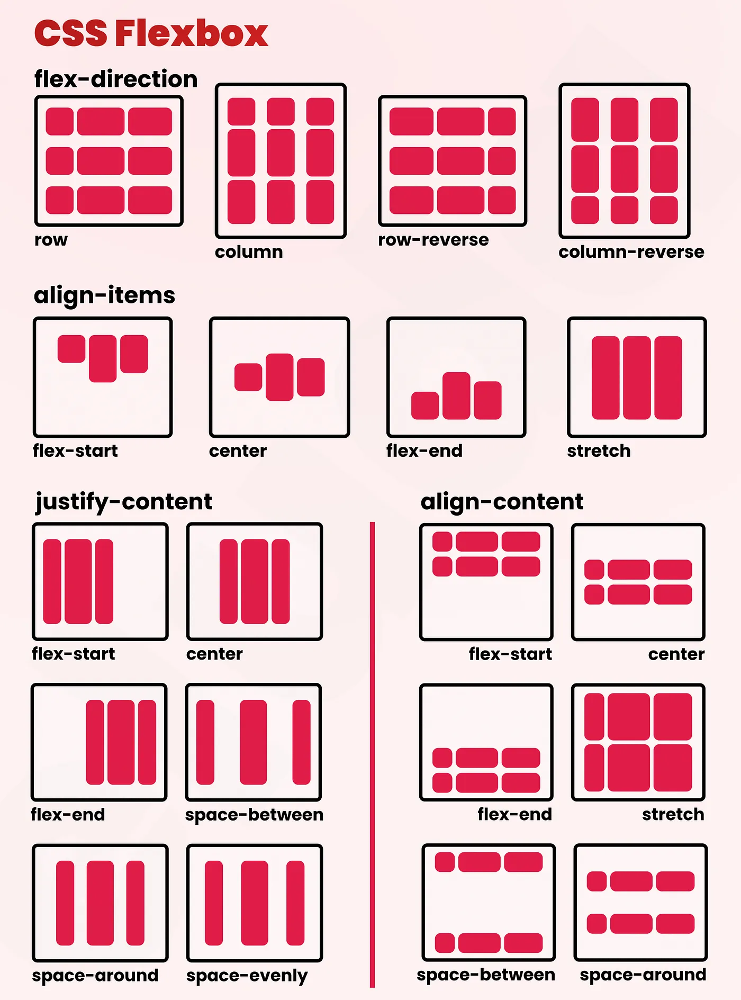

# HTML

## 태그의 구성

- Opening Tag (여는 태그)
	- Tag name
	- Attiributes
		- key / value
		- 값이 없는 attribute도 있음.
- Content (내용)
- Closing Tag 

Closing Tag가 없고 Opening Tag만 있는 경우, 끝에 슬래시(`/`)를 붙여 표시해주기도 한다.


## HTML의 구성

`<!DOCTYPE html>`
이 문서가 HTML로 작성됐음을 밝히는 메타 태그

`<html>`
HTML 문서의 루트

`<head>`
문서의 내용이 아닌 메타 정보들을 기입하거나 스타일 시트, 자바스크립트 등을 연결한다.

`<body>`
문서의 내용에 해당하는 부분

`<!-- 주석 -->`
코드에 대한 설명

## `<head>`

### `<meta>`

메타 데이터를 표현하는 태그

#### 오픈 그래프(Open Graph)

```
<head>
  <meta property="og:title" content="웹페이지 제목" />
  <meta property="og:description" content="웹페이지 설명" />
  <meta property="og:image" content="웹페이지 이미지 URL" />
  <meta property="og:url" content="웹페이지 URL" />
</head>
```

웹사이트의 정보를 요약하고 대표하는 이미지를 표현하는 메타 태그

---

### `<title>`

웹사이트의 제목을 표시한다.

### `<link>`

사이트에 사용될 CSS 스타일시트, 자바스크립트 파일 등을 불러온다.

### `<style>`

문서 한정으로 정의된 CSS 스타일을 담을 수 있는 엘리먼트

### `<script>`

문서 한정으로 정의된 자바스크립트를 담아 불러올 수 있는 엘리먼트

## `<body>`

문서의 실질적인 내용을 담고 있는 파트

### 제목

- `<h1>` ~ `<h6>` 

### 본문

- `<p>` 태그: Paragraph
- `<br/>` 태그: line-break
- `<hr/>` 태그: horizontal line
- `<a>` 태그: 하이퍼 링크
- `<ul>`, `<ol>` Unordered, Ordered List 태그
	- `<li>` 태그
- `<pre>`: pre-format

---

### 특수문자

HTML의 예약어로 사용되는 문자를 표시하는 방법

| 특수문자 | 설명                     |
| -------- | ------------------------ |
| `&nbsp;` | non-breaking space, 공백 |
| `&lt;`   | less than >              |
| `&gt;`   | greater than <           |
| `&quot;` | quotation mark "         |
| `&amp;`  | ampersand &              |

## 텍스트 서식

텍스트 안에서 사용되는 강조 등의 서식

- `<b>` 태그: bold
	- `<strong>`
- `<i>` 태그: italic
- `<u>` 태그: underline
- `<s>` 태그: strike-through
- `<sub>` 아래 첨자
- `<sup>` 윗첨자

---

### 기타 텍스트 서식

- `<ins>`, `<del>`: 문서에서 추가되거나 삭제된 등의 버전 관리를 하기 위해 표시
- `<em>`: emphasize 강조할 부분을 가리킴. 

## 테이블 태그
- 테이블 관련 태그는 표 형식의 데이터를 표시할 때만 쓴다.
- `rowspan`, `colspan` attribute를 사용해 셀 병합

```
<table>
	<thead> 
		<tr>
			<th>열 제목</th>
			<th>열2 제목</th>
		</tr>
	</thead>
	<tbody>
		<tr> <!-- 행 태그 -->
			<th>내용 셀</th>
			<td>내용 셀2</td>
		</tr>
	</tbody>
</table>
```

## 정의 리스트

- `<dl>` description-list
- `<dt>` description-term
- `<dd>` description-description

### 주의사항

- `<dl>`은 반드시 하나 이상의 `<dt>-<dd>` 짝을 담고 있어야 합니다.
- `<dt>,<dd>` 는 `<dl>` 밖에서 독립적으로 사용할 수 없습니다.
- **단, `<dt>-<dd>`가 반드시 하나의 짝으로 지어져야 되는 것은 아닙니다.**  
    - 그래서 `<dt>`는 하나 이상의 `<dd>`를 형제 요소로 가질 수 있습니다. (예: `dt-dd-dd`)  
    - 그래서 하나 이상의 `<dt>`가 연속으로 나올 수 있습니다. (예: `dt-dt-dd`)
- `<div>`는 `<dt>-<dd>` 쌍을 감쌀 때 쓸 수 있지만, `<dt>-<dd>`의 형제 요소여서는 안 됩니다.
- `<dl>`은 공백이 아닌 텍스트 노드와 `<div>,<dt>,<dd>`가 아닌 요소를 포함해서는 안 됩니다.

## `<a>` 태그

- 자식 요소 또는 텍스트에 링크를 걸 때 사용 (anchor)

### attributes

- `href="{url}"`
- `target="_blank"`
- `download="{filename}"`

### 절대 / 상대 경로

- 절대경로: 최상위 경로 `/`에서부터 모든 경로를 입력
- 상대경로: 현재 경로 기준으로 상대적으로 경로를 찾아가기
	- `.` : 현재 디렉토리
	- `..` : 상위 디렉토리

## `` 태그

웹 상에서 이미지를 표시하기 위한 태그

### attributes

- `src` : 이미지의 URI
- `width`, `height`: 너비, 높이 (생략 시 원본 크기)
- `alt`: 대체 텍스트

## `<form>` 태그

- [폼&인풋 한방정리](https://inpa.tistory.com/entry/HTML-%F0%9F%93%9A-%ED%8F%BCForm-%ED%83%9C%EA%B7%B8-%EC%A0%95%EB%A6%AC#%3Cform%3E_%ED%83%9C%EA%B7%B8)
- 웹 서버와 통신하기 위한 유저 입력값을 받아 보관하고 전송처를 밝히는 요소
- 실제 화면상에 표시되는 것은 없으며, 오로지 `input` 요소의 값들을 취합하여 보내는 역할

### attributes

- `method`: `GET` 또는 `POST`
- `action`: 폼을 전송할 서버의 script 파일 지정 = URL
- `name`: 스크립트에서 다루기 위한 이름, 식별자.

## `<input>` 태그

사용자의 입력을 받기위한 UI 엘리먼트

### attributes

- `type` : 인풋 요소의 형태를 결정
	- `text`, `tel`, `url`, `email`, `password`, `number`, `search`, `range`, `color`, `checkbox`, `radio`, `datetime`, `datetime-local`, `date`, `month`, `week`, `time`, `button`, `file`, `submit`, `image`, `reset`

## URL

Uniform Resource Locator. 어떠한 정보 또는 자원의 위치를 표현하기 위한 규격

```
프로토콜://사용자정보@호스트:포트/경로?쿼리#프래그먼트
```

## 컨테이너

- 별다른 기능이 없지만 다른 요소들을 감싸서 그루핑하고 사각형의 영역을 형성하는 태그
- `<div>` 태그: 블록 레벨 요소
- `<span>` 태그: 인라인 레벨 요소

### 시맨틱 태그 (Semantic Tags)

레이아웃에서 어떤 역할인지 밝히는 컨테이너 요소

- `<header>`, `<section>`, `<article>`, `<nav>`, `<aside>`, `<footer>`


# CSS

## Cascading Style Sheet

HTML 요소들을 꾸미는 방법을 정의하는 규칙

### Cascading (캐스케이딩, 계단식)

- 구체적으로 어떻게 계단식인가
	- 스타일 우선순위(Priority)
	- 스타일 상속(Inheritance)

## 스타일의 우선순위

1. 중요도
	- 작성자 > 사용자 > 사용자 도구
2. 명시도 (Specificity)
	- in-line > id > class > type
3. 코드 순서 (최신순)

## CSS 문법 구성

```
셀렉터 {프로퍼티 : 밸류; 프로퍼티2: 밸류 ... }
```

- 선택자(selector)와 선언부(declarations)로 구성
- 각 프로퍼티의 사이는 반드시 세미콜론(`;`)으로 구분

### `!important` Rule

- value의 뒤에 넣게 되면 즉시 최우선순위로 해당 스타일이 적용됨.

## CSS의 위치

- 외부 스타일(.css) 사용: 별도로 작성된 `css` 파일을 HTML에 연결하여 사용하는 방법. 비슷한 스타일을 여러 HTML 문서에 적용하고자 할 때 유리
- 내부 스타일: `<style>` 태그 안에 정의된 스타일 사용
- 인라인 스타일: 각 HTML 요소 안에 `style` attribute에 기술된 스타일

# 선택자 (Selectors)

## CSS Selector (선택자)

선택자는 문서 내의 특정 HTML 요소를 '선택'하는 일을 한다. 대놓고 특정 엘리먼트를 가리키기도 하지만 추상적으로 여러 개의 엘리먼트를 선택할 수 있다. 선택한 뒤에는 선언을 사용해 스타일을 지정한다.

- 타입 셀렉터: `h1`, `img` 등의 HTML 요소의 종류를 전부 선택
- 클래스 셀렉터: HTML 요소에 `class` attribute를 사용해 부여한 클래스 이름을 가진 모든 요소를 선택
- ID 셀렉터: HTML 요소에 `id` attribute를 사용해 부여한 ID를 가진 요소를 선택
- 속성 셀렉터: 특정 attribute를 가지고 있거나 특정 attribute의 값이 특정되는 HTML 요소를 모두 선택
- 전체 셀렉터: 모든 요소를 선택
- 가상 클래스 셀렉터: 요소의 특정 상태 또는 해당 요소의 조건에 따른 다른 요소를 선택함

### Selector list

- 콤마(`,`)를 사용해 여러 선택자를 한꺼번에 스타일링

## Combinator (결합자, 조합 선택자)

선택자끼리 조합하거나 하는 연산을 통해 좀 더 세부적으로 요소를 선택하거나 차별화할 수 있다.

- A` `B: 자손 결합. 공백을 사용해 A의 자손인 B를 선택.
- A`>`B: 직계자손 결합. A의 직계 자손(바로 밑에 있는) B
- A`+`B: 직후 형제 결합. A의 바로 다음에 오는 형제 B
- A`~`B: 형제 결합. A의 뒤에 오는 모든 형제 B를 선택

## 타입, 클래스, ID, 전체

- 타입 셀렉터: 단순히 HTML 태그 이름을 입력 (`h1`, `img`, `p` ... )
- 클래스 셀렉터: 마침표(`.`)뒤에 클래스 이름을 입력 (`.first`, `.box` ...)
- ID 셀렉터: 샵(`#`) 뒤에 ID명을 입력 (`#sumbit`, `#nav` ...)
	- ID는 문서 내에 한 번만 써야 한다.
- Universal Selector: 와일드 카드(`*`) 사용.
	- 문서 전체의 패딩, 마진 등을 초기화할 때 유용


## 속성 셀렉터

```
태그명[속성명="속성값"]
```

- 태그명은 생략 가능
- 값을 생략하면 해당 attribute를 가지고 있는 요소를 선택한다.

## 가상 클래스(pseudo-class) 셀렉터

- 콜론(`:`)을 사용해 정의. 
- 특정 요소를 기준으로 요소를 찾거나, 특정 상태에 있는 요소를 선택
- `:hover`, `:active`, `:focus`, `:link`, `:visited`
- `:nth-child(n)`, `:first-child`, `:first-of-type`, 

## 가상 요소 (pseudo-element)

- 특정 선택자에 의해 선택된 요소를 기준으로 콘텐츠를 생성하여 채워넣는다.
	- 두 개의 콜론(`::`)을 사용
- `::after`, `::before`
- [예시](https://developer.mozilla.org/en-US/docs/Web/CSS/::after)

##  Emmet

- 여러 HTML 태그 구조를 입력하는 단축 표현 확장
- 본래 Extension이었으나 현재는 VS Code에 통합됨
- `html:5`
- `html>body>ul>li*5`
- `div.classname>span.lable+input[type="submit"]`

# CSS 선언부(declaration)

## 타입 (Types)

- 텍스트, 숫자, 컬러
- url()
- [CSS Data types](https://developer.mozilla.org/en-US/docs/Web/CSS/CSS_Types)

## 단위 (Units)

1차원 크기(distant)를 결정짓는 여러가지 단위가 있으며, 단위의 이해도에 따른 결과물의 차이가 크다.

- `px` 픽셀.
- `%` 부모 크기에 대한 상대적 크기
	- 부모가 크기가 없으면 자식도 없게 된다.
- `vw`, `vh`: Viewport width, height. 디바이스의 한 화면에 보이는 크기
- `em`, `rem`: 부모 또는 `html` 요소의 `font-size`에 비례한 단위
- `lh`, `rlh`: 엘리먼트의 line-height 속성을 따라가는 `lh`, `html` 요소의 line-height를 따라가는 `rlh`

### CSS-wide keywords

- inherit, unset, initial, revert

## 박스모델

모든 HTML 요소는 박스로 되어 있으며, 각각 패딩과 마진을 가지고 레이아웃을 차지하게 된다는 CSS의 원리

- Margin: 박스의 바깥 여백
- Border: 외곽선의 굵기
- Padding: 박스의 안쪽 여백

### box-sizing

- `box-sizing: border-box`: width의 기준을 border 굵기 포함하여 계산
- `box-sizing: content-box`: width의 기준을 content에 한정


## Margin, Padding

```
div {
	margin: 10px 0 10px 10px;
	margin: 10px 10px;
	margin 10px;
}
 
```

- `top`, `right`, `bottom`, `left`의 순서
- `margin-top`, `padding-bottom` 의 형태로 따로 작성하는 것도 가능

## 마진 상쇄, 마진 겹침 (Margin Collapse)

- HTML이 문서도구였던 시절의 유산
	- MS Word 등의 문서도구도 이러한 규칙을 가진다(고 함)
- 붙어있는 두 블록 요소의 위 아래 마진이 겹치는 경우, 더 큰 쪽의 마진으로 통합하는 규칙
- [마진 상쇄 완벽 정리](https://velog.io/@raram2/CSS-%EB%A7%88%EC%A7%84-%EC%83%81%EC%87%84Margin-collapsing-%EC%9B%90%EB%A6%AC-%EC%99%84%EB%B2%BD-%EC%9D%B4%ED%95%B4)


## Border

- Border의 굵기만큼 Box의 영역을 차지함

```
div {
	border: 10px solid blue;
}
```

- `border-with`, `border-style`, `border-color`의 형태로 분리해서 작성 가능

## Block & In-line level

- 모든 HTML 요소는 기본적으로 block 또는 in-line의 속성을 가지고 있다.
- Block: 문서의 가로폭을 모두 차지하고 줄바꿈을 일으키는 요소
	- `<a>`, `<b>`, `<input>`, `<span>`
- In-line: 정해진 만큼만 가로폭을 차지하고 줄바꿈을 일으키지 않는 요소
	- `<p>`, `<h1>`, `<ul>`, `<li>`, `<div>`, `<audio>`
- CSS의 `display` 속성을 통해 이를 변경할 수 있다.
	- `block`, `inline`, `inline-block`, `none`

## Visibiliy, Overflow

### visibility

- `visibility: visible`
	- 보임
- `visibility: hidden`
	- 안보이지만 자리는 차지함


### 넘치는 경우

- `overflow: hidden;`
	- 넘칠 시 자르고 감춤
- `overflow: scroll;`
	- 넘칠 시 스크롤 바
- `overflow: visible;`
	- 넘칠 시 그냥 보여줌
- `overflow: auto`
	- 넘칠 시 알아서 스크롤 바 보여줌 

## 그림자

### 박스 그림자

- `box-shadow: 10px 10px 20px gray;`
	- 각각 h-offset, v-offset, blur, spread, color를 의미

### 텍스트 그림자

- `text-shadow: 상동;`

## position

- `static`: 기본값 (브라우저가 배치하는 방식, inline, block을 따름)
- `relative`: 본연의 위치에서 `top`, `left` 적용
- `absolute`: 본연의 위치를 벗어나서 문서 내에 절대적 위치
- `fixed`: 본연의 위치를 벗어나 viewport에 고정
- `sticky`: 본연의 위치에서 viewport에 고정

## float & z-index

### float 

- 요소를 어디에 띄울 것인가를 결정하는 속성
	- float 처리된 요소는 위치값을 갖지 않음
	- `flex`의 등장으로 잘 안쓰게 됨.

### z-index

- 요소가 2차원 캔버스에서 겹치는 경우 그 우선순위를 정하는 속성
- 설정되지 않으면 HTML 상에서 나중에 나오는 요소가 전에 나온 요소를 덮음
- `z-index`가 높은 속성이 위로 올라가게 됨

## flexbox

- 1차원 레이아웃을 다루기 위한 속성

### 컨테이너 속성

- `display: flex;`
- `flex-flow: row wrap;`
	- `flex-direction: row | row-reverse | column | column-reverse;`
	- `flex-wrap: nowrap | wrap | wrap-reverse`
- `justify-content: flex-start | flex-end | center | space-around | space-evenly | space-between`
- `align-item: center | baseline`
- `align-content`

---

### 아이템 속성

- `order`: 디폴트 `0`, HTML 상의 순서를 임의로 덮어씌울 수 있다.
- `flow-grow`: 늘어날 때 늘어나는 공간을 차지하는 비율
- `flow-shrink`: 줄어들 때 줄어드는 공간 만큼 스스로를 줄일 비율
- `align-self`


---



## 미디어쿼리

- 더 이상 HTML/CSS는 웹 문서만을 위한 것이 아니며, 다양한 문서 형태와 플랫폼을 위한 것
- 각각의 미디어에서 어떻게 보일지를 조건과 CSS Rule을 사용해 정의함
- `@media screen and (min-width: 800px)`


## Feather Icons

- 공짜로 간편하게 쓸 수 있는 여러 아이콘들
- CSS로 스타일링 가능
- [Feather Icons](https://feathericons.com/)

## CSS 전처리기

- CSS의 확장 문법을 사용하여 더욱 간편하고 강력한 스타일링을 할 수 있는 도구
- 브라우저가 자체적으로 해석할 수 없으나 컴파일을 통해 css로 변환된다.
- Sass, SCSS, Less


## CSS Reset

- 브라우저가 지정한 스타일들을 초기화하는 CSS
- 

# 감사합니다