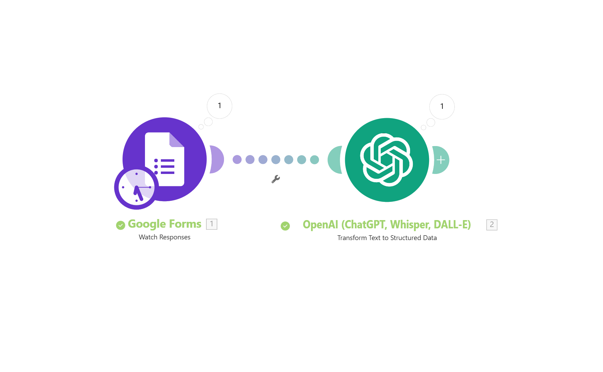
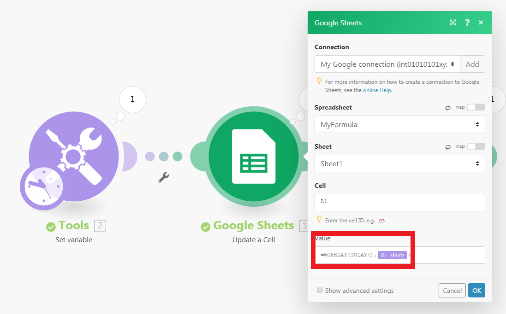

# Make

## Make.com

- 구 인티그로맷(Integromat)
- 재피어(Zapier), IFTTT, n8n과 같은 클라우드 기반 **백엔드 자동화 도구**

### 재피어와의 비교

- 강력함: 보다 뛰어난 자유도
- 경제적: 넉넉한 무료 티어, 유료 기능도 재피어에 비해 저렴
- 인터페이스: 섬세한 시각화 및 노드식 UI 구성으로 직관적

## Terms

- 시나리오(Scenarios): 하나 하나의 작업을 지칭.
	- 모듈(Modules): 시나리오를 구성하는 하나 하나의 작업.
		- 트리거(Triggers): 모듈 중 시나리오를 시작하는 조건이 되는 모듈
	- 수행(Operations): 시나리오 실행 시 실행된 모듈 한 개당 1 Operation으로 과금 기준이 된다.
- 연결(Connections): 각 모듈의 실행을 위한 연결된 외부 서비스들의 인증/연결 내용들
- 웹훅(Webhooks): 외부에서 시나리오를 실행시킬 수 있는 API
- 데이터 구조(Data Structure): 자주 쓰게 되는 JSON 등의 데이터 구조를 템플릿으로 등록해서 사용

## 시나리오(Scenarios)

### 시나리오를 시작시키는 3가지 방법

- 직접 실행하기
- 스케줄을 통해 자동 실행하기
- 웹훅을 사용해 외부에서 실행하기
	- 이 경우 HTTP Response를 통해 결과값을 반환할 수 있다

### 스케줄을 통해 실행하는 경우

1. 스케줄이 실행되는 조건을 체크 (날짜,시간)
2. 트리거가 되는지를 판단
3. 이후 모듈 실행

***

### 트리거(Trigger)

- 시나리오에는 최대 하나의 트리거 모듈이 등장할 수 있다
	- 노드의 가장 처음에 있어야 한다
	- 대표적으로 'Watch ..' 로 시작하는 모듈
	- `ACID` 가 붙어있는 모듈들

## 모듈(Modules)

- 실질적으로 기능을 수행하거나 작업의 흐름을 제어하는 요소
- 요소마다 작업의 결과 데이터를 반환(Return)하고
	- 이 데이터는 이후의 모듈에서 사용할 수 있다

## 데이터 타입 (Data Types)

- **번들**(Bundles)
	- 엄밀한 의미에서 타입은 아니고 Make의 개념에 가까움
	- 모듈은 실행되었을 때 하나에서 여러 개의 번들을 리턴할 수 있고
	- 연결된 모듈에서 번들 당 1회 모듈이 실행됨
- **컬렉션**(Collections): Key-Value 형태의 프로퍼티 집합 ≒ Dictionary, Object
- **배열**(Array)
- **숫자**(Number)
- **텍스트**(Text)

***

- **날짜**(Date)
	- ISO 8601 형식을 따름
	- `2024-12-10T00:45:00`
- **불리언**(Boolean)
- **바이너리**(Binary)
	- 파일, 이미지, 음성 등

## 인증 (Authentication)

- API는 결국 코드를 통해 서비스에 접근하려는 사용자에게 서비스 제공자(Service Provider)가 제공하는 것
	- 사용자 관련 정보와 기능을 코드를 통해 사용하기 위해서는 로그인에 준하는 무언가가 필요

### OAuth

- Open Authorization
- 대부분 웹 인터페이스를 사용하여 직접 로그인을 하도록 하나
- 몇몇 구글 서비스는 Google Cloud Platform에서 발급한 Client / Client Secret을 사용해야 함
	- 대표적으로 Gmail

### API Key

- 사용자의 인증을 대신할 수 있는 암호화된 키를 사용해 인증을 대신하는 것
- 서비스에서 간단하게 발급받을 수 있으나 키가 유출되는 경우 누구나 접근 가능하므로 위험할 수 있음
	- 이 경우 해당 키를 비활성해야함

## 주요 모듈들

### 구글 G Suites

- Docs/Sheets/Slides/Forms
- Drive/Calendar
- **Gmail**

### 인스턴트 메시징

- 텔레그램/디스코드
- Solapi(SMS/카카오톡)

***

### DB, 저장소

- 노션
- Airtable
- 드롭박스

### 소셜 미디어, 블로그

- 노션
- 인스타그램 for business
- 틱톡/페이스북/유튜브

---

### AI / LLM

- OpenAI
- Claude
- Google Vertex AI (Gemini)
- Replicate

### Flow Control

- Repeater
- Iterator
- Array Aggregator
- Router

***

### Tools 및 기타

- Basic Trigger
- JSON
- HTTP Request

## Functions

- 구글시트, 노션과 비슷하게 Make 전용 함수들을 아이템 매핑에 사용할 수 있음
- 특이하게 인수 구분자로 세미콜론(`;`)을 사용

