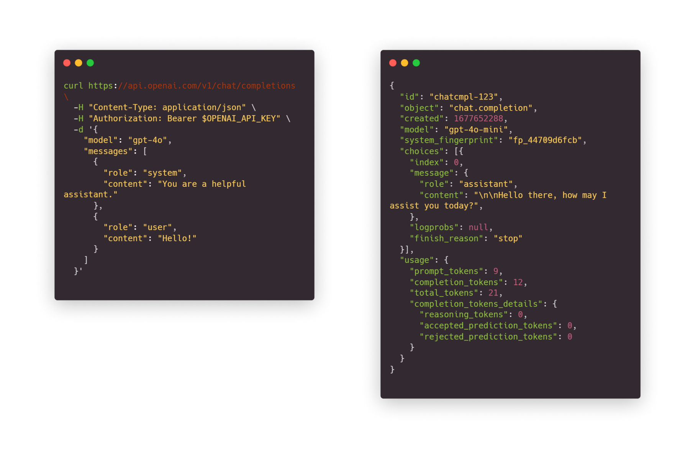

## 서버와 클라이언트, 프론트엔드와 백엔드

### 두 가지 의미가 있는

- Server: serve-r. 사용자에게 서비스를 제공하는 컴퓨터 or 프로그램
- Client: 고객. 서비스를 제공받기 위해 고객이 사용하는 컴퓨터 or 프로그램

### 보이느냐 보이지 않느냐

- Front-end: 사용자가 접하는 측면의 인터페이스, 프로그램 등을 뜻함
- Back-end: 사용자가 알 필요 없는 내부의 동작 원리

## API

- Application Programming Interface
- User Interface, UI와 비교
	- 버튼으로 대표되는 UI를 User가 누르는 버튼이라고 한다면,
	- API는 '프로그램이 누르는 버튼'이라고 말할 수 있다.

### HTTP Request

- 웹 서버와 클라이언트가 서로 소통하는 방법. 웹 API
- Request, Response로 구성
	- GET, POST 등의 종류로 나뉘며
	- Endpoint, Path, Header와 Body 등으로 구성돼있다.

