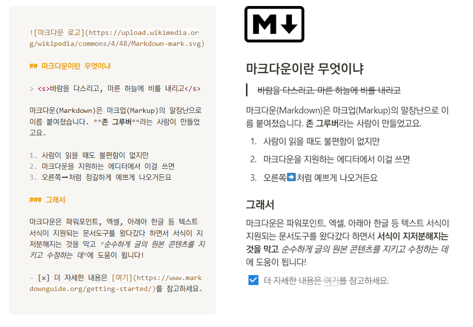
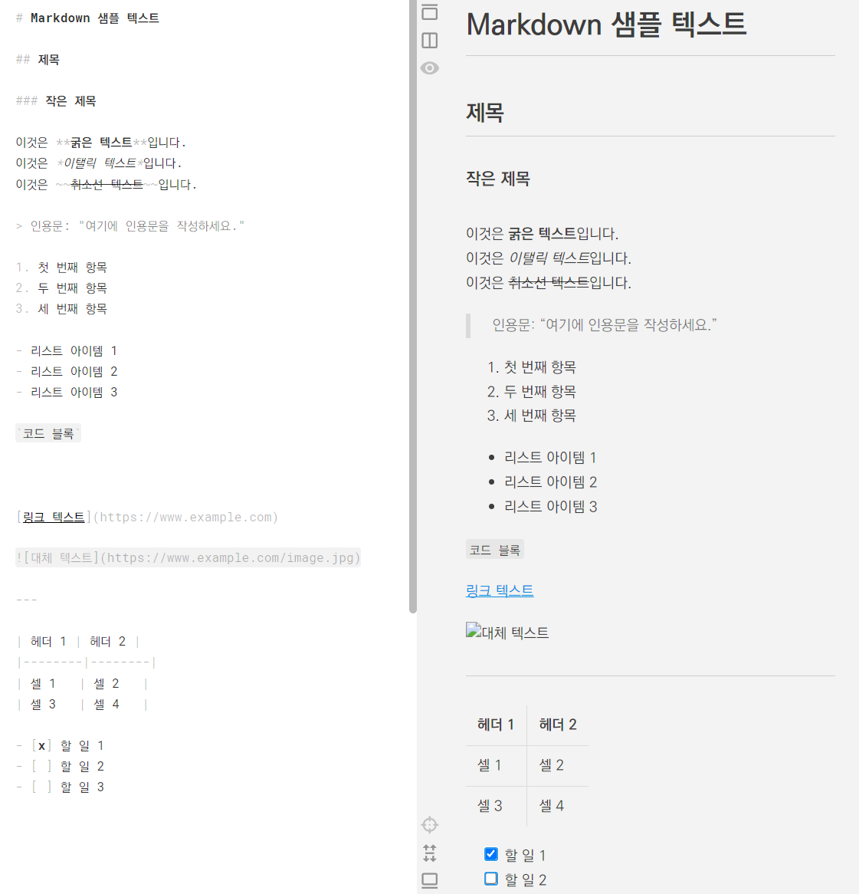
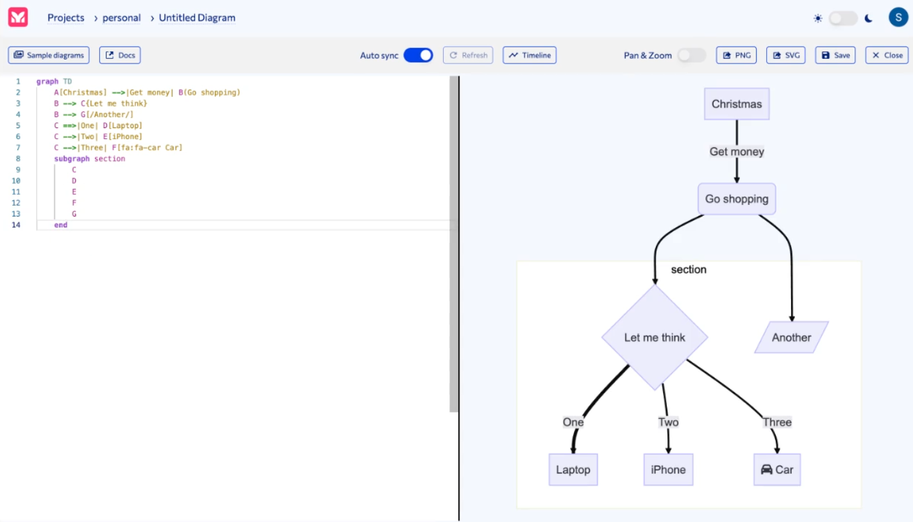

## 마크다운(Markdown)

- HTML의 Subset인, 리치 텍스트를 표현하기 위한 간이 문법
- 이름은 HTML(Hypertext Markup Language)의 말장난
- [마크다운 가이드](https://m00nlygreat.notion.site/ba2a279ebbf94484b4bdfa42105935a0)

### 플레인 텍스트와 리치 텍스트

- 플레인 텍스트: 메모장
- 리치 텍스트: 워드패드

### 사용처

- 디스코드, 슬랙, 노션, Github
- Obsidian, LogSeq, Github, ChatGPT, StackEdit, Joplin



---



## 마크다운의 문법 소개

1. **제목**: 
   `# 제목`, `## 작은 제목`, `### 더 작은 제목`
2. **텍스트**:
    - **굵게**: `**텍스트**`
    - *이탤릭*: `*텍스트*`
    - ~~취소선~~: `~~텍스트~~`
3. **인용문**: 
   `> 인용문`
4. **리스트**:
    - 순서 있는 리스트: `1. 항목`
    - 순서 없는 리스트: `- 항목`

***

5. **코드**:
    - 인라인 코드: 
      `` `코드` ``
    - 블록 코드: 
    ````
    ```
    코드 블록
    ```
    ````
1. **링크**: 
   `[링크 텍스트](URL)`
2. **이미지**: 
   ``
3. **수평선**: 
   `---`
4. **테이블**:
    | 헤더1 | 헤더2 |
    |-------|-------|
    | 셀1   | 셀2   |
5. **체크박스**:
    - `[x] 완료 항목`
    - `[ ] 미완료 항목`

## Markdown is the new MS Word

1. 마크다운은 생각과 아이디어를 **최소한의 서식으로 보존하고 정리**하는 데에 도움을 줍니다.
2. 마크다운은 여러 포맷으로 변환될 수 있습니다. 따라서 레이아웃이나 서식과 같은 장치보다도 **원본 콘텐츠를 지키고 더욱 개선하는 일**에 적당합니다.
3. 마크다운은 글의 구조를 표현하는 데에 필요한 모든 규칙을 가지고 있습니다. 따라서 **구조적 글쓰기 훈련**을 하는 데에도 도움이 됩니다.
4. ChatGPT와 같은 대부분의 거대언어모델 역시 마크다운 호환 형식으로 답변하며, 마크다운을 읽고 쓰는 데에 능숙합니다. 말하자면 AI와 대화할 때도 최적화되어 있는 것이죠.
5. 마크다운은 점차 더 많은 현세대 애플리케이션에 통합되고 있습니다. 곧 더 많은 곳에서 마크다운을 보게 될 것입니다.

## 옵시디언 (Obsidian)

- 마크다운과 노트의 연결을 근간으로 하는 개인 지식 DB 구축 도구
	- 제텔카스텐(Zettelkasten), 세컨드브레인
- Graph View


## Mermaid.js

- 마크다운을 채택한 많은 에디터에서 호환되는 다이어그램/차트 작성 도구
- 간단한 플레인 텍스트 문법으로 차트 또는 다이어그램 작성
- [Mermaid.js Live Editor](https://mermaid.live/edit)

