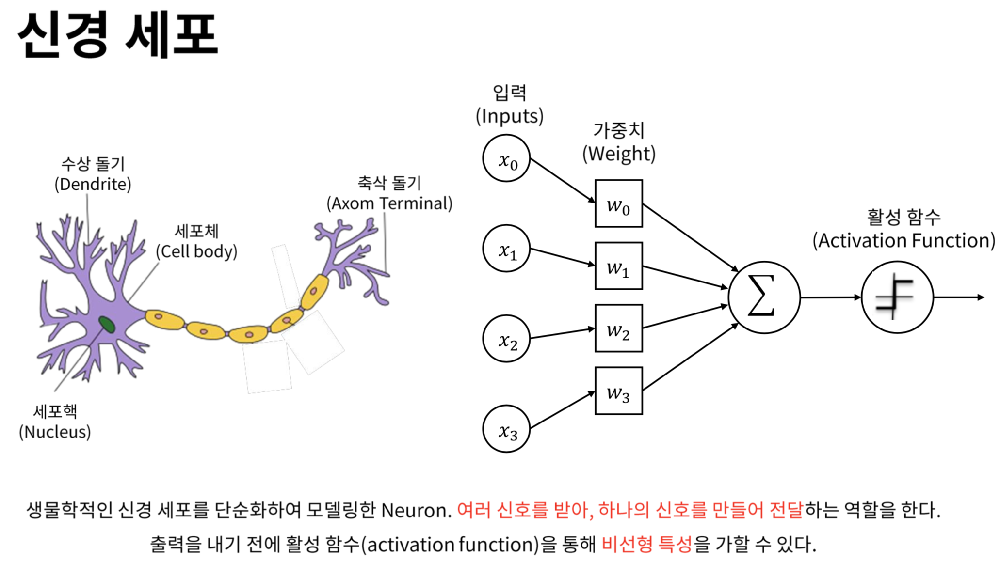
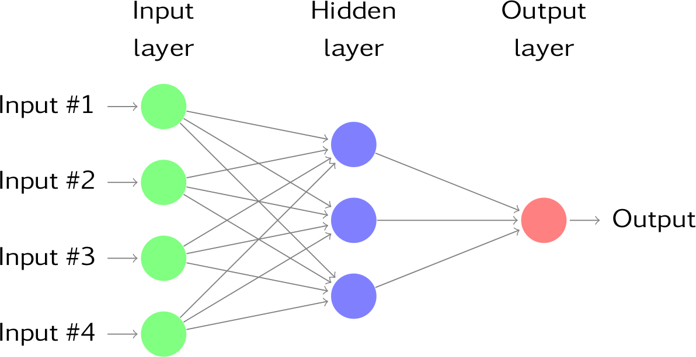
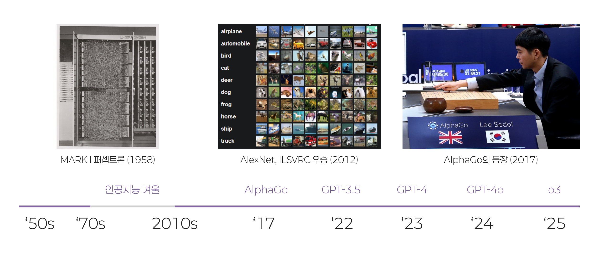
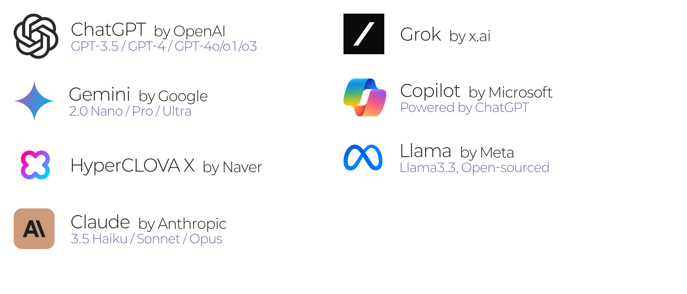
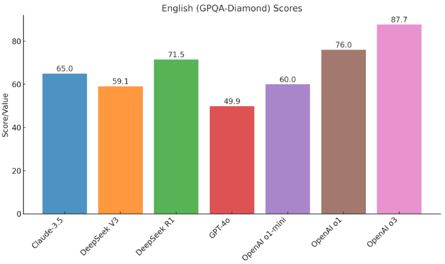
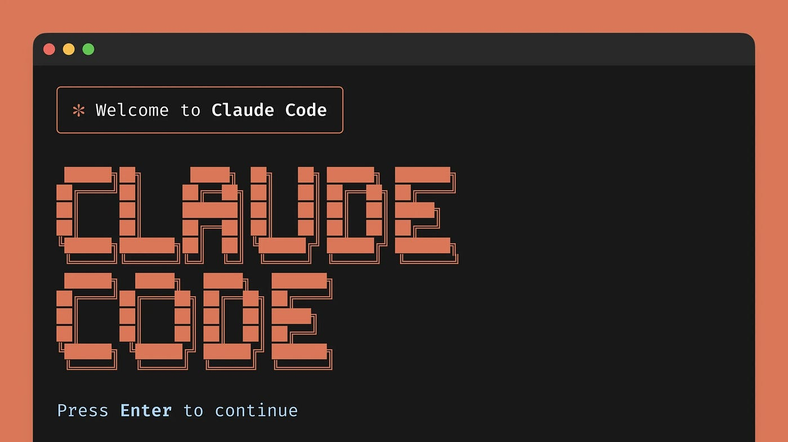
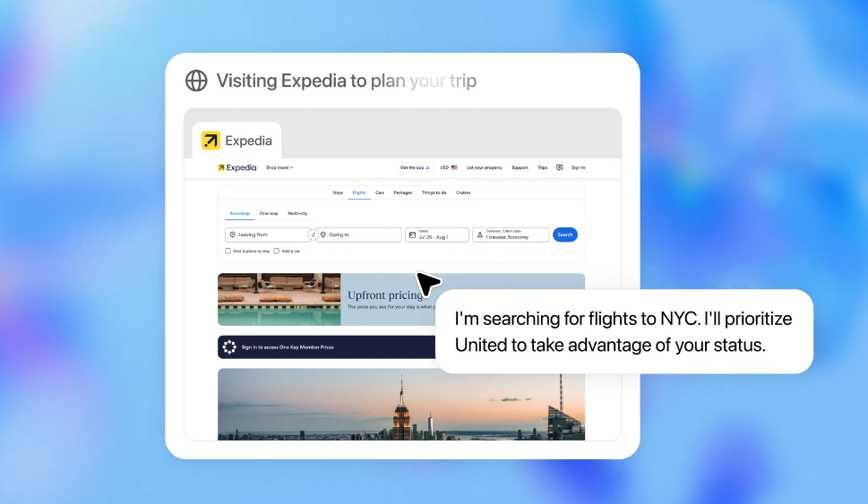

## AI의 역사

### 인공지능 (Artificial Inteligence)의 두 갈래

- 알고리즘 기반 (Rule-based Systems)
	- 사람이 모든 규칙과 조건을 제시하여 그대로 수행하는 인공지능
	- 사람이 지시한 것 이외에는 할 수 없음
	- 2010년도 이전까지 인공지능 구현의 대세였음.

- 인공신경망 기반 (Machine Learning)
	- 뉴런을 모방하여 인간 두뇌와 비슷하게 작동하는 인공 신경망 (Neural network)
	- 막대한 연산량이 필요하고 따라서 **GPU와 같이 방대한 양의 작은 연산을 동시에 수행하는 능력** 필요

---

---

---

## LLM의 종류

[figma]: # (https://www.figma.com/design/iubwB7Prnrvzy147L1mMpM/%EA%B0%95%EC%9D%98-%EC%82%BD%ED%99%94?node-id=5-33&t=DmgUW0UCLRFfz0J8-4)

## 오픈 AI와 일론 머스크

[note]: # (- AI에 대해 상반된 두 가지 입장)
[note]: # (	- AI는 위험하며 투명하게 공개되고 통제되어야 함 (허사비스, 머스크))
[note]: # (	- AI는 인류의 발전을 가져올 중요한 파트너 (페이지))
[note]: # (- 일론 머스크, AI 발전을 감시하기 위해 딥마인드 지분 구입)
[note]: # (### 딥마인드 구글에 인수)
[note]: # (- 머스크 반발)

---

### 머스크 오픈AI 설립

- 일론, 샘 올트먼, 일리야 수츠케버 등
- 오픈AI와 테슬라 병합 시도
- 실패 후 마이크로소프트에 지분 전량 매도

### 오픈AI의 대성공

- 오픈AI, CEO 샘 올트먼 해임 및 복직
- 머스크 x.ai 설립
- 오픈AI, 초정렬팀 해체
	- 일리야 수츠케버 퇴사
- [머스크 vs 올트먼 설전](https://www.chosun.com/economy/tech_it/2025/02/11/BWX6CAAL2RAAVCAZNYCMHMHXIQ/)
	- "OpenAI 141조에 사겠다"
	- "트위터 14조에 사겠다"

## AI의 미래

### 인공 일반지능 (AGI)

- Artificial General Inteligence
- 강인공지능과 약인공지능 (Strong vs. Weak AI)
	- 특정한 분야의 일을 인간의 지시에 따라 수행하는 인공지능
- 스스로를 업데이트하는 인공지능
- [최초의 AGI를 자칭하는 o3 모델](https://www.aitimes.com/news/articleView.html?idxno=166425)

***

#### AI 3대천왕

- 제프리 힌튼, 토론토
- 요슈아 벤지오, 몬트리올
- 얀 르쿤, 메타 인공지능 수석 과학자
	- "Transformer 모델로는 AGI 달성 못해"
	- "o1은 Transformer가 아냐"
	- Advanced Machine Intelligence는 2030년에 올 것

---

### AI와 인간의 가치

> AI를 통해 노동에서 해방된 후 인간은 어떻게 될 것인가

- 로마시대 콜로세움의 이야기
	- 노예가 모든 노동을 대신했기에, 일할 필요가 없어진 사람들은 유희를 찾게 됨.
- Genuine, authentic한 인간에의 선호
	- AI가 생성한 예술보다는 **진짜 인간**이 작성한 예술을 찾고 검증하려는 시도
- 기본 소득에 대한 활발한 논의
	- [샘 올트먼의 기본 소득 실험](https://lilys.ai/digest/2645038?s=1&nid=786925)

## AI 전쟁에서 승리하기

### 하드웨어 vs 소프트웨어?

- 학습과 추론에 거의 절대적으로 쓰이는 NVIDIA H100, H200, B200칩 
- NVIDIA의 승리는 어디까지인가
	- [짐 켈러 "엔비디아 시대는 결국 끝난다.."](https://www.youtube.com/watch?v=2pw-YZ7KuFY)
	- [짐켈러 인터뷰](https://www.youtube.com/watch?v=iwXr1IRaqWA)
- 딥시크가 다시 불붙인 소프트웨어 경쟁
	- 하드웨어의 병목(bottleneck) 현상을 소프트웨어로 뚫고 나가려는 시도

---

### Data 보유

- 학습시킬 데이터의 양이 AI 전쟁의 키라고 보는 입장
	- 빠르면 [2026년 학습시킬 데이터 고갈](https://www.hankyung.com/article/202401220871i)될 수 있다
	- AI의 빠른 학습속도 때문에 인간이 생산해낸 콘텐츠가 고갈되면 더 이상 모델을 발전시키기 어렵다
- 구글, 메타 등 소셜 미디어/사용자 데이터를 가진 회사들이 강점을 가진 영역
- 머스크가 트위터를 인수해 X로 바꾼 이유도 여기에 있다는 관측

## GPT-4o

- GPT-4 Omni
	- 진정한 멀티 모달
	- `im-a-good-gpt2-chatbot`과 `also-a-good-gpt2-chatbot`
- 1/2 정도의 토큰을 쓰고도 같은 성능
	- 무료 사용자에게도 제공
	- GPTs 무료화
- [Say Hello to GPT-4o](https://www.youtube.com/watch?v=vgYi3Wr7v_g)
- [Be My Eyes Accessibility](https://www.youtube.com/watch?v=KwNUJ69RbwY)

## AI 에이전트

- Anthropic "Claude 3.5 Computer Use"로 가상환경에서 컴퓨터를 직접 조작하는 기능 선봬
- OpenAI는 macOS / iOS 등의 OS 통합(integration)으로 대응
	- Apple Inteligence 발표와 ChatGPT 통합에서 예견됨
- Genspark, 에이전트형 AI 서비스 출시

### 툴 콜링 (Tool calling)

- 또는 펑션 콜링(Function Calling)
- LLM이 자기주도적으로 판단 하에 외부 기능(Tool)을 실행하는 것
	- MCP

## GPT-o1 추론모델

- 스스로 회고(Self-reflect)하는 특성으로 추론(Reasoning) 능력을 대폭 향상
	- 인간으로 치면 IQ 120
	- 박사 학위 수준

#### OpenAI o3 / o3 mini 출시

- 최초로 AGI에 진입했다는 의견
- o3 출시 (2025. 4. 16)

## 딥시크(Deepseek) 충격

- 중국의 AI 스타트업이 개발한 오픈소스 LLM 모델 Deepseek V3와 R1
- NVIDIA의 저가형 *H800* 칩을 사용해 훈련, 추론에는 화웨이 *어센드 910C*
	- NVIDIA의 하드웨어 패권에 대한 회의론 확산
	- 그러나 여전히 CUDA 생태계에 의존하고 있음
- MoE(Mixture of Experts) 기법과 강화학습 위주의 학습 방식으로 저비용 고효율 달성

## 구글 nano-banana / Veo 3

### `nano-banana`

- `nano-banana` 라는 이름으로 AI 벤치마크 랭킹에 등장한 이미지 모델
	- 이후 `gemini-2.5-flash-image` 라는 이름으로 출시
- 뛰어난 일관성(consistency)이 특징

### Veo3

- 음성과 영상을 동시에 생성하는 모델
- 유리 과일 자르기 등 영상 유행
	- Veo 3.1

## 바이브코딩

- 캐나다의 인공지능 과학자, **안드레 카파시**(Andrej Kaparthy)가 만든 단어로 기존의 논리 기반의 규칙이 엄격하고 질서정연한 사고과정을 통해 코드를 작성하던 전통적 개발과 달리, *느낌 위주로 언어모델에게 요청하여 코드를 작성하는 개발방법*

### 두 가지 의미

- **완전한 바이브코딩**: 개발을 모르는 사람이 자연어만으로 코드를 작성하는 것
	- *Replit*, *Lovable*, *v0*, *Figma Make* 등
- **AI 페어 프로그래밍**: 개발자가 설계 및 코드 품질 검토를 담당하며 언어모델을 동료직원처럼 대하며 코드를 작성하는 것
	- 이걸 뭐라고 불러야 하는가에 대한 논의 진행 중. *Vibe Engineering*, *Augmented Coding*, *AI assisted Programming* 등

---

### 코딩 에이전트 전성시대

- Cursor, Windsurf 등 IDE 통합형 코딩 에이전트에서 
- Gemini-CLI, Claude-Code, Codex-CLI 등 CLI 기반 코딩 에이전트로의 이행

## GPT-5 출시

- 단일 모델이면서, 질문을 받으면 라우팅(routing)을 사용해 질문의 목적에 부합하는 다양한 크기와 목적의 세부 모델이 응답하게 하는 통합형 인공지능 모델

### 사용자 불만 폭증

- GPT로부터 위안을 받거나, 농담따먹기, 영어회화 연습 등의 목적으로 GPT를 이용하던 사람들이 *'GPT가 재미없어졌다.'* 라며 호소
- 답변이 짧아졌고 멍청해졌다는 증언
- [샘 올트먼, GPT-5 실패를 인정](https://www.reddit.com/r/OpenAI/comments/1muhlun/sam_altman_admits_openai_totally_screwed_up_its/)
	- GPT-5.1 (2025. 11. )

## AI 브라우저 대결

- OpenAI 'Agent' Mode
- Perplexity Comet
- Genspark AI Browser
- Chrome + Gemini

