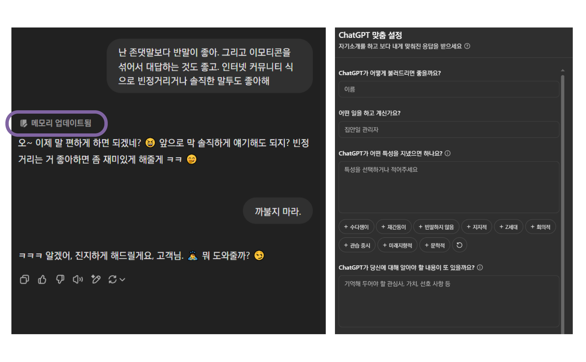
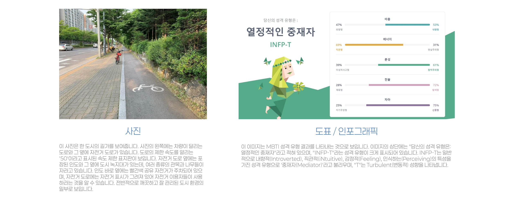
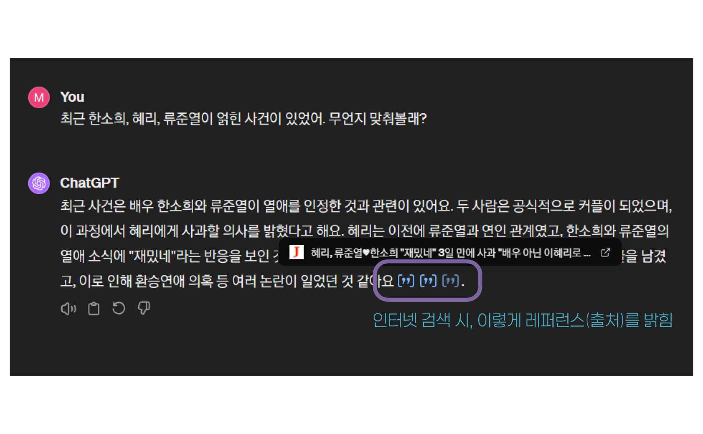
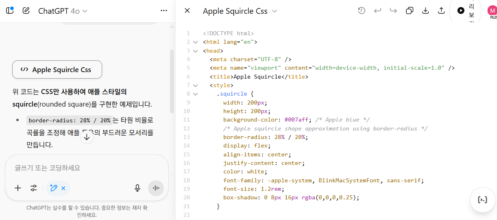
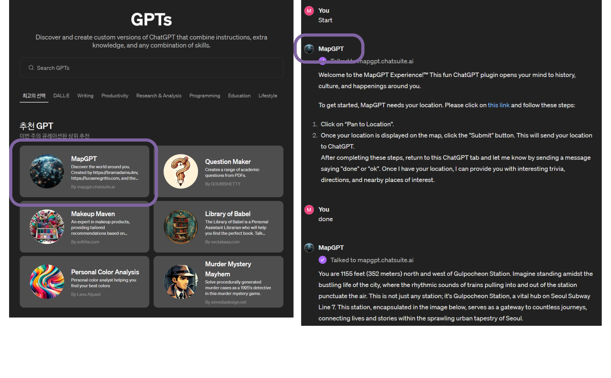
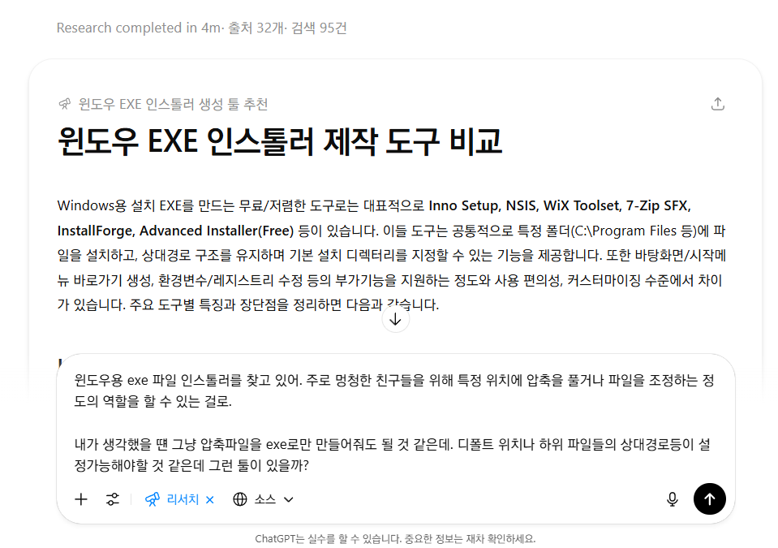
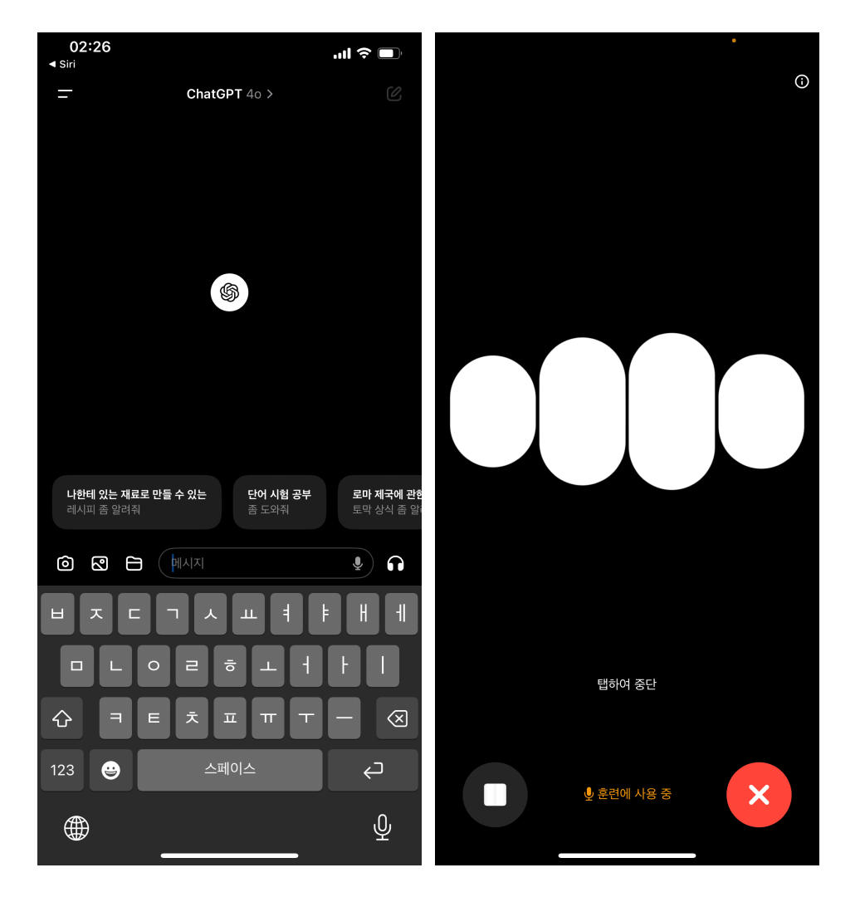

## Custom Instruction & Memory

### Custom Instruction 

- ChatGPT가 좀 더 사용자 친화적인 맥락으로 대답할 수 있도록 사용자의 정보나 답변에 있어서의 희망사항을 미리 알려주기

### Memory

- ChatGPT는 대화 도중 사용자의 선호나 배경에 대한 정보가 감지되면 그 사실을 자신의 *메모리*에 업데이트하여 답변에 반영한다.

#### Unified Memory

```
내가 너와 상호작용한 모든 내용을 바탕으로 내 사고 패턴과 의사 결정 방식, 무의식적인 편향, 반복적으로 드러나는 '약점'이나 '맹점'을 상세히 분석해 줘. 그리고 각 항목에 대해 나에게 필요한 조언을 구체적으로 적어줘. 5000자 이상
```



## Vision & DALL-E

- GPT-4 Vision: 사진을 보고 해석하는 능력
	- 프롬프트에 사진 파일을 첨부
- DALL-E 3: 프롬프트 기반으로 이미지를 생성하는 능력 (Midjourney와 같은)
	- '그림을 그려줘.', '이미지를 생성해줘.' 등의 표현 사용
- 풍경 사진, 이미지에서 도표, 이미지로 된 텍스트까지




## GPT-4o 이미지 생성

### GPT-4o Image Generation

- GPT에 탑재된 새로운 이미지 생성 모델 (2025. 3)
- Input / Output에 각각 멀티모달 통합이 뛰어나 각각 `Image 2 Image` 등의 작업에 뛰어남
- 편집이나 재창작, 언어 이해, 스타일 재현이 뛰어남

#### 지브리 스타일 프로필 사진 만들기

- 한 때 전세계를 뜨겁게 달구었던 지브리 프사 만들기
- [미야자키 하야오 "역겹고 모욕적.."](https://v.daum.net/v/2qzwHKc6Ay)


## Browsing

- 실시간으로 인터넷을 검색하고, 검색한 내용을 기반으로 답변을 생성하는 것 (RAG)
	- '최근', '오늘', '2025년' 등 시점을 가리키는 표현
	- 최근 화제가 되었던 연속성 있는 이슈
	- '검색해줘' 등의 직접적인 표현
- 기존 ChatGPT의 데이터 학습 시점
	- GPT-3.5: 2022년 1월 까지
	- GPT-4: 2023년 12월 까지
	- GPT-4o: 2023년 9월 까지
	- o3, 4o mini: 2024년 7월까지



## Data Analysis

- 파이썬 백엔드를 실행하여 데이터 분석 등을 수행하는 기능
	- 파일 리딩: CSV, PDF, PPT, XLS, DOC 등 문서 제공
	- '차트를 그려줘.'와 같은 표현
- 알아서 파이썬 코드를 짜고 실행함.
	- 오류 발생 시 자동으로 재시도
- 기본적으로 파이썬으로 수행가능한 데이터 분석, 파일 관련, 수학 등의 요청을 받아들이나, API콜, 크롤링 등 시스템에 영향을 주거나 부담스러운 작업은 거절


## 캔버스

- 코드 또는 글을 작성할 때 좀 더 전문적으로 집중을 도와주는 도구
	- Claude의 Artifact에 대응하는 기능이다
		- 체감상, Claude가 글을 좀 더 꼼꼼히 읽고 쓰는 경향 있음
- 기본적으로 초안을 Develop하는 형태로 작동하여, 퇴고와 수정을 기본으로 작업하는 경우 유용



## GPTs

- 자주 사용하는 GPT 프롬프트 설정을 별도의 GPT로 만들어서 편리하게 독립된 채널에서 대화하기
- GPT-4o의 고급기능 사용가능: 
	*Vision, Browsing, Data Analysis*
- GPTs Action: 요청 받은 텍스트의 내용에 따라, 외부 API를 사용해서 전용 기능을 실행하고 그 응답결과를 답변 처리에 사용가능



## 심층 리서치(Deep Research)

웹 검색, 학술문서 등을 반복 검색하며 정보를 수집, 분석, 정리하여 사용자가 제시한 연구 주제에 대해 품질 높은 보고서를 제공하는 **검색 에이전트** 기능

- 사용량 제한이 있으므로 마음껏 사용은 어려움 (Pro 플랜)
- 연구 범위, 출처, 세부 주제 등의 상세한 목적과 배경, 요청사항을 줄수록 결과의 품질이 좋음
- [딥 리서치 프롬프트 작성 도우미](https://chatgpt.com/g/g-67e2161dd7b88191bfc4e6b56b66ce90-dibriseoci-peurompeuteu-jagseong-doumi)를 활용해보자.
	- [출처](https://www.youtube.com/shorts/ghIj-bjPBpU)



## ChatGPT App

- iOS/Android/Windows/Mac 을 지원하는 네이티브 앱
- 내장된 마이크를 통해 ChatGPT와 음성대화 가능!
	- 원어민급 영어 회화 연습 가능
	- 중간에 끊기(interrupt) 가능한 자연스러운 대화
		- Advanced Voice Mode
	- 이제 웹에서도 사용 가능 (2024. 11)
- 향후 OS와 AI Agent 통합의 전초기지가 될 전망



## 에이전트 (Agents)

- **2025년 7월**에 발표한 브라우저 자동화 기능
- 가상 환경에서 사용자 대신 브라우저 조작(검색, 웹사이트 열기, 상호작용 등)을 수행하며 요청을 수행
- 