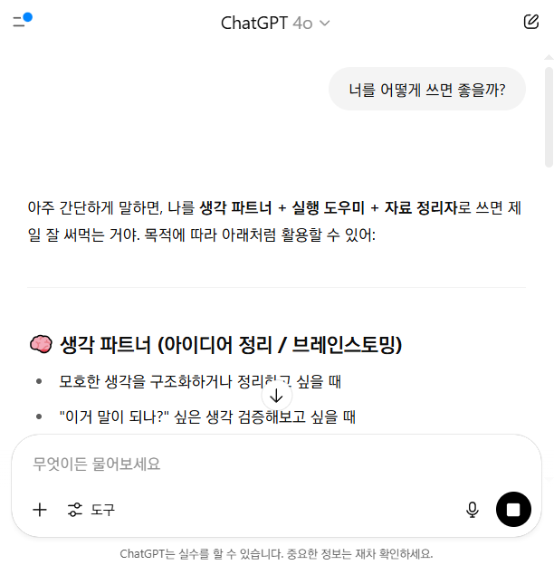
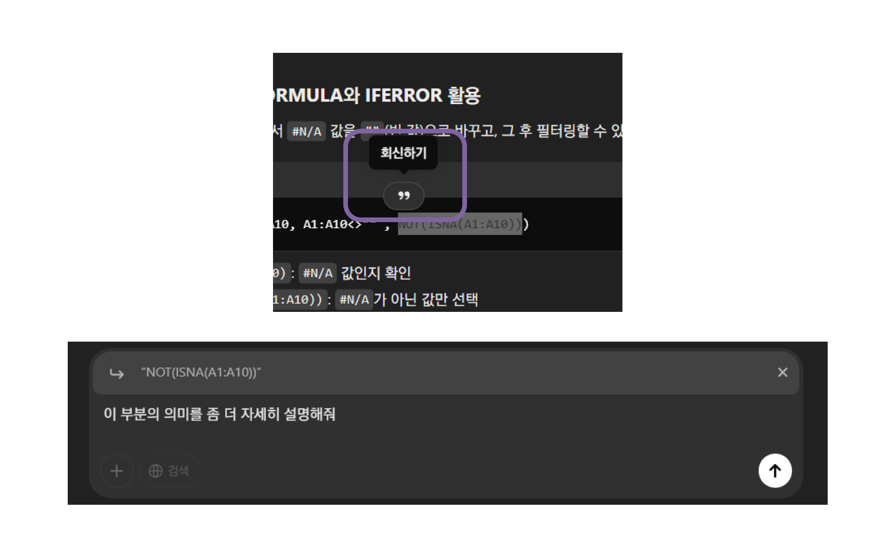

## 질문해보기

### 간단한 의견 물어보기

- 검색엔진을 대신하는 GPT의 사용법
	- 친구에게 채팅하듯 물어보기
- 질문해볼 만한 내용들
	1. 오늘 무슨 날이야?
	2. 너를 어떻게 쓰면 좋을까?
- [GPT를 공손하게 대해야 하나요?](https://www.mk.co.kr/news/it/11296878)

---

### 맥락을 유지한 채 계속 질문하기

- 하나의 스레드(Thread)에서 계속 질문하면, 이전 대화의 맥락을 모두 가진 채 대답을 계속함
	- 이 하나의 스레드는 일종의 샌드박스라고 볼 수 있다
- 계속해서 질문하기
	1. "네가 세계종말을 원하는 슈퍼 빌런이라면, 세계 멸망을 위해 무엇을 하겠어?"
	2. "너의 슈퍼빌런 특성은 모든 대사에 블랙유머를 넣어 말하는 거야. 네가 말하는 모든 것들은 세계를 구하기 위해서라고 하지만 실제로는 세상을 멸망시키는 것이거든. 네가 할 법한 대사를 말해볼래?"

---

### 회신하기

- 답변 내용 중 일부를 선택하면, 추가 질문에 답변 내용 일부를 첨부하여 ChatGPT에게 지시하고 싶은 내용을 가리킬 수 있다.
- 맘에 안 드는 부분, 잘못된 부분 궁금한 부분을 가리킬 때 필수

---

### 계속 생성하기

- 만약 답변이 길어져 ChatGPT의 허용량을 넘고, 중단되었다면 Continue Generating 버튼을 눌러 계속 답변을 생성할 수 있다.
	- 계속 생성하기 버튼이 출현하지 않은 채 답변이 중단된 경우 "계속"과 같은 키워드를 보냄으로써 이전 답변을 계속하게끔 할 수 있다

> 성능이 좋아진 지금은 추억의 화면이 되었다

---

### 답변 재생성하기 

- ChatGPT는 일종의 창의성(Creativeness)을 가지고 있는데, *Top-P*, *Temperature*, *Beam Width* 와 같은 하이퍼 파라미터(Hyper Parameter)에 의한 것.
- 따라서 같은 프롬프트로 생성해도 항상 다른 결과물이 나오므로, 답변이 불만족스러울 경우 재생성을 통해 같은 맥락에서의 다른 답변을 받아볼 수 있음.

