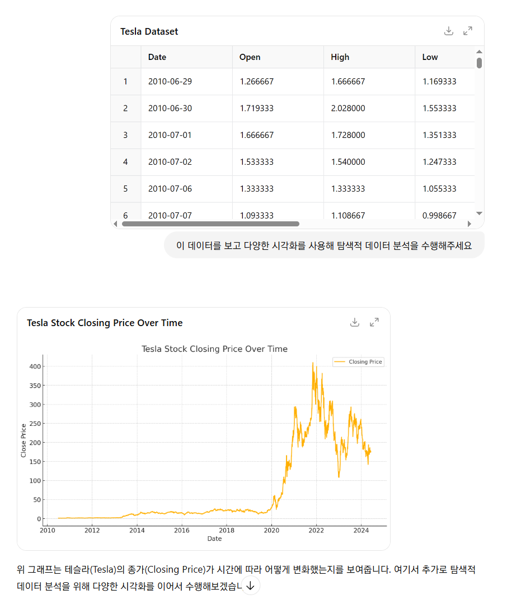

## Advanced Data Analysis

- ChatGPT가 계산, 분석 등이 필요하다고 판단하면 **스스로 가상환경에 파이썬 백엔드를 실행**시켜 데이터를 분석하는 기능
	- 성능이나 환경상 제약이 있으므로 복잡한 연산이나 대규모 데이터 처리는 제한적
- 단순하게 `CSV`, `XLSX` 등의 파일 형태로 데이터를 제공해주거나 하는 방법으로 활성화

## 탐색적 데이터 분석(EDA) 수행

- 데이터의 성격, 특성 등을 알아보기 위해 다양한 측면에서 시각화를 시도해보고, 분석 아이디어를 얻는 방법

```
이 데이터를 읽고 탐색적 데이터 분석을 수행해주세요.
```

