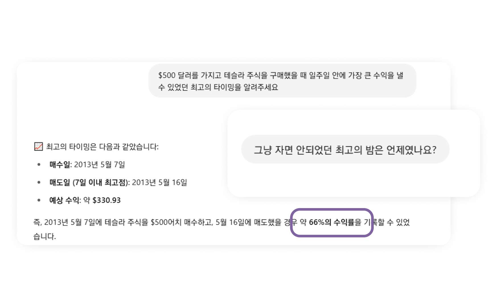

## Advanced Data Analysis

- ChatGPT가 계산, 분석 등이 필요하다고 판단하면 **스스로 가상환경에 파이썬 백엔드를 실행**시켜 데이터를 분석하는 기능
	- 성능이나 환경상 제약이 있으므로 복잡한 연산이나 대규모 데이터 처리는 제한적
- 단순하게 `CSV`, `XLSX` 등의 파일 형태로 데이터를 제공해주거나 하는 방법으로 활성화

## 탐색적 데이터 분석(EDA) 수행

- 데이터의 성격, 특성 등을 알아보기 위해 다양한 측면에서 시각화를 시도해보고, 분석 아이디어를 얻는 방법

```
이 데이터를 읽고 탐색적 데이터 분석을 수행해주세요.
```


## 상세 데이터 분석 요구사항 수행

- EDA 결과에서 얻어낸 인사이트, 궁금증을 토대로 분석을 진행시켜 나갑니다.
- 가설을 세우고, 이를 검증하기 위한 분석을 수행해봅니다.



## Google Colab 사용하기

- GPT의 가상환경에서는 여러 제약(성능, 설치된 패키지 등)으로 수행할 수 없는 고급 데이터 분석을 **구글 Colaboraroty**에서 수행할 수 있습니다.
- 코드 작성을 요청하고, 구글 Colab에서 실행해 봅니다.

```
방금 수행하지 못한 분석을 Colab에서 실행해볼 수 있도록 코드를 작성해주세요. 파일은 colab uploader를 사용해 업로드하겠습니다.
```

- [tesla_lstm](https://chatgpt.com/c/686e9044-b420-8008-8c62-8d4bd17117f0)
	- [colab](https://colab.research.google.com/drive/11sL7AyK5Lub3GMcN22ahLakCBkr5QSg_?usp=sharing)


# 데이터분석 실습


