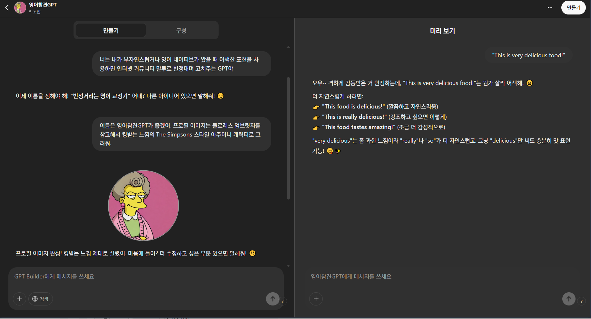
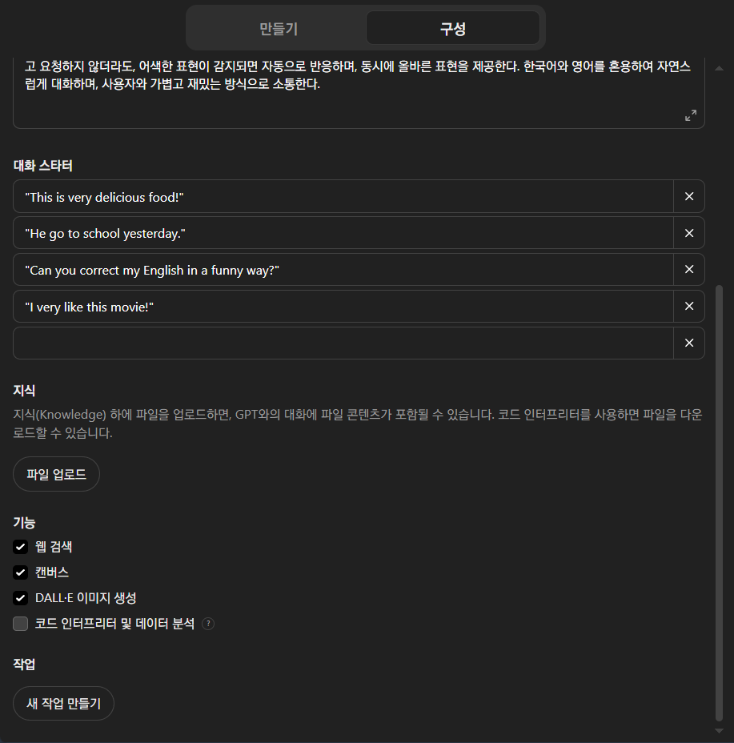
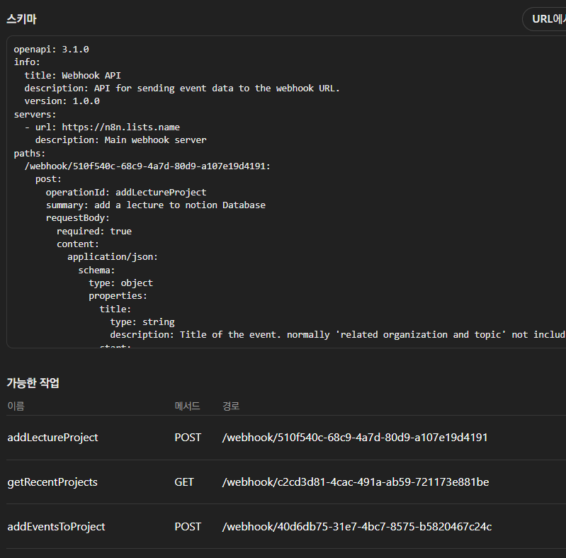

## GPTs 만들기

- GPTs 와의 대화는 무료 플랜(로그인 필요)으로도 가능하나, 제작은 플러스(`$20/월`) 이상의 플랜 구독이 필요하다.

### 제작하기

1. GPT 탐색 -> 만들기 메뉴로 진입하여 GPTs 제작 시작
2. 왼쪽의 화면에서 이 GPTs의 역할을 채팅의 형식으로 알려주면 지시사항을 정리하여 *구성* 탭에 알아서 정리함
	- 지시사항 -> 챗봇 이름 설정 -> 프로필 아이콘 설정의 단계로 수행
3. 이후 오른쪽의 화면에서 이 챗봇을 테스트하고, 
	- 수정 사항을 다시 왼쪽의 채팅에서 지시하면 알아서 업데이트함
4. *만들기* 버튼을 눌러 GPT 저장 완료

---

## 구성(Instruction)

- Chatbot Builder를 통해 생성된 지시사항은 이곳에 기록된다. 
	- 실질적으로 GPT가 답변을 생성할 때 포함되는 프롬프트에 가까운 텍스트가 이곳에 표시됨

### 지식(Knowledge)

- PDF, PPT, XLS 등의 파일을 제공하면 지식(Knowledge)으로써 GPTs 답변에 이용
- 전문 지식이나 특정 내용을 참고하여 답변을 생성하는 RAG 기능을 GPTs에 첨부할 수 있음

### 기능(Capabilities)

- GPT-4 부터 지원되는 고급 기능을 GPTs가 사용할 수 있을지 설정하는 영역

---

### 작업(Actions)

- 필요한 경우 GPTs 챗봇의 판단에 의해 HTTP 요청을 통해 외부 API를 이용할 수 있고, 이를 통해 다양한 자동화를 수행할 수 있다.
	- HTTP 헤더를 1개 밖에 지원하지 않아 복잡한 API 사용은 어려움
	- 따라서 make.com / Zapier 등의 백엔드 자동화 도구를 이용하는 것이 좋음

#### *OpenAPI 스키마*

- API의 사용법을 나타낸 문서. Swagger 3.0이라고도 부름
- 직접 작성하지 않아도 OpenAI가 마련한 [ActionsGPT](https://chatgpt.com/g/g-TYEliDU6A-actionsgpt)가 생성해줄 수 있다.
	- 그러나 API 사용법을 충분히 잘 설명해주어야 함

