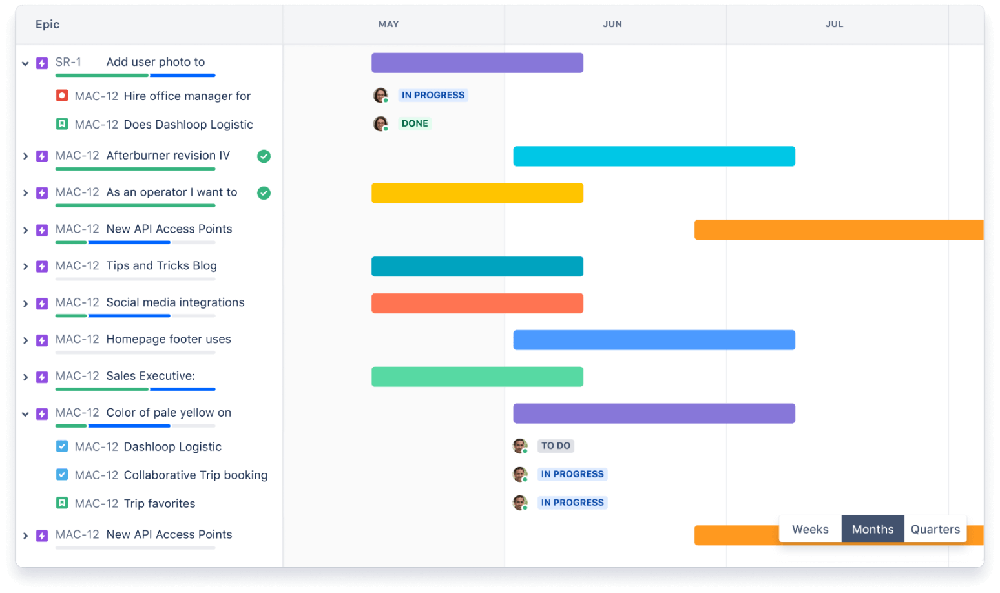

## Jira

Atlassian 社가 개발하고 운영하는, 애자일 방식의 협업을 돕는 협업도구

- **스크럼**, **칸반** 등 다양한 템플릿을 제공

## 용어 및 개념

### 스크럼

- 스프린트(Sprint)를 반복(Iterate)하며 소프트웨어를 개발하는 애자일의 대표적인 팀 개발 협업 프레임워크

### 스프린트

- 보통 1-2주를 단위로 목표를 설정해 정해진 스코프의 태스크를 수행하는 것
- 스프린트 중에는 팀원들이 각자의 업무에 집중할 수 있도록 서로 도울 것
	- [구글을 바꾼 시계](https://www.youtube.com/watch?v=olXHv2AOrzE)

***

### 데일리 스크럼

- 스프린트 중 매일 진척상황과 방해요소를 공유하는 짧은 미팅 (15분 가량)

#### 스크럼 마스터

- 스크럼을 관리하고 동료들의 스프린트를 지원하고 촉진, 방해요소를 제거하는 역할. PM과는 분리하는 것이 권장된다.

---

### 백로그

- 할일의 목록. 이슈(Issue)를 모아놓는 공간의 개념이다.

#### 이슈

Jira에서 주된 관리 요소로 삼는 '할 일'의 단위. 에픽, 스토리, 태스크, 서브태스크로 나뉨

- **에픽**: Epic. 최상위 단위. 일반적으로 개월 단위의 큰 프로젝트를 의미
- **스토리**: User Story. 사용자에게 필요한 기능 또는 요구사항. PRD의 항목과 대응되며 대체로 한 번의 스프린트 내 달성 가능한 규모와 난이도로 구성된다. 완료 시 미리 협의한 만큼의 스토리 포인트(Story Point)를 획득
	- 가상의 사용자를 주체로 하여 달성가능한 행동을 표현하는 문장으로 적는 것이 일반적
	- *사용자는 이메일을 사용해 비밀번호를 재설정 할 수 있다.*
- **태스크**: Task. 스토리를 달성하기 위한 세부 작업
- **서브태스크**: Sub-Task. 태스크의 하위 단위
