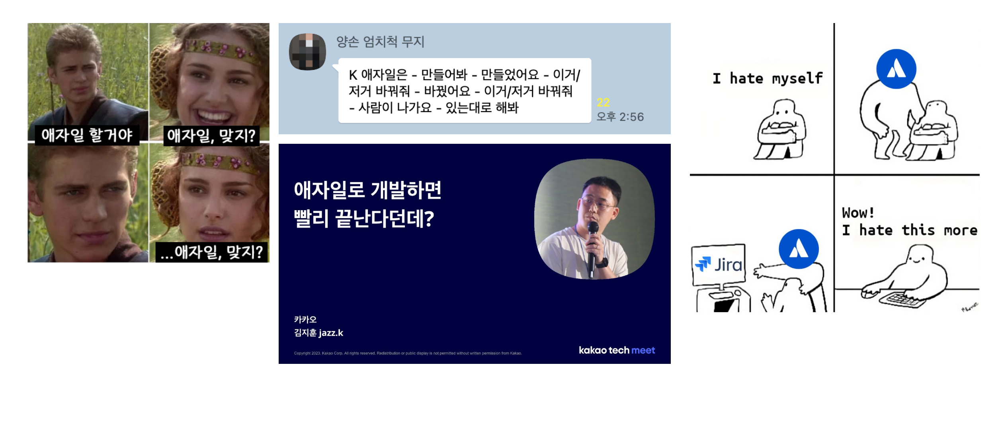

## K-워터폴 vs 더 밸리 애자일

## 비교

| 구분                | K-워터폴                              | 더 밸리 애자일                                      |
| ------------------- | ------------------------------------- | --------------------------------------------------- |
| **방식**            | 순차적, 단계별 진행                   | 반복적, 점진적 개선                                 |
| **계획 수립**       | 초반에 전체 계획 수립                 | 작은 단위로 유연하게 계획                           |
| **변경 대응**       | 변경에 취약, 계획 고수                | 변경에 유연, 고객 피드백 반영                       |
| **고객 관여**       | 초반 요구사항 정의 후 거의 없음       | 지속적 참여 및 피드백                               |
| **문서화**          | 철저한 문서화 중시                    | 최소한의 문서, 구두 커뮤니케이션 우선               |
| **진행 속도**       | 각 단계 완료 후 다음 단계 진행        | 빠른 프로토타입, 주기적 결과물 제공                 |
| **리스크 관리**     | 후반부에 문제 발견 가능성 높음        | 초반부터 리스크를 발견하고 대응                     |
| **품질 보장**       | 테스트는 개발 완료 후 일괄 수행       | 매 주기(Iteration)마다 테스트                       |
| **팀 구조**         | 역할과 책임이 명확, 계층적            | 다기능 자율 팀, 수평적                              |
| **적합한 프로젝트** | 명확한 요구사항, 변경이 적은 프로젝트 | 요구사항이 유동적, 빠른 시장 대응이 필요한 프로젝트 |

## 하지만 여기서 **K-애자일**이 등장한다면 어떨까

