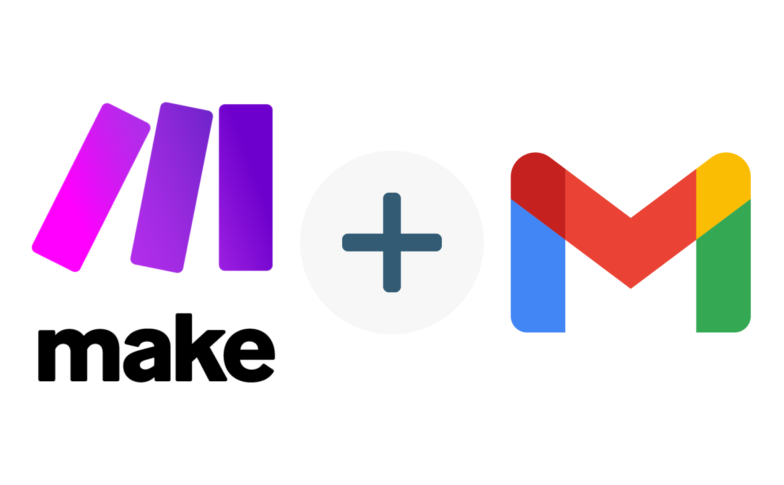

## Make와 G메일 연동

- 2025.10 이전, Make.com 에서 G메일을 연동하려면 Google Cloud Platform에서 프로젝트를 등록하여 G메일 API 사용신청해야 **했음**
	- 커스텀 Client ID와 Client Secret을 사용하는 방법으로 oAuth 로그인을 해야 함

> *지금은 그냥 oAuth로 로그인하면 됩니다!*

- [G메일과 Make 연동하기.pdf 참고](https://drive.google.com/file/d/1MJVbFbGLZGgr8ADDKMTgp1mm5N2cTQVE/view?usp=sharing)
	- [Make documentation](https://www.make.com/en/help/app/gmail)

