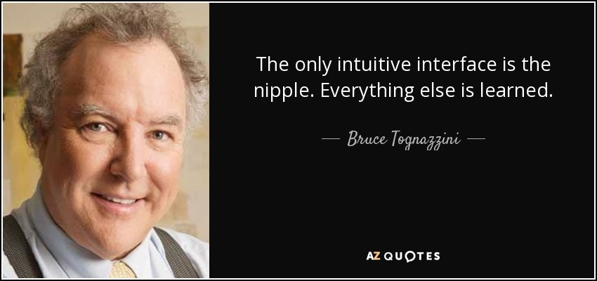
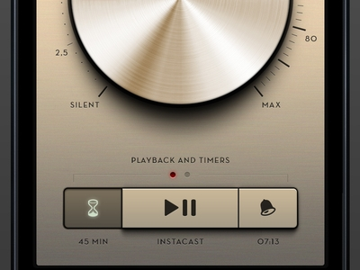

## UI/UX

- User Interface vs User Experience?
- 둘은 서로 대립하는 개념이 아님.
- UX는 [나중에](../notes/나중에.md)

### 직관

- 直觀, Intuition
- 보고 아는 것

---

### 직관의 우선순위

1. 내가 아는 것
2. 내가 아는 것과 닮은 것
3. 모르지만 왠지 알겠는 것
4. 논리적으로 알아챌 수 있는 것

## 어포던스

### Affordance

- 제임스 깁슨
- 행위자와 환경 사이의 관계에 존재하는 행동 가능성(possibility of action)
- 행위자가 인지하든 하지 않든, 어포던스는 존재함

---

### 지각된 어포던스 (Perceived Affordance)

- 또는 기표(Signifiant), 도널드 노먼
- 사회적/개인적 경험에 의해 만들어질 수 있음
- 의도적으로 설계되거나 우연히 만들어질 수도 있음

- [어포던스 - 위키백과](https://ko.wikipedia.org/wiki/%EC%96%B4%ED%8F%AC%EB%8D%98%EC%8A%A4)

***

### 어포던스의 응용

1. 이미지들의 선택과 허용가능한 상호 작용 양쪽에서 일반적인 사용법을 따르라.
2. 원하는 행동을 묘사하는 단어를 사용하라. 예를 들어 마우스로 클릭가능한 링크가 연결된 그래픽 오브젝트에 여기를 클릭라고 표시하는 것.
3. 메타포(Metaphor, 은유)를 사용하라.
4. 인터페이스를 학습한 이후 이것을 다른 부분에 활용할 수 있도록 지속적으로 같은 컨셉 모델을 따르도록 하라.