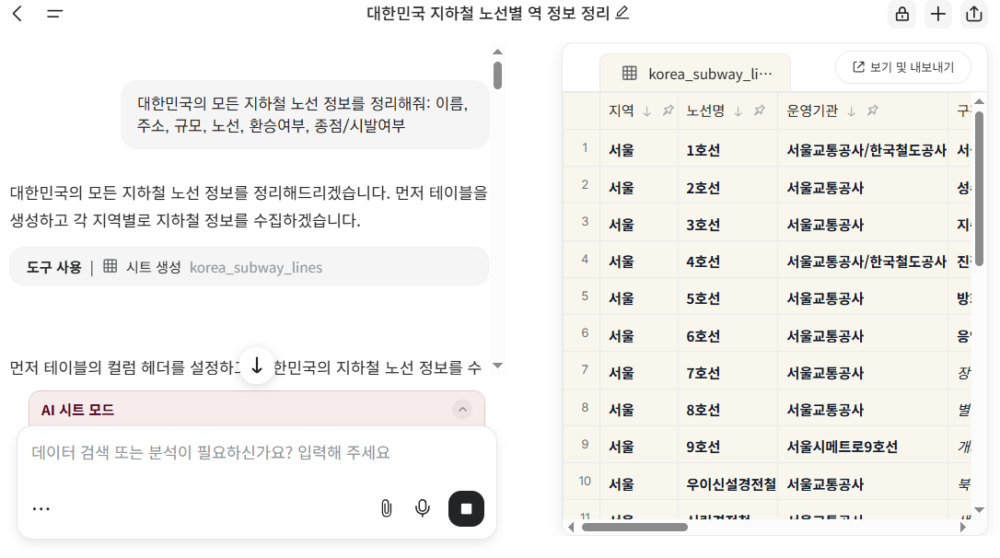
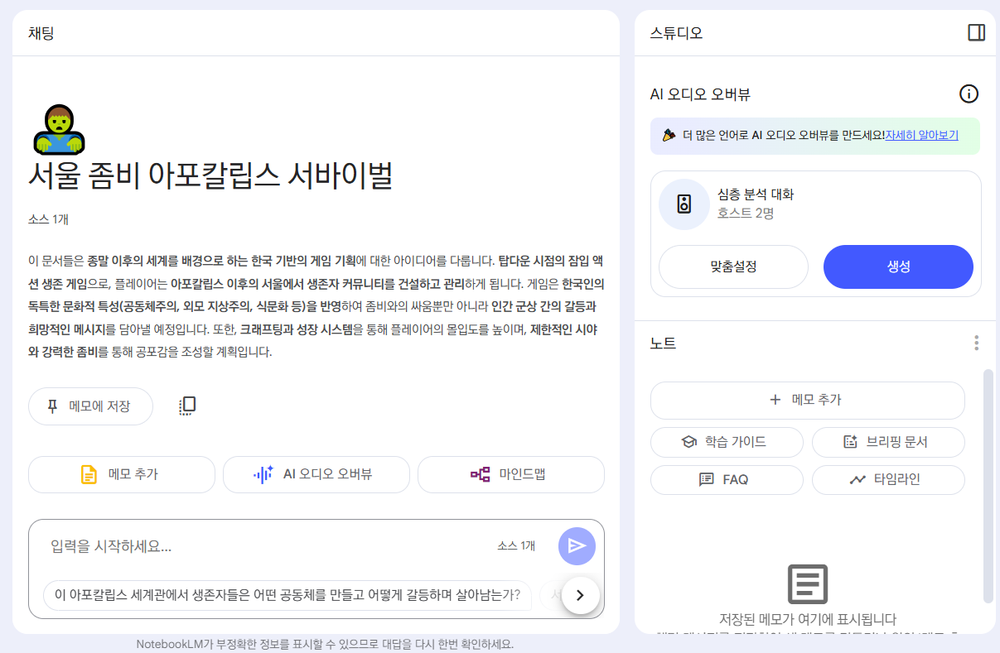
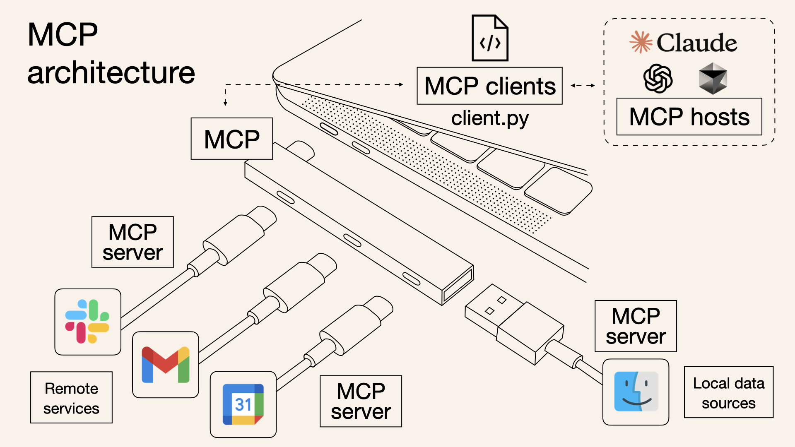
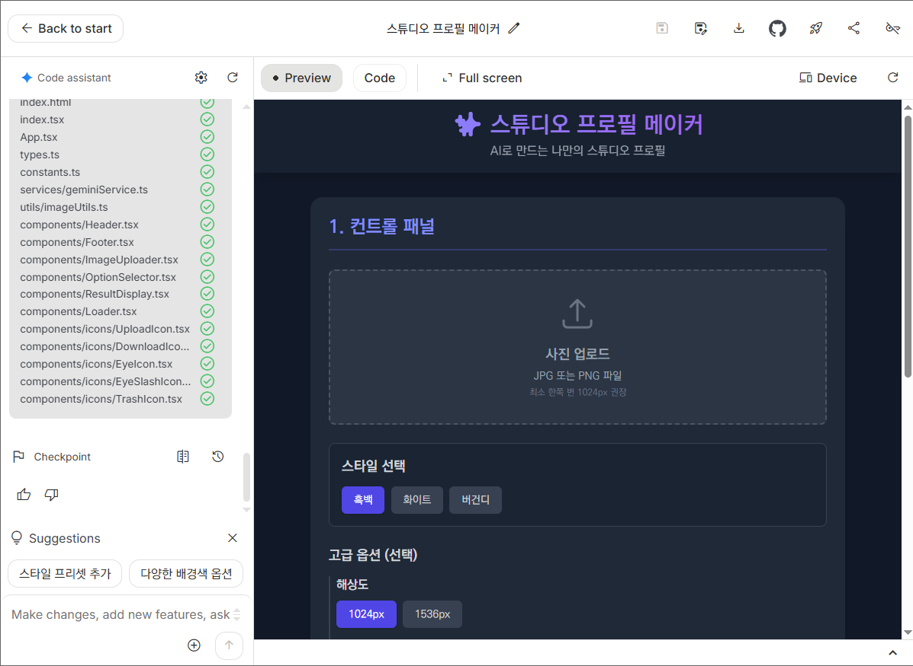

## [Genspark.ai](https://www.genspark.ai/invite_member?invite_code=YzBkN2EzMDJMYTFmZExiNDhlTGE3MGRMY2M1N2NkODg0MjE2)

MoA(*Mixture of Agents*) 라고 부르는 기술을 사용해 여러 에이전트와 빠르게 소통하며 고품질의 정보를 생성하는 **슈퍼 에이전트** 기능을 대표로 가진 AI 서비스 (2025.4)

### Agents

- AI 슬라이드: `pptx` 또는 `html` 형식으로 된 발표자료 작성
- [AI 시트](https://www.genspark.ai/agents?id=de55b136-3ca6-41f2-afb3-cb073c1c693c): 검색을 통해 데이터를 스프레드 시트 형태로 정리
- AI 통화 비서: 요청하면 에이전트가 목적을 달성하기 위해 사람과 통화하여 결과를 남김

## NotebookLM

구글 Gemini를 사용해서, 주어진 자료에 집중 한정하여 RAG를 수행하고 정보를 정리하는 서비스

- `PDF`, `txt`, `Markdown`, `MP3` 오디오, 구글 드라이브 문서, 웹사이트, Youtube 등의 다양한 포맷 지원
- 주어진 자료 외에서 정보를 생성하는 **환각 현상 최소화**
- 팟캐스트 생성 기능
- 친구 공개 또는 전체 공개 등으로 공유 가능
- [서울 좀비 아포칼립스 서바이벌](https://notebooklm.google.com/notebook/dbf52a76-e468-4a5f-a88b-4a667c0f6435?original_referer=https:%2F%2Fnotebooklm.google%23&pli=1)

## MCP

LLM이 다양한 기능에 접근할 수 있도록 만든 규칙과 인터페이스. Anthropic 제안 *Model-Context Protocol*

- 이를 통해 LLM이 자신의 판단에 따라 브라우저를 조종하거나, 컴퓨터의 파일을 열어보거나, 다른 애플리케이션을 조작하거나 다른 온라인 서비스에 접근하는 등의 확장된 의사결정과 수행을 할 수 있으며
	- 이를 **도구(Tool)** 라고 부름
- 현재 Claude Desktop 및 Cursor 에서 사용가능
- [구글 A2A(Agent 2 Agent) 발표](https://developers.googleblog.com/ko/a2a-a-new-era-of-agent-interoperability/)

## Make, n8n

- 백엔드 자동화를 위한 도구. *사용자의 직접적인 개입이 없어도* 동작해야 하는 자동화 워크플로우를 작성하고 수행
- API를 사용해 ChatGPT, Claude, Gemini와 같은 LLM에 접근할 수 있고 이를 통해, 이메일 자동화, 사무 자동화, 챗봇 등 다양한 애플리케이션을 개발
- 코드를 전혀 사용하지 않거나 최소한의 코드를 사용해 강력한 확장성

## Google AI Studio

- 구글 Gemini 관련 기능을 테스트하거나, API 키를 관리할 수 있는 간단한 도구
- `nano-banana` 또는 Build Apps with Gemini 등 자유롭게 테스트해볼 수 있고 무료

## Google Stitch

- 디자인을 제작해주는 