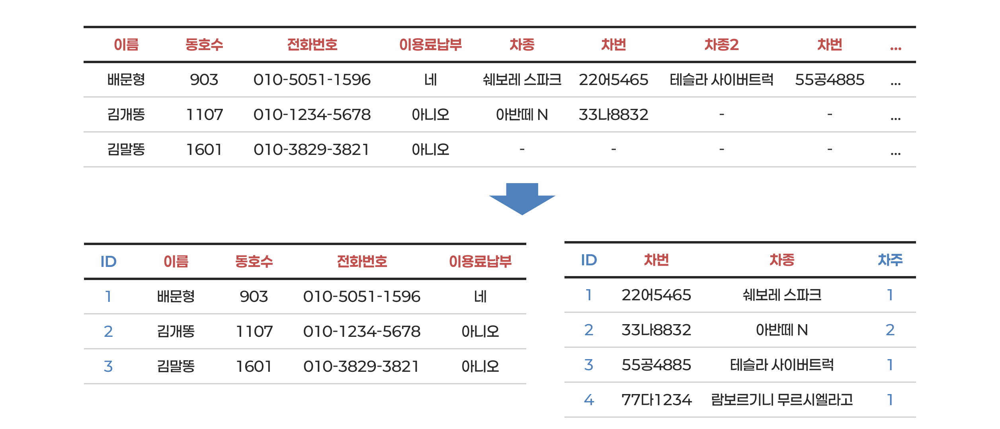

## 데이터베이스

- 데이터베이스는 *말하자면 엑셀 시트와 같다.*
	- 행(Rows)으로는 단일 개체(Entity, 엔티티)에 대한 정보를
	- 열(Columns)로는 그 엔티티들의 특정 속성 값을 적는다.
	- 하나의 열은 동일한 타입의 값이 들어가야 한다.
- 즉 하나의 데이터베이스는 같은 성질을 가진 **엔티티의 집합**이 되고, 이것을 **테이블**(Table)이라고 한다. 
	- 회원의 테이블, 상품의 테이블 등등..

---

### 예를 들면

- 헬스장의 회원 목록이 있을 수 있다.
	- 이 목록을 테이블(Table)이라 부르고, 테이블이 대상으로하는 회원이라는 개념을 개체(Entity, 엔티티)라고 부른다.
- 한 줄 한 줄, 즉 하나의 행은 한 명의 회원에 대해 적는다.
	- 이 한 줄을 엔트리(Entry)라고 부른다.
- 한 명의 회원은 이름(텍스트), 전화번호(텍스트), 생년월일(날짜), 가입일(날짜) 등의 정보를 가지고 있다. 
	- 이들을 필드(Field)라고 부른다. 
	- 즉 데이터베이스의 열은 한 가지 타입으로 되어있으며 *엔티티의 하위 정보이다.* ≒ **프로퍼티**(Property)

## 관계형 데이터베이스

- 아파트 주차장 차단기를 자동으로 올리고 내리기 위해 두 데이터가 필요한 상황
	- 진입하는 차량의 차 번호
	- 차 주인의 입주민 여부 및 주차장 이용료 납부 여부
- 다음과 같은 엔티티를 주제로 하는 두 개의 테이블이 있다고 할 때
	- **차량**: ID(text), 차번(text), 차종(text) 등의 필드
	- **입주민**: ID(text), 이름(text), 생년월일(datetime), 동호수(text), 이용료 납부 여부(boolean)
- 차량의 필드에 '입주민ID'와 같은 필드를 만들어 해당 주민의 ID를 기록하면
	- 차량이 진입할 때 번호를 통해 입주민을 찾아낼 수 있다
- 이렇게 ID를 기준으로 여러 테이블을 관련지어 특정 목적을 위한 정보체계를 만들어내는 방법을 **관계형 데이터베이스**(RDBMS, Relational DataBase Management System)라고 한다.

---

