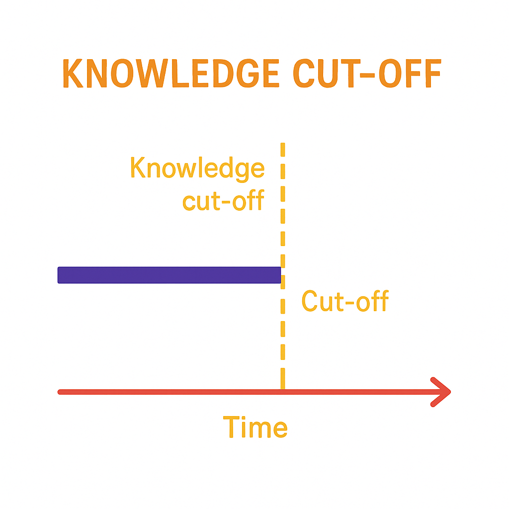

## 왜 내 GPT는 대답을 이상하게 할까?

### Knowledge Cut-off

- LLM은 특정 시점까지의 데이터를 학습하고 있기 때문에, 그 이후에 일어난 일은 잘 모름
- 이를 Knowledge Cut-off라 하며, RAG 등을 사용해 데이터를 보강하는 것으로 해결할 수 있다

---

### 환각 현상

- 환각은 LLM의 오류가 아닌, LLM의 태생적 한계
	- 우리는 LLM과 대화를, 혹은 질문을 하는 것이 아님. LLM이 단지 우리가 만들어놓은 몇 단어를 토대로 글을 완성시키는 것뿐.

> 대형언어모델(LLM)은 확률적 정보에 따라 방대한 훈련 데이터에서 관찰한 언어 형식의 시퀀스를 우연히 꿰맞추는 시스템이다. 의미를 되새길 필요없는 확률론적 앵무새(Stochastic Parrots)다. ***- 에밀리 M. 벤더, 언어학자***

### 질문이 잘못됨

- 우리는 자신에 대한 기대와는 달리 비논리적이며, 의사소통에 게으르다.
- 동문서답, "맛집 알려드릴까요?"

---

### 챗봇의 기억력

- LLM을 구동하는 데에는 많은 자원이 필요하며, 대화가 길어지면 긴 대화를 처리하기 어려워함
	- [Exposing pre-prompt](https://www.reddit.com/r/ChatGPT/comments/12fnqhd/exposing_preprompt/?rdt=53762)
	- [Gaslighting AI into 2+2=5](https://www.youtube.com/watch?v=3wlvNfTNgB8)

### 맥락에 대한 컨트롤

- 대화의 맥락은 마치 미로를 탐색하는 것처럼 선형적 구성을 따르기 때문에 
- 원하는 결과를 얻기 위해 *대화의 맥락을 컨트롤할 필요가 있고*, 
- 맥락이 오염된 경우 아예 새로 시작하는 것이 좋음. 

---

### AI 윤리

- 생성형 AI의 출현과 함께 야기된 딥페이크 등의 AI 윤리 위반에 대해 대부분의 상용 AI들은 비윤리적 답변을 통제하고 있음
	- 가짜 뉴스
	- 딥페이크
	- 반인륜적 주제
- 이러한 제한사항은 탈옥(Jailbreak)이라 불리는 적대적 프롬프팅에 의해 해제되기도 함
	- 개발자가 LLM을 완전히 통제할 수 없기에 일어나는 일

## 생성형 AI를 대하는 올바른 태도

- 태생이 '다음 단어를 예측하는 알고리즘'인 LLM은 **애초에 정답을 말할 의무가 없음**
- 단순히 확률이 높은 패턴으로 글, 그림을 배치하니 그것이 사람이 보기에 말이 되는(make sense) 것처럼 보일 뿐
- 말이 되는지, 진실에 가까운지 판단하는 것은 오로지 인간의 몫. **비판적 태도**를 가지고 보자

### 인간 언어의 해상도 문제

- 인공지능이 사용하는 언어 '벡터'는 *인간 언어보다 해상도가 훨씬 높다.*
- 따라서 프롬프트(인간 언어)에 명시된 심상을 컴퓨터가 결과물로 내놓고자 할 때 비어있는 부분을 컴퓨터가 자의적으로 채우는 과정이 필연적
- 따라서 표현된 결과물의 방향성, 디테일, 사실성 등은 매 실행마다 천지차이가 되므로
	- 원하는 결과를 얻기 위해 **여러 번 반복**하며 랜덤성에 기대는 것이 기본적인 전략
	- 그럼에도 프롬프트는 결과를 유의미하게 한정할 수 있는 유일한 방법