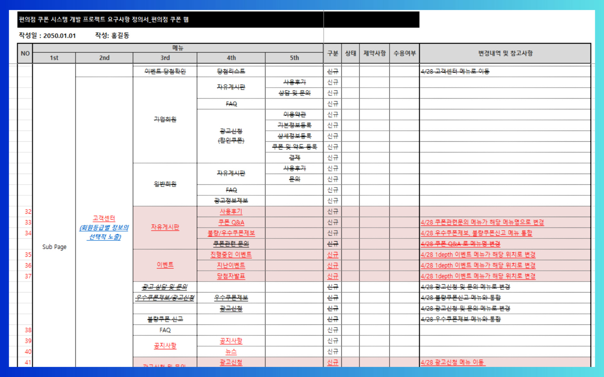

## 요구사항 정의서

*Product Requirements Document.* 줄여서 **PRD**

- 완성된 IT 프로덕트가 가져야하는 요구조건을 적어놓은 문서. 
- 한국어로 **요구사항 정의서**
- 키드린의 법칙(Kidlin's law):
	- *"If you can’t write your problem down clearly, you don’t understand it"*
	- 문제를 명확하게 적어낼 수 없다면, 당신은 그걸 이해하지 못한 것입니다

### Spec-Driven Development



---

### Figma's Approach to PRDs

PRD에 대한 해석, 관습은 조직에 따라 다르지만 [피그마의 PRD 접근방식](https://m00nlygreat.notion.site/Figma-s-Approach-to-PRDs-23296ccfa44080c4aabce301feb892c0)을 참고해보자.

***

- **문제 정의**
	- 해결하려는 문제를 설명
	- 잠재 고객, 사용자에 대한 설명
- **솔루션 정의**
	- 솔루션을 한 눈에 볼 수 있는 도식 제공 
		- Userflow, Journey map 등
	- 기능적 요구사항
- **출시 준비**
	- 제품 출시 마일스톤
	- 출시 준비 체크리스트

## 실시간 라이브 강의 보조 인터랙션 플랫폼의 요구사항

#### ...(전략)

```markdown
### 회원

- 세션 설정에 따라 비회원도 수업에 참여할 수 있다.
	- 일단 랜덤한 한국어 닉네임이 부여되며, 수정할 수 있다
	- 수업이 종료되기 전 가입 및 로그인하면 비로그인 상태의 참여데이터가 보존된다.

### 세션

- 세션은 1회의 강의에서 사용할 수 있는 수업의 인스턴스이다.
	- 강의자가 개설하고 공개/비공개/로그인 필수 여부를 선택할 수 있다
- 채팅 / 칸반 / 설문 / 미니 프로젝트 / 퀴즈 등을 생성할 수 있다
```

***

```markdown
### 클래스

- 반복적으로 세션을 개설할 수 있는 멤버의 집합이다.
- 강의자가 개설할 수 있으며
- 수강자는 로그인이 필수

### 미니 프로젝트

- 미니 프로젝트는 세션 당 여러 개를 생성할 수 있다.
- 세션에 참가한 수강자들이 프로젝트에 대한 실습 결과를 제출할 수 있고, 마감 전까지 수정 가능
- 강의자가 수강자들의 제출 상태를 한 눈에 볼 수 있는 대시보드를 제공한다
```

#### (후략)...