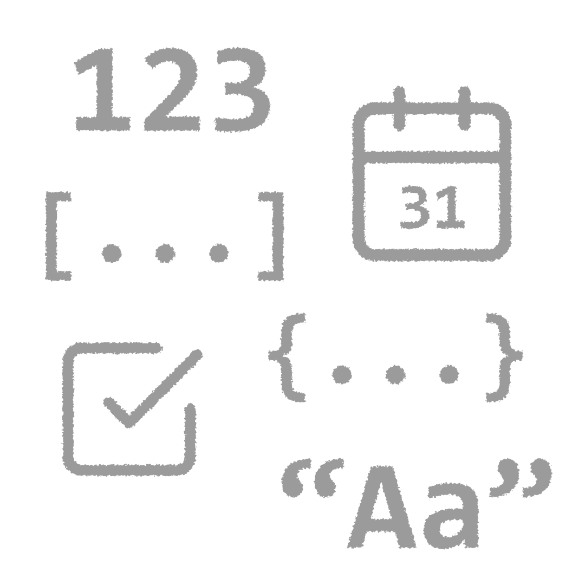
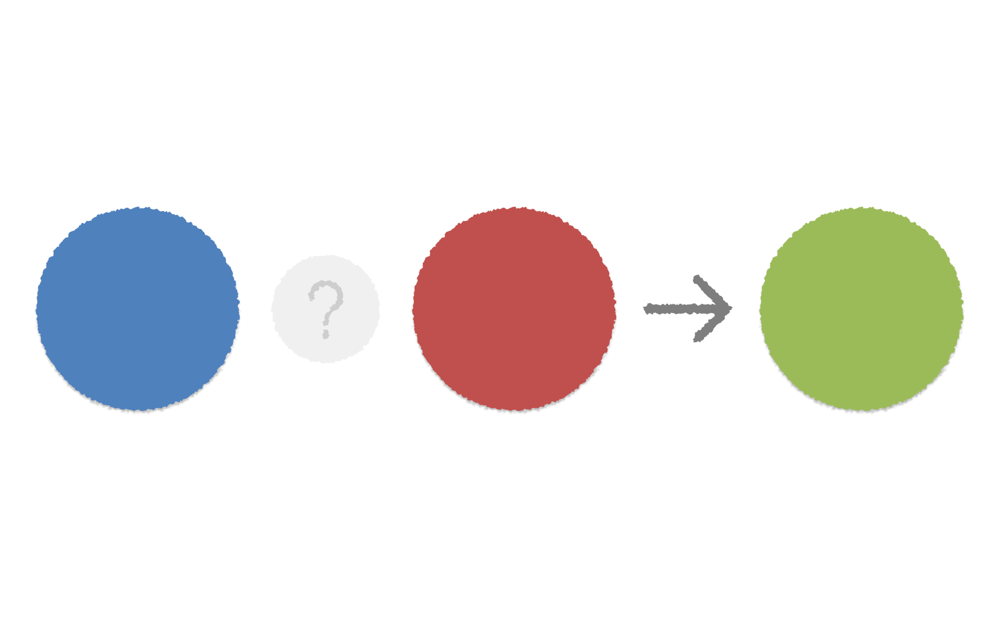

## 타입(Types, 유형)

### 데이터는 타입과 값으로 이루어져 있다.

- 정보의 유형, 종류
    - 숫자와 텍스트, 불리언
    - 날짜, 지리적 위치 등 복합적인 정보 형태
    - 리스트, 객체, 함수 등

#### 타입이 같으면, 연산을 할 수 있다.

= *타입이 다르면, 연산을 할 수 없다.*

### 값(Values)

- 정보(데이터)의 최소 단위
    - 타입을 가짐
- **타입**은 텍스트고 **값**은 `"강아지"`야

## 연산(Operations)

#### 1. 두 개의 정보(값)을 연산자(Operator)를 사용해 하나로 만드는 것.
#### 2. 이 때 `두 개`와 `하나`는 타입이 같다.

- **사칙연산**
	- 더하기, 빼기, 곱하기, 나누기
- **비교연산**(Comparison Operation)의 경우는 결과값이 항상 *불리언* 타입으로 나옴.
- **Join 연산**: 텍스트끼리 이어붙이는 것

## 타입의 종류

### 숫자(Number)

- 어떤 것의 **양**(amount)에 대한 정보
	- Integer (정수)
	- Float (소수)
	- Double

#### 날짜와 시간(Datetime)

- 내부적으로 숫자로 처리됨.
	- 엑셀과 구글 시트의 경우 `1899-12-30` 부터 하루를 1로 쳐서 지난 시간을 날짜와 시간으로 관리
	- 노션과 대부분의 개발 언어에서는 *Unix Timestamp*를 사용.

---

### 텍스트(Text)

- 문자의 나열, 순서
- `"강아지", "컴퓨터", "나비"`
- `"동해물과 백두산이 마르고 닳도록"`
	- 대부분의 프로그래밍 언어에서 따옴표(`"`) 또는 작은 따옴표(`'`) 또는 백틱 문자(`\``)를 사용해 표시한다

---

### 불리언(Boolean, Bool)

- 모 아니면 도 형태의 데이터. *기면 기고, 아니면 아니고.*
	- Yes / No
		- Bit
	- `True` or `False`
	- 참 또는 거짓
	- `1` 또는 `0`
- _**어중간함**을 용서하지 않는_ 무자비한 타입이다.

---

### 리스트(List), 배열(Array)

- 단순한 타입이 여러 개 있는 타입
- 리스트의 타입은 한 종류여야 합니다. **아마도**
	- `[1, 2, 3, 4, 5, 6, 7, 8, 9, 10]`
		- *숫자의 리스트*
	- `[”강아지”, “새”, “컴퓨터”]`
		- *텍스트의 리스트*

***

- **리스트의 연산**이 있다면?
	- 리스트끼리 더하기(*Join*)
	- 리스트에서 겹치는 것만 남기기(*Intersect*)
	- 리스트끼리 안 겹치는 것만 남기기(*Exclude*)
- 리스트는 **1차원 배열**
- 프로그래밍에서 무언가를 **반복**하는 데에 사용된다.

---

### 행렬(Matrix)

- 한 가지 타입을 가진 배열, *근데 이제 모양(Shape)을 곁들인*
- 모양(Shape)
	- 3행 5열, 5행 2열과 같은 2차원 형상을 만들기 위한 행렬의 크기를 나타내는 데이터
	- 이 경우 모양은 숫자의 리스트 `[3,5]` 형태의 데이터
- 구글 시트에서는 범위(Range)가 바로 행렬에 대응됨
	- `[[1,2,3],[4,5,6],[7,8,9]]`
	- `={1,2,3;4,5,6;7,8,9}`

---

### **객체**(Object)

= **엔티티**(Entities, 개체)
- 프로퍼티를 갖는 것.

***

### 프로퍼티(Properties, 속성)

- 질문과 답변의 형태로 정리된 *객체의 하위 정보*
    - Key and Value (키와 값)
	- *답변은, 값이므로 타입을 가지고 있고*, *타입을 가지고 있기 때문에 연산이 가능*
		- 즉, 프로퍼티는 현실에 존재하는 사물이나 현상을 **연산가능한 형태**로 만들기 위해 사용하는 것

## 그 밖의 연산

- 비교연산: `>`, `<` , `=`, `<=`, `>=`, `<>` 또는 `!=`
	- 비교연산자를 사용해 Boolean 타입의 값, 즉 `참 또는 거짓`의 값이 나오는 연산
- 논리연산:
	- and
		- `TRUE` and `TRUE` => `TRUE`
		- `FALSE` and `FALSE` => `FALSE`
		- `TRUE` and `FALSE` => `FALSE`
	- or
		- `TRUE` or `TRUE` => `TRUE`
		- `TRUE` or `FALSE` => `TRUE`
		- `FALSE` or `FALSE` => `FALSE`

## JSON

JavaScript Object Notation. 자바스크립트의 객체 리터럴을 독립시켜 하나의 데이터 형식