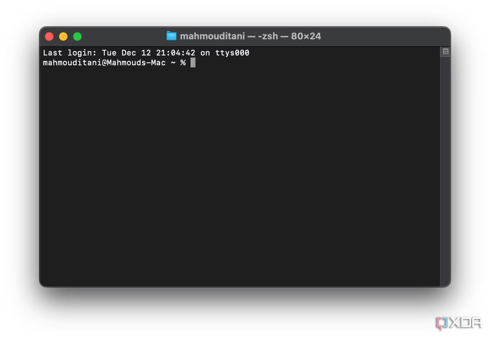
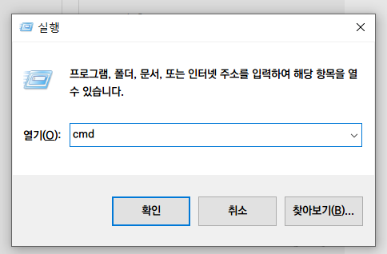
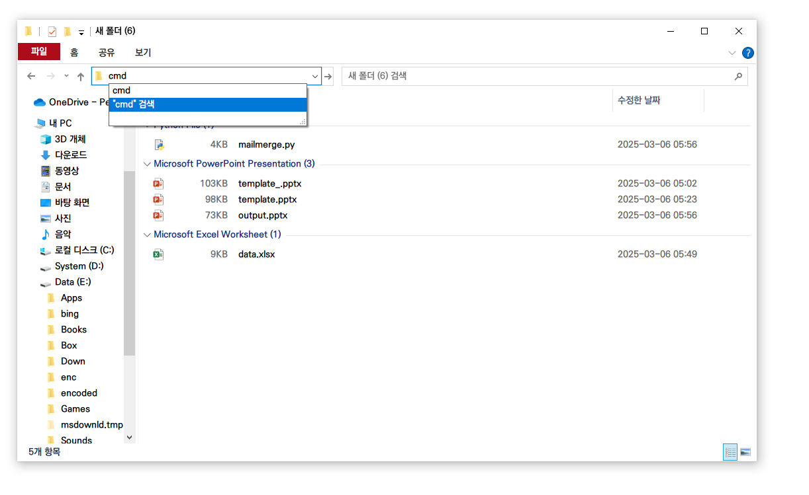
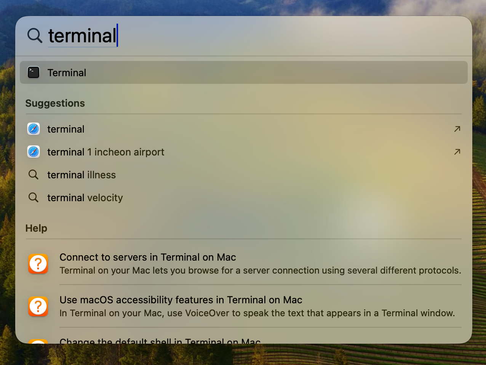
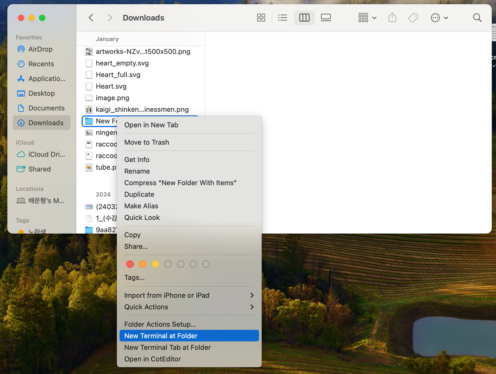

## 터미널이란?

- GUI와 반대되는 CLI(Command Line Interface)로 컴퓨터를 조작하기 위한 도구

> 우리가 지금까지 쓰던 것은 이것의 껍데기였다!

### 경로(Paths)

- 파일과 폴더 구조로 되어 있는 시스템 저장소의 위치를 나타내는 표현

- Windows
	- 드라이브 루트(`C:\`)로부터 시작
- Mac/Linux
	- 루트 (`\`)



## 터미널 실행하기

### Windows

- 시작 메뉴 - 명령 프롬프트
- 탐색기에서 경로창에 `cmd` 또는 `powershell.exe`
- `Win + X` 후 `I` 또는 `A`
- `Win + R` 후 `cmd` 또는 `powershell`

### Mac

- Spotlight(`Cmd - Space Bar`) 에서 `terminal` 검색 후 실행
- Finder에서 폴더를 우클릭하고 '폴더에서 새로운 터미널 열기' 실행



---



---



---



## 명령 실행하기

### 경로를 이동하기

```ruby
CD [경로]
```

> .. 상위 폴더로 이동


### 폴더 안의 내용 확인하기

```ruby
LS
```

> 또는 Windows 한정 `DIR`

***

### 명령 실행하기

```ruby
명령어 [파라미터1] [파라미터2] ...
```

### 터미널 종료

```ruby
EXIT
```