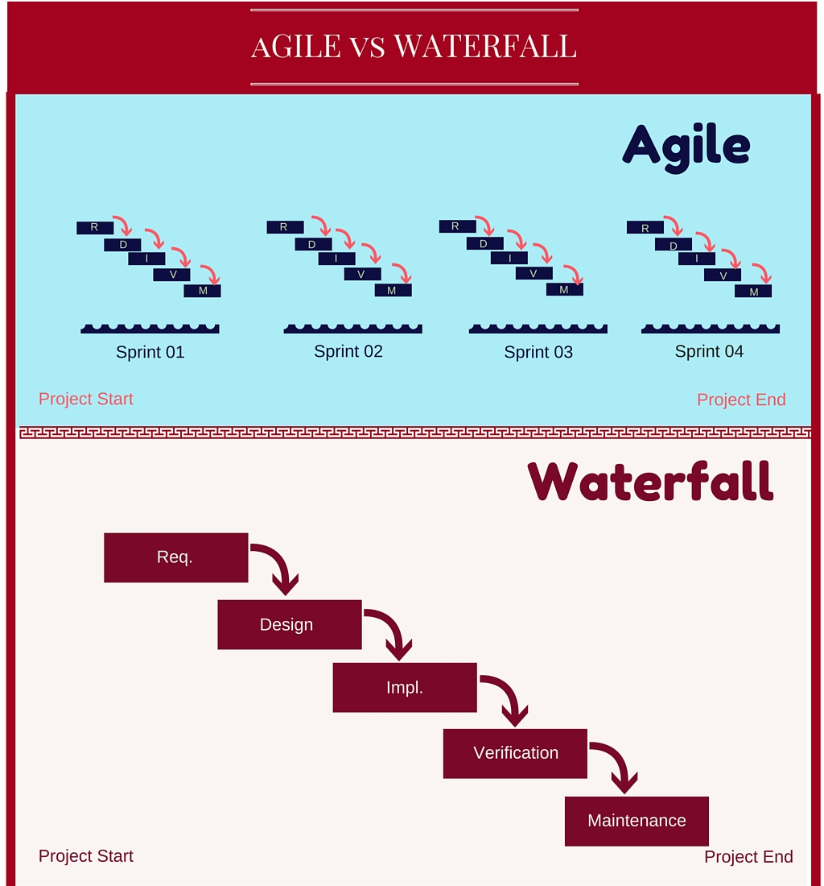
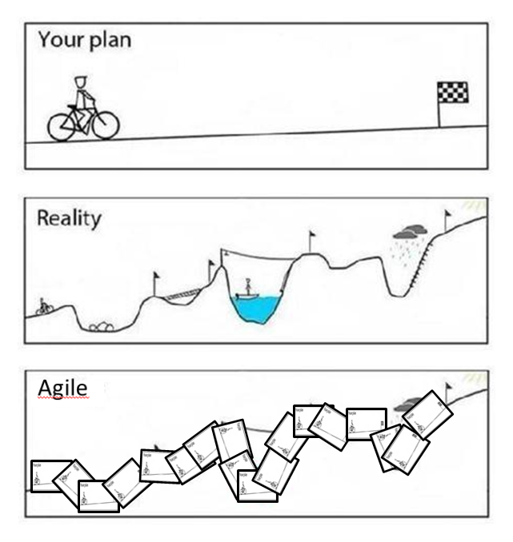
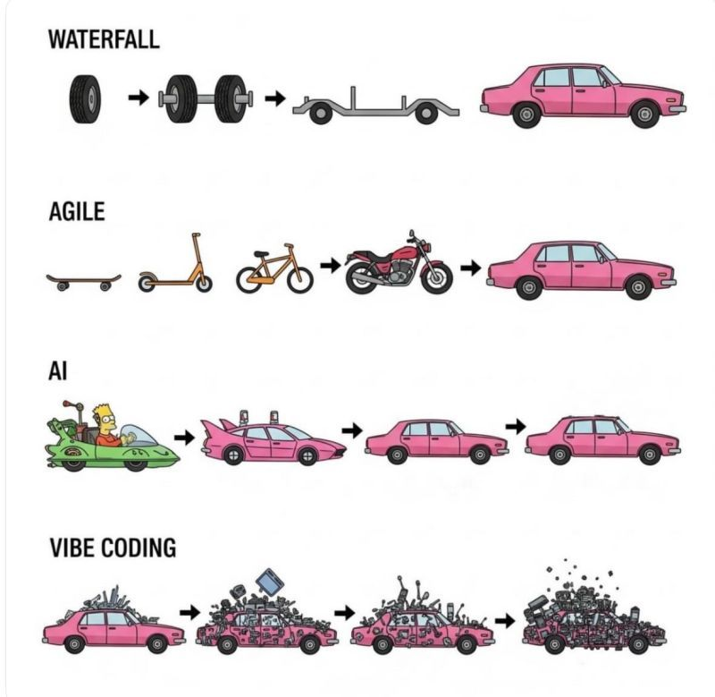
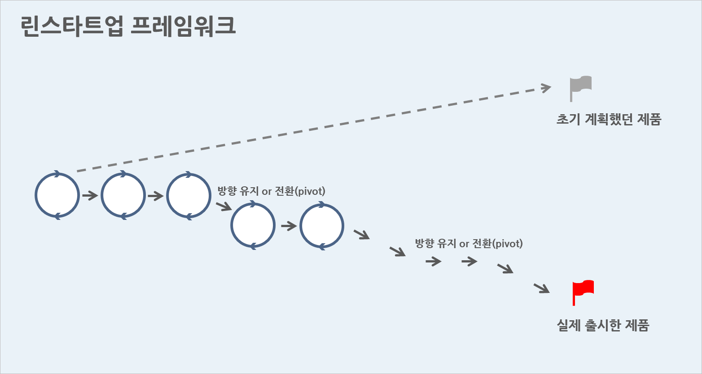

## 소프트웨어 개발 조직의 성격

- 전통적, 한국적 방법: 여러 문서와 워터폴 방식을 따르는 조직
- 스타트업, 해외 유래: 프로토타입과 TDD 위주의 애자일 조직

## 애자일과 워터폴

- [애자일 소프트웨어 선언](https://agilemanifesto.org/iso/ko/manifesto.html)
- 빠른 주기로 프로덕트의 개발을 반복하며 매 주기마다 동작하는 프로토타입을 전달, 빠른 피드백을 통해 완성품의 품질을 높여가는 소프트웨어 개발 방식

---

---

## 린 스타트업

- MVP를 위주로 빠르게 가설을 검증하고 피봇(Pivot)을 통해 Product-Market Fit을 찾아가는 창업 프레임워크
- Build -> Measure -> Learn의 구성을 따름
- [프로그래밍 좀비님의 이야기](https://www.youtube.com/watch?v=XYR2-_H4PzI)

---

### MVP

- Minimum Viable Product, 최소 기능 제품
- 문제를 해결하는 최소한의 제품 구성
- 프리토타입(Pretotype)
	- "**Fake it** till you make it"
	- [유의미한 실패는 성공의 어머니, 프리토타입](https://blog.wishket.com/유의미한-실패는-성공의-어머니-프리토타입pretotype/)

### 피봇(Pivot)

- MVP 등의 실험으로부터 얻어진 것을 통해 인사이트를 도출하고 제품 또는 문제, 타겟 등을 수정하여 새로운 전략을 도출하는 것

---

