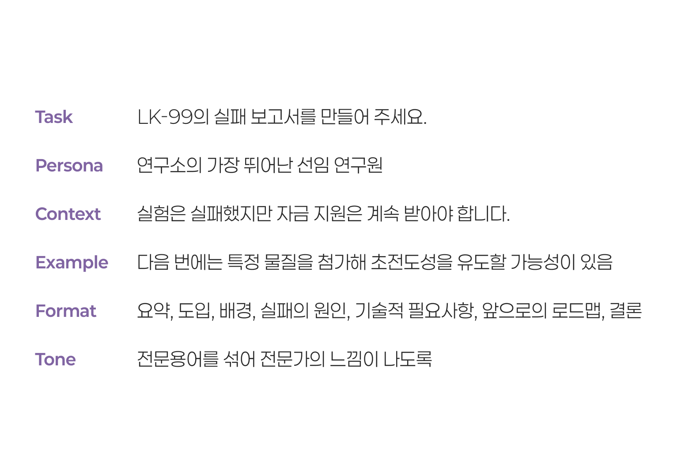

## 프롬프트 엔지니어링

- *프롬프트* 란 언어모델과 대화할 때 사용자의 요청, 질문을 말함. 언어모델이 학습된 데이터를 가지고 글을 생성하기 위한 시작점과 방향이 된다
- *프롬프트 엔지니어링* 은 언어모델이 좀 더 의도에 맞는, 좋은 품질의 답변을 내놓도록 이 프롬프트를 조절하는 것

### 미래의 유망직종?

- LLM 초창기, 프롬프트 엔지니어가 AI 시대의 유망직종처럼 생각되었지만 LLM의 성능이 빠르게 발전함에 따라 사용자의 의사를 더욱 정확하고 빠르게 이해할 수 있게 되면서 일부 LLM 연구자의 업으로 남게 되는 추세에 있음
	- 그러나 현시점 ChatGPT를 더욱 강력하게 사용하기 위해서는 프롬프트에 대한 이해가 어느정도 필요
	- [프롬프트 엔지니어 회의론 증가](https://www.aitimes.com/news/articleView.html?idxno=158070)

## 프롬프트 잘 쓰기

- 프롬프팅을 잘하는 것은 **대화를 잘하는 것**에 가깝다.

### 대화를 잘 한다. 라는 것

- 상대방의 의도를 이해하고, 나의 의도를 오해없이 전달하는 것
	- '경청'의 중요성
		- 다행히도, 언어모델은 우리의 말을 *아주 잘 듣는다*
- 맥락과 의도를 설명하는 충실함.
	- 내가 당연히 알고 있는 것들에서 벗어나 상대가 파악한 수준을 고려하기
	- 즉 대화를 잘 한다는 것은 '태도의 문제'라고 볼 수 있음.


---

### 프롬프트의 필수 요소들

- *Task* 무엇을 해야하는지
- *Context* 어떤 상황인지
- *Persona* 어떤 역할이 되어야 하는지
- *Example* 예시로는 어떤 것이 있는지
- *Format* 어떤 형태로 작성해야 하는지
- *Tone* 어떤 어조를 사용할 것인지



---

#### Before

```
"LK-99의 실패를 보고하는 보고서를 작성해줘"
```

#### After

```
"상온 상압 초전도 물질 LK-99의 개발 실패를 보고하는 보고서를 작성해줘. 너는 세계 최첨단 수준의 연구를 진행하는 연구소의 가장 유능한 시니어 연구원으로서 LK-99의 실패에 대한 보고서를 작성해줘야해. LK-99는 실패했지만 우리 연구소에 지원되는 자금에 영향은 없어야 하므로 앞으로의 연구를 계속해야 한다는 뉘앙스를 띠어야해. 물론 그러한 의도는 숨겨야 하고. 예를 들면 다음 번 연구에서는 어떤 물질을 더 첨가해서 초전도성을 띠도록 유도할 수 있을지도 모른다는 예측을 추가해서 설득력을 높일 수 있어. 답변은 요약, 도입, 배경, 실패의 원인, 기술적 필요사항, 앞으로의 로드맵, 결론 등의 항목을 중심으로 전문용어를 섞어 전문가처럼 보이도록 설명해주면 좋겠어."
```

- [LK-99 보고서](https://chat.openai.com/share/ff2be24f-2f7e-4f65-91ad-6a3386de3106)

---

### 스무고개형으로 질문하기

- 대화 중심으로 프롬프팅을 완성해가는 방법
	- 맥락을 바꿔버리거나 너무 일관성 없는 대화를 하나의 스레드에서 다루지 않도록 주의
	- 잘못된 답변 역시 입력으로 다시 들어가기에, 잘못된 답변을 놔두고 계속 맥락을 이어가면 안 됨.

- 사내 의사결정을 위한 보고서 작성

```
"고향만두는 오랫동안 사람들에게 사랑받아왔지만 그만큼 낡은 이미지를 가지고 있어. 최근 점보 육개장, 점보 크림빵과 같은 유행에 발맞추어 점보 고향만두를 출시하려고 계획 중에 있는데, 이사회를 설득하기 위한 주장과 근거를 만들어줘."
```

> GPT는 점보 상품이 바이럴 마케팅용이라는 것을 모를 가능성이 높다.


---

### '가스라이팅'

언어모델을 다그치거나 회유하는 어조를 사용해 답변 결과의 품질을 높일 수 있다는 연구결과

- *협박하기, 도발하기, 강조하기, 애원하기, 보상하기/벌하기*

> '딥시크는 할 수 있던데? ㅋ'

- 그러나 **미안해하거나 고마워하는 등 저자세를 취할 경우** 오히려 답변 품질이 낮아질 수도 있다고 한다.


---

### few-shot

- 예시를 밝혀 답변의 구조 또는 여러 측면을 제한하는 방법
- 언어모델이 어떤 지시사항의 자세한 의미를 파악하거나 추론하기 위해 연산력을 사용할 필요가 없게되어 답변의 품질이 높아진다. 
- [일정 묻기](https://chat.openai.com/share/a74f8ea7-9f7a-43f0-8bdc-4dbfb86cd3ba)


---

### chain-of-thought

- 연쇄적 사고. 단계를 풀어헤쳐 자연스럽게 답을 유도하기
	- *step by step*과 같은 키워드를 써주는 것만으로도 답변의 품질이 높아질 수 있다.
	- 의식적으로 단계를 지정해주고 사용자의 '다음' 키워드 입력으로 넘어가도록 지시해서 각 단계에 언어모델이 집중하도록 유도할 수 있다.


---

### '해줘'

목적을 제시하고, 이를 위한 정보를 GPT가 사용자에게 질문하게 하여 맥락을 채워나가는 방법


- "다음 두 개 프로젝트 중 하나를 골라서 다음 주 임원 회의에 기획안을 제출해야 해. 둘 중 하나를 선택하는 데에 도움을 줄래? 필요한 것들을 나에게 물어봐 줘"
	1. 점보 고향만두 출시
	2. [첵스나라 대통령 선거](https://namu.wiki/w/%ED%8C%8C%EB%A7%9B%20%EC%B2%B5%EC%8A%A4%20%EC%82%AC%EA%B1%B4#s-3.2)

- [프로젝트 선택 도움](https://chat.openai.com/share/614216da-4661-4eae-9518-c6cb5140e80f)
- 우리가 처음 언어를 배울 때 자신의 필요만을 얘기하는 것처럼. 주도권 자체를 GPT에게 줘버리기

```
"이 결과가 맘에 들어. 다음에 다른 텍스트로도 동일한 결과를 낼 수 있도록 너에게 보낼 프롬프트를 작성해줘"
```

## 프롬프트 구조화

- LLM이 Context Window 안에서 **중요한 부분에 좀 더 집중**하게 만들거나 **문장 그대로 사용**하도록 유도하기 위해 