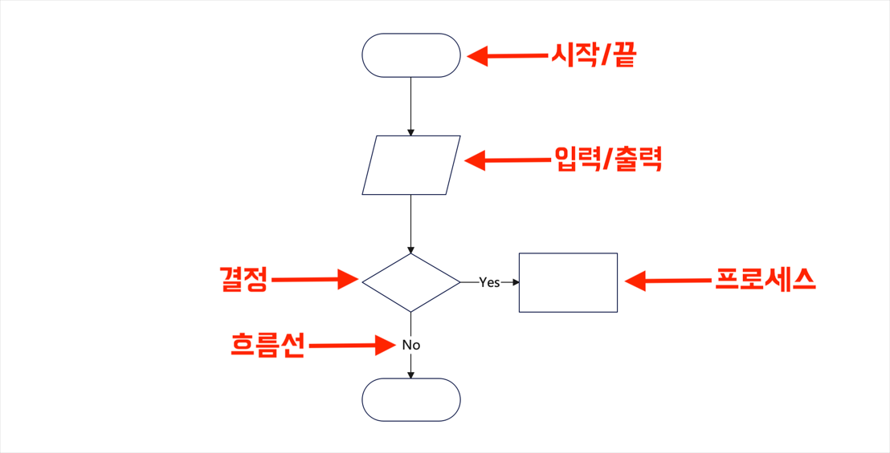
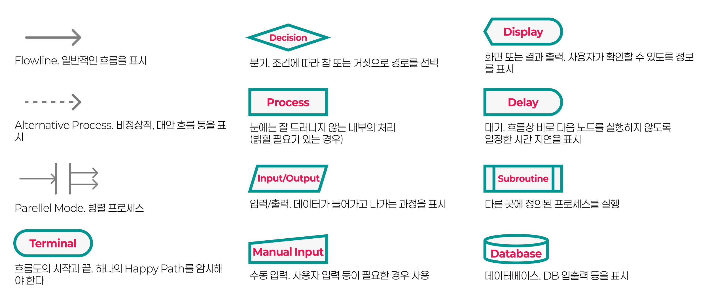

## 플로우차트

복잡한 시스템을 설계하려고 할 때, 처음부터 코딩을 시작하기 보다는 대략의 흐름을 도식화해서 표현하고 이를 참고하는 방법이 있고, 이것을 **흐름도(Flowchart)**라고 한다. 

### 플로우차트의 설계 원칙

- 하나의 시작과 하나의 종료을 가짐
- **해피 패스(Happy path)**를 기준으로 삼아 주된 경로를 그리기
- 빈틈 없는 에러 케이스 설계를 통해 결국은 모든 경로가 종료에 도달해야
- 플로우차트의 주체는 '**시스템**'. 각 노드는 시스템의 행동을 표현

## 플로우차트 심볼

## 플로우차트의 응용

- 플로우차트를 사용자 중심으로 그리면 **유저 플로우**(Userflows)가 됩니다.
	- 이때 각 노드는 유저가 보게되는 화면, 유저의 행동 및 상태 단위가 됩니다.
- 또한 스토리보드와 플로우차트를 결합해 **와이어플로우**(Wireflows) 또는 **스크린플로우**(Screenflow)를 그릴 수도 있습니다.
- 플로우차트를 이해하면 여러 표현에 응용할 수 있습니다.

