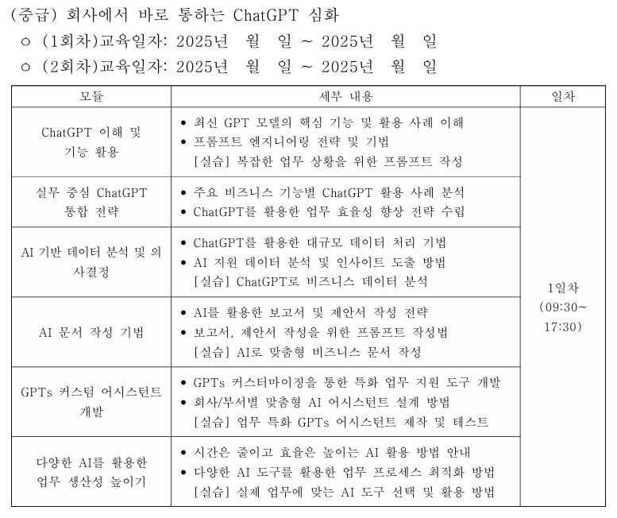

## ChatGPT 이해 및 기능 활용

- 최신 GPT 모델의 기능
	- GPT 기능 소개
		- **GPT 기능 업데이트**
- 프롬프트 엔지니어링 전략 및 기법

(2H)

## 실무 중심 ChatGPT 통합 전략

- ChatGPT 활용사례 분석
- 업무 효율성 향상 전략 수립

## AI 기반 데이터 분석 및 의사결정

- AI 지원 데이터 분석 및 인사이트 도출 방법

## AI 문서 작성 기법

- AI를 활용한 보고서 및 제안서 작성 전략
- 보고서, 제안서 작성을 위한 프롬프트 작성법

## GPTs 커스터마이징을 통한 특화 업무 지원 도구 개발

- 회사/부서별 맞춤형 AI 어시스턴트 설계 방법

## 다양한 AI를 활용한 업무 생산성 높이기

- 다양한 AI 도구 활용

# 강의 소재

- VBA
- Genspark
- MCP (클로드) // 쓸 수 없다.
	- Filesystem
- Make
	- GPTs (이메일?)