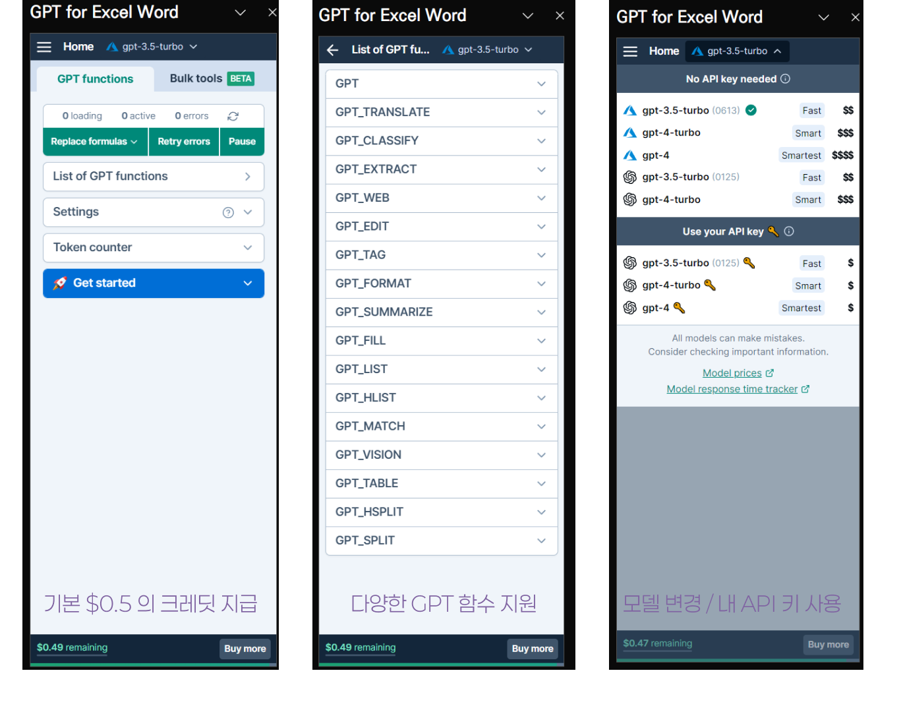
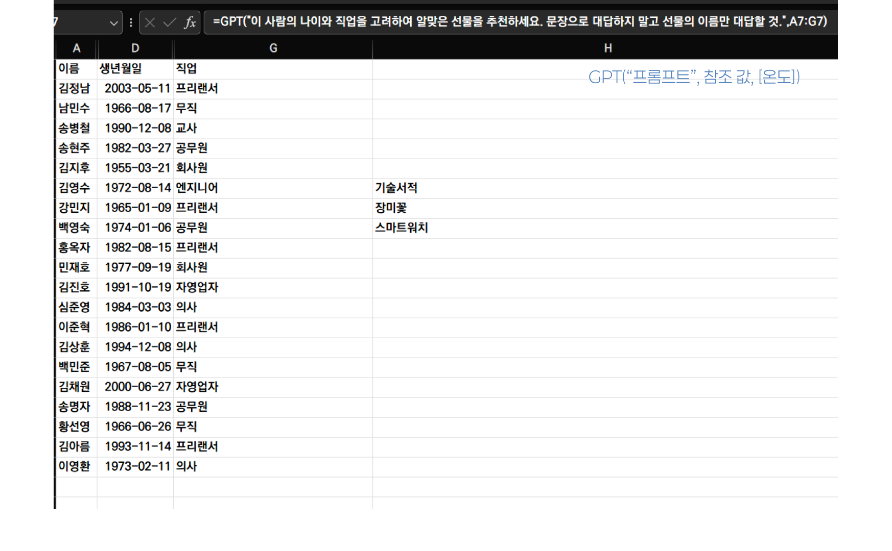
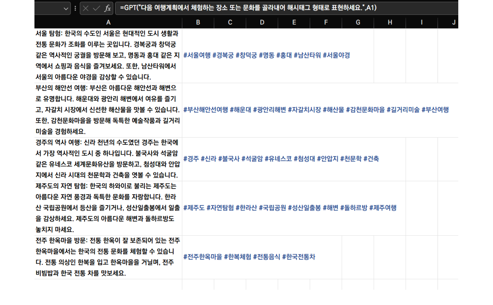
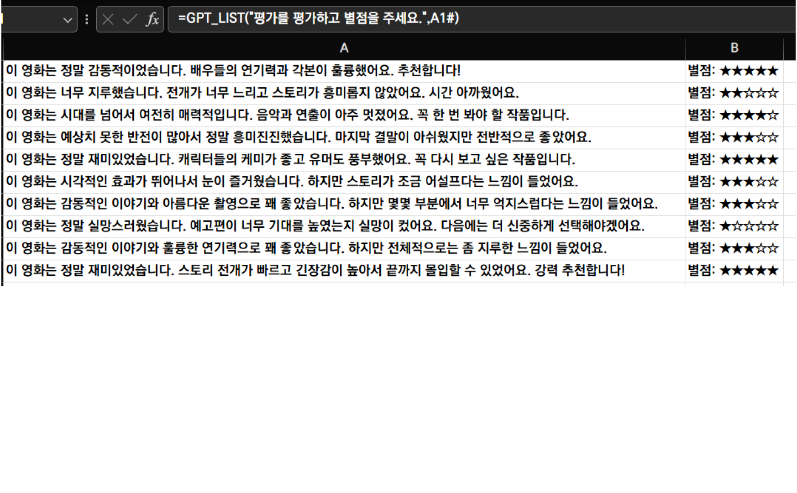
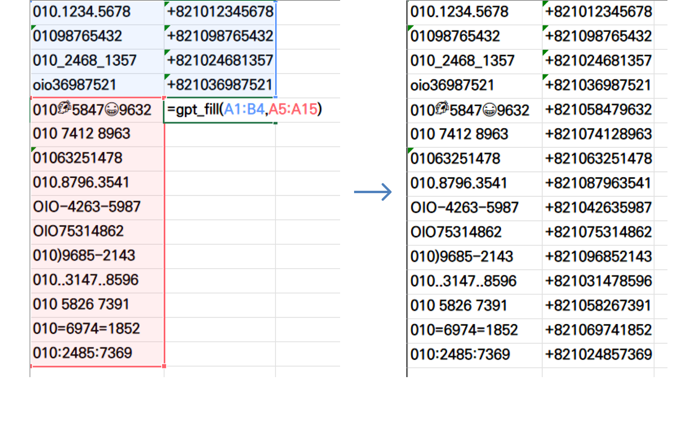

## GPT를 엑셀 안에서 사용하기

- ChatGPT API를 사용하여 엑셀 안에서 함수를 통해 GPT를 사용하게끔 도와주는 추가기능
	- [gptforwork.com](https://gptforwork.com)
- 기본적으로 유료이나, 가입시 약간의 크레딧을 제공하여 테스트해볼 수 있다



---

### 기존 데이터와 연관된 데이터 생성하기

- 회원의 이름, 나이, 직업을 고려하여 선물 제안하기
- `GPT()` 함수 사용하기

```ruby
GPT(프롬프트, [참조데이터], [온도])
```

- 온도는 ChatGPT의 창의성을 의미하는 하이퍼 파라미터 (optional)



---

### 알맞은 해시태그 달기

- 여행코스에서 여행지와 체험하는 문화를 꺼내어서 해시태그 형태로 표현.
	- 무엇을 해시태그로 뽑아내야 할지 정확히 알려주기
- 드래그 핸들을 잡고 채우기(Fill) 기능을 사용해 `GPT()` 함수 반복하기

> 채우기를 사용해서 GPT() 함수를 반복할 경우 그 수만큼 API 호출이 이뤄지니 주의



---

### 내용 분류하기

- 정성적인 평가를 긍정과 부정의 뉘앙스, 그리고 긍정 부정의 정도를 평가하기.
- `GPT_LIST()` 함수 사용하기

```ruby
GPT_LIST("프롬프트", [참조값], [온도])
```

- 결과물이 배열(Array)의 형태로 반환된다. 엑셀 또는 구글 시트에서 배열은 여러 행 또는 열의 데이터로 표현되므로
	- 한 번의 API 호출로 여러 줄의 데이터를 입력할 수 있음.
	- 간혹 항목의 갯수를 헷갈리는 경우 있음.



---

### 패턴 파악해서 채우기

- Before와 After의 결과값 예시를 주고 다량의 Before 값을 After 형식으로 변환하기
- `GPT_FILL()` 함수 사용하기

```ruby
GPT_FILL(패턴 범위, 입력 범위, [온도])
```

- 패턴 범위에는 몇 개의 정답을 가진 패턴을 입력해야 하고, GPT로 하여금 일정한 패턴을 발견할 수 있도록 설계되어야 함
	- 문제 범위를 헷갈리지 않도록 주의



