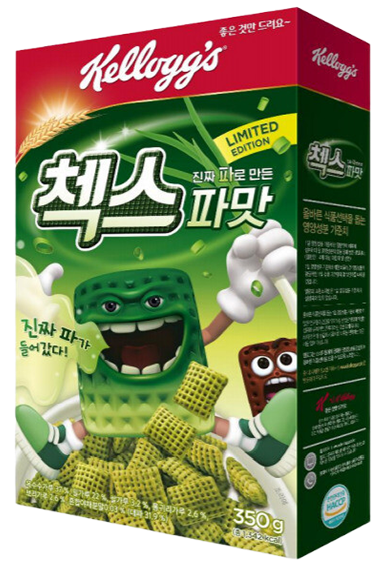

## 실습: 첵스나라 대통령 선거 프로젝트 제안

초코 첵스의 새로운 버전인 '밀크 초코 맛' 홍보를 위해 **첵스나라 대통령 선거** 프로젝트를 제안합니다. 온라인 선거 이벤트를 통해, 밀크 초코 맛 첵스를 만들겠다는 공약을 내건 *체키 후보*와 파 맛 첵스를 만들겠다는 공약을 내건 *차카 후보*를 경쟁시켜 체키 후보가 당선되면 홍보 효과가 뛰어날 겁니다. 기획안을 포함한 제안서를 작성하세요

### 세부 사항

- 선거 기능이 동작하는 웹사이트를 포함하세요.
- 각 후보의 인격을 매력적으로 만들고 공약을 재미있게 설명하세요.

