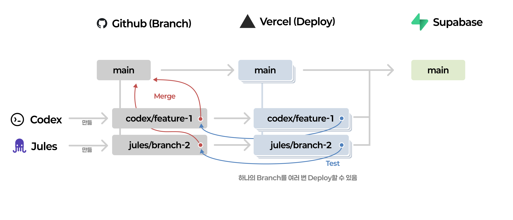
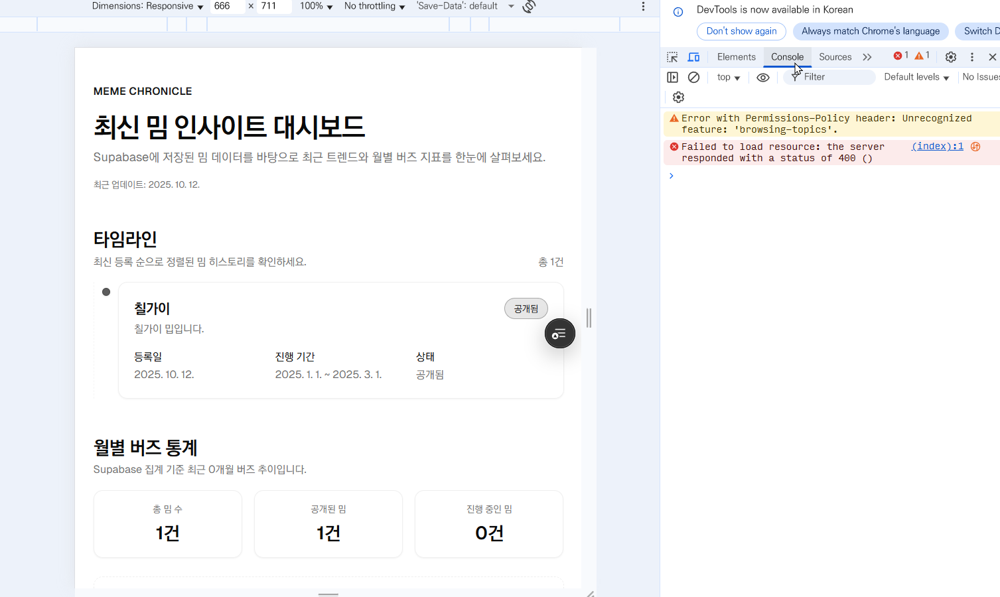
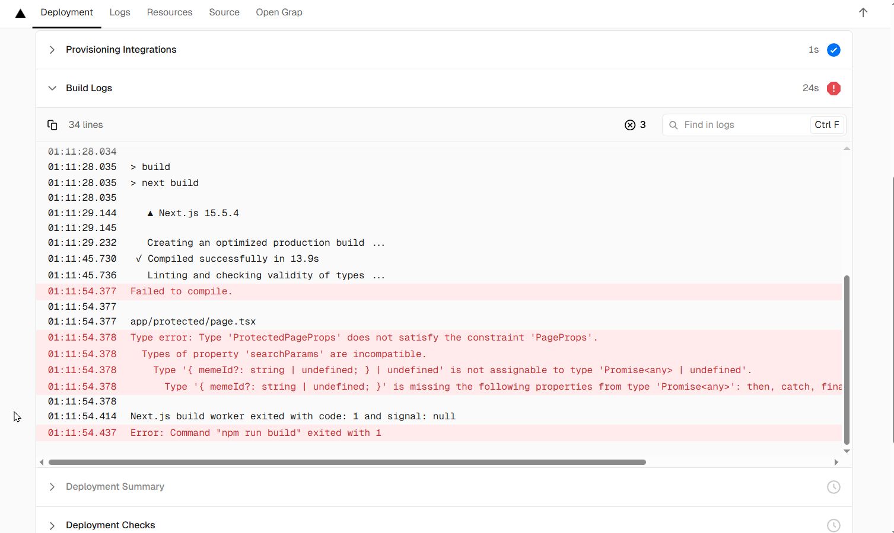
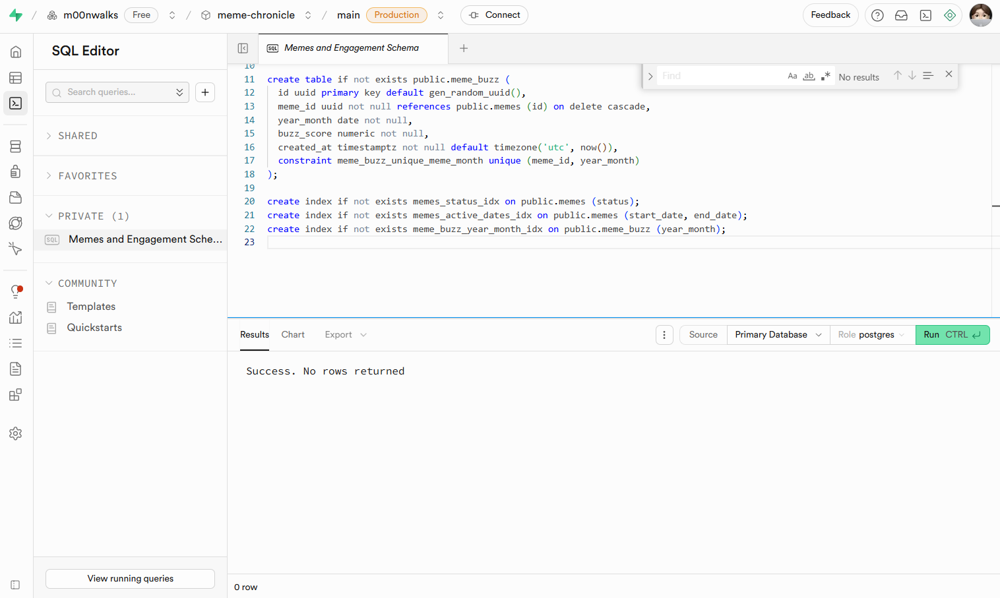
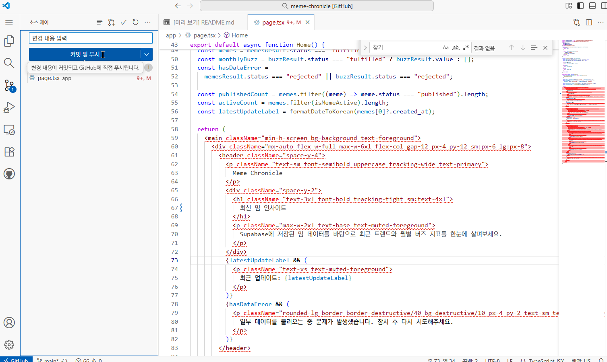

## 터미널 없는 진짜 바이브코딩, 터없찐

### 딸깍보단 다능한, 날코딩보단 쉬운

- 바꿔말하면 *딸깍보단 귀찮은, 날코딩보다는 무능한*
- 코드를 몰라도, 터미널을 다루지 못해도 도전해볼 수 있는 바이브코딩 **최대 아웃풋**
- 비동기식 코딩 에이전트(Codex, Jules) 사용

***

### Tools

- **[Github](https://github.com)**
- **[Vercel](https://vercel.com)**
- **[Supabase](https://supabase.com)**
- 코딩 에이전트
	- **[OpenAI Codex Cloud](https://chatgpt.com/codex)** (유료)
	- **[Google Jules](https://jules.google)** (무료체험)

> 구글 계정으로 모두 가입가능하니 가입먼저 해두기

> Vercel은 Github 가입후 Github 계정으로 가입할 것

## 근데 터미널이 없다는 게 무슨 말인데요

## OpenAI Codex Cloud

- **가상 환경**(남의 컴퓨터)에서 
	- 내 코드베이스(Github Repository)를 복제하고 
	- 브랜치를 생성한 다음 `GPT-5`로 코드를 수정한 뒤
	- Pull Request 를 던져주는 코딩 에이전트
- 직접 코드를 만질 필요없이 프롬프트만 던지면 알아서 작업을 수행하고 코드를 수정
- CLI 코딩 에이전트들에 밀려 상대적으로 인기가 없음

### Google Jules

- Codex Cloud도 빛을 못 보고 있는데 *무슨 자신감인지 유료로 출시해버린* 구글의 코딩 에이전트
- Codex와는 달리 **제한적인 무료 사용 가능**

## Vercel / Supabase

### Vercel

- 클라우드 웹 호스팅 서비스
- **Next.js** 기반의 웹사이트 호스팅에 특화됨
- *밀키트가 생길 때마다 가져가서 조리해서 손님에게 갖다주는 로봇이라고 생각하자*

#### Github 과의 연동

- Github 리포지토리와 브랜치를 자동으로 가져다 배포해줌
	- 따라서 **임시 수정 중인 코드 변경사항**(브랜치)도 배포된 사이트 형태로 확인 가능!

***

### Supabase

- 클라우드 **PostgresDB** 서비스
- 적당한 무료 사용량과 간편한 연동으로 MVP 제작 / 바이브코딩에서 인기

> 무료 플랜에서는 1개 Branch 밖에 지원하지 않으므로 하나의 DB를 현재 수정중인 브랜치에 맞게 수동으로 편집하고, 되돌려줘야 합니다.

> 가입 시 Team을 생성하게 되어 있는데 Team 이름을 간단한 걸로 지읍시다.

## 프로젝트 배포 플로우

# 가이드

## 템플릿 복제

1. Vercel Dashboard에서 새 프로젝트 추가하고
2. 템플릿 복제 - Supabase Starter 복제
3. Vercel Settings에서 `NEXT_PUBLIC_SUPABASE_ANON_KEY` 환경 변수의 이름을 `NEXT_PUBLIC_SUPABASE_PUBLISHABLE_OR_ANON_KEY` 로 변경하거나 새로 추가 후 Redeploy
4. Supabase 설정에서 Redirect URL 설정
5. 회원 가입 테스트

## Codex / Jules 설정

1. Vercel 프로젝트 대시보드 - Storage 탭에서 환경 변수 복사
2. Codex / Jules 설정에서 환경 추가
3. Github Repository 선택 후 환경 변수 붙여넣기
	- `NEXT_PUBLIC_SUPABASE_PUBLISHABLE_OR_ANON_KEY` 변경해서 넣어줄 것
4. 인터넷 켜짐 - 무제한으로 설정
5. AGENTS.md 추가 / PRD.md 추가

## Coding Start

1. 프롬프트로 작업을 요청
2. '계획 모드'와 '작업 모드'를 구분해서 사용할 것
3. 작업이 완료되면 PR 생성
4. PR 생성되면 Vercel이 자동으로 Branching 하며 배포 시작
5. 빌드가 완료되면 확인 및 테스트 하고 Merge / Close PR 하기

## 뭔가 잘 안될 때

### 클라이언트 측 에러 확인

- 배포된 사이트를 크롬에서 열어놓고 `F12` 또는 `Cmd` + `Option` + `i`
- 크롬 개발자 도구에서 Console 탭 확인
- 빨간 글씨 복사해서 LLM에 요청하기

---

### 서버 측 에러 확인

- Vercel의 해당 Deploy 확인
- Build Log 펼쳐서 서버 로그 확인
- 빨간 글씨 복사해서 LLM에 요청하기

## DB 관련

- DB 관련 변경사항이 있는 경우 에이전트가 SQL 적용(Up)/롤백(Down) 명령어 제공
- 브랜치를 테스트하기 위해서는 Supabase의 프로젝트 대시보드에서 **SQL Editor** 선택 후 직접 SQL 명령어 실행해서 적용해주어야 함
	- 이후 브랜치를 버리거나 `main`으로 돌아갈 때는 롤백 명령 실행

## vscode.dev 사용하기

- 깃헙 리포지토리 페이지에서 주소의 `github.com` 을 `github.dev`로 바꾸면 웹에서 해당 리포지토리를 VS Code로 열어볼 수 있음
- 간단한 텍스트 수정 등은 여기서 수정 후 커밋 & 푸시하여 반영 (Vercel 자동 배포됨)

