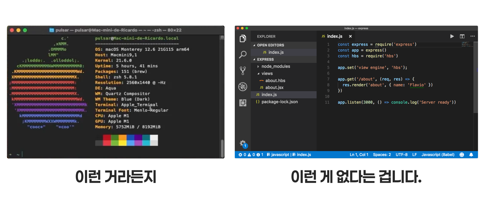
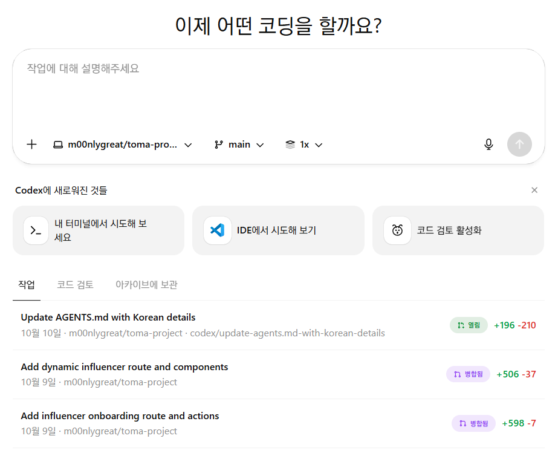
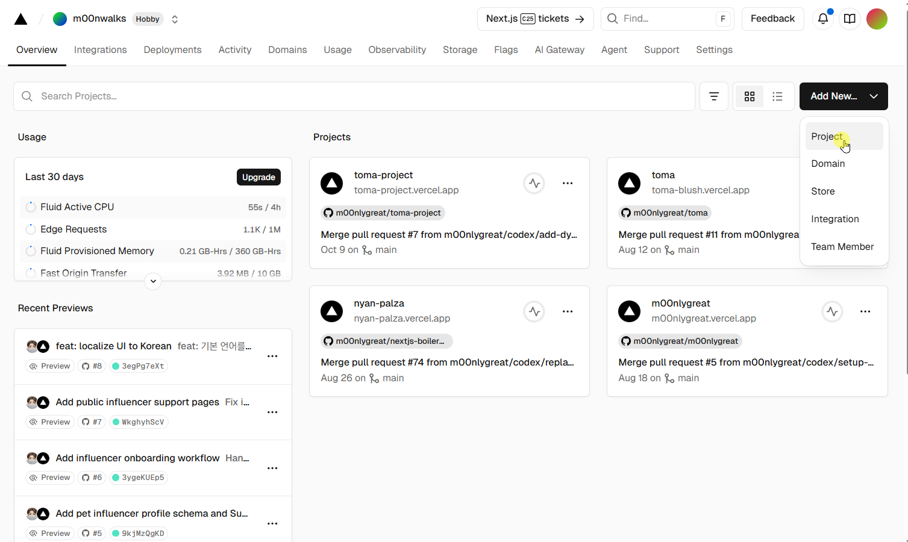
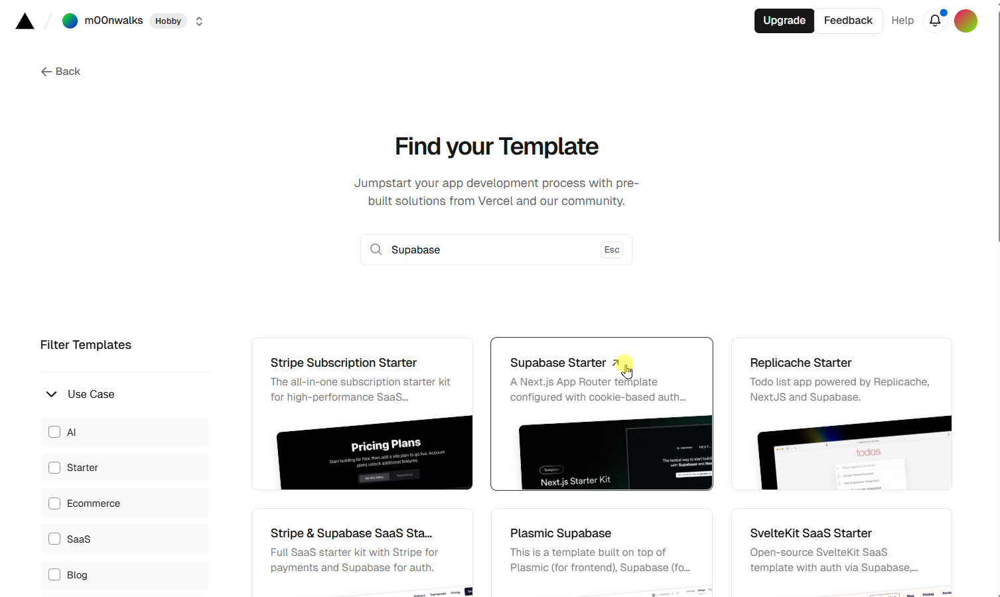

## 터미널 없는 진짜 바이브코딩, 터없찐

### 딸깍보단 다능한, 날코딩보단 쉬운

- 바꿔말하면 *딸깍보단 귀찮은, 날코딩보다는 무능한*
- 코드를 몰라도, 터미널을 다루지 못해도 도전해볼 수 있는 바이브코딩 **최대 아웃풋**
- 비동기식 코딩 에이전트(Codex, Jules) 사용

***

### Tools

- **[Github](https://github.com)**
- **[Vercel](https://vercel.com)**
- **[Supabase](https://supabase.com)**
- 코딩 에이전트
	- **[OpenAI Codex Cloud](https://chatgpt.com/codex)** (유료)
	- **[Google Jules](https://jules.google)** (무료체험)

> 구글 계정으로 모두 가입가능하니 가입먼저 해두기

> Vercel은 Github 가입후 Github 계정으로 가입할 것

## 근데 터미널이 없다는 게 무슨 말인데요

## OpenAI Codex Cloud

- **가상 환경**(남의 컴퓨터)에서 
	- 내 코드베이스(Github Repository)를 복제하고 
	- 브랜치를 생성한 다음 `GPT-5`로 코드를 수정한 뒤
	- Pull Request 를 던져주는 코딩 에이전트
- 직접 코드를 만질 필요없이 프롬프트만 던지면 알아서 작업을 수행하고 코드를 수정
- CLI 코딩 에이전트들에 밀려 상대적으로 인기가 없음

### Google Jules

- Codex Cloud도 빛을 못 보고 있는데 *무슨 자신감인지 유료로 출시해버린* 구글의 코딩 에이전트
- Codex와는 달리 **제한적인 무료 사용 가능**

## Vercel / Supabase

### Vercel

- 클라우드 웹 호스팅 서비스
- **Next.js** 기반의 웹사이트 호스팅에 특화됨
- *밀키트가 생길 때마다 가져가서 조리해서 손님에게 갖다주는 로봇이라고 생각하자*

#### Github 과의 연동

- Github 리포지토리와 브랜치를 자동으로 가져다 배포해줌
	- 따라서 **임시 수정 중인 코드 변경사항**(브랜치)도 배포된 사이트 형태로 확인 가능!

***

### Supabase

- 클라우드 **PostgresDB** 서비스
- 적당한 무료 사용량과 간편한 연동으로 MVP 제작 / 바이브코딩에서 인기

> 무료 플랜에서는 1개 Branch 밖에 지원하지 않으므로 하나의 DB를 현재 수정중인 브랜치에 맞게 수동으로 편집하고, 되돌려줘야 합니다.

> 가입 시 Team을 생성하게 되어 있는데 Team 이름을 간단한 걸로 지읍시다.

# 바이브 세팅

## 템플릿 복제

- Vercel 대시보드에서 **Add New** - **Project**

---

- **Browse All Templates...**

---

- Supabase 를 검색하고
- Supabase Starter를 선택합니다

