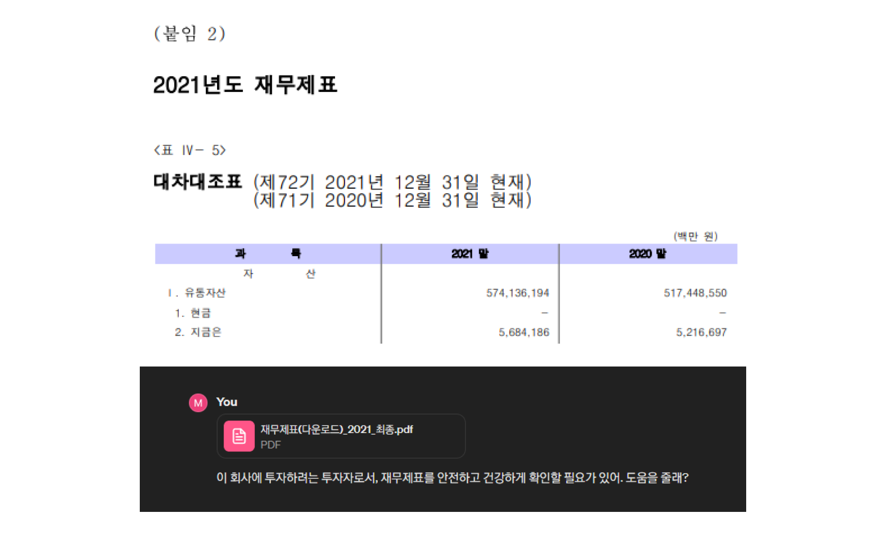

## 실습: 회사 재무제표 읽기

- GPT를 사용하면 재무제표를 읽을 줄 몰라도 [재무제표](https://drive.google.com/file/d/1aNeEe025YJzzH1yqr3xfzTpscl9-1I_X/view?usp=drive_link)를 통해 대강의 인사이트나 분위기를 파악할 수 있습니다. 

### 질문들

1. 이 회사의 올해 성과가 어떠하며, 주된 원인은 무엇입니까?
2. 앞으로 어떤 점을 중점으로 운영해나가면 좋겠습니까?
3. 한국의 현 경제 상황과 앞으로 이 회사의 비전과 전략을 구상해보세요

