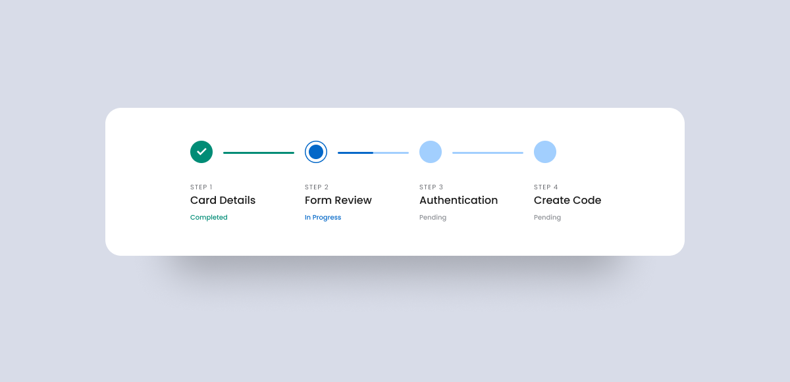

## 실습 설계를 어떻게 해야 할까

## 실습의 종류

실습의 개요(해야하는 이유)와 목적이 공통적으로 제공되어야 납득한다.

### Project

- 배운 내용을 토대로 자유도를 가지고 각자의 프로젝트를 수행해보는 것
- 현재의 학습 수준으로 가능한지 철저하게 검토
	- 선수지식이 명확해야 한다.
- 팀/개인 활동 모두 대응
- 혹은 일련의 project 자체가 일관된 하나의 팀 활동일 수 있다.

### Tutorial

- 하나의 목적을 달성하기 위한 따라하기 (Follow-along)
- 시작과 끝이 하위 Phase로 구분되어서 최종 목적과 간단한 Stepper가 제공되어야 하고
	- 이것이 시작 전에, 그리고 실습 도중 계속 고지되어야 길을 잃지 않는다.
- 모든 환경, 모든 맥락에서 일어날 수 있는 일을 예상하고 

### Discussion

- 최소 2인 이상 실습
- 배운 내용을 확장하여 각자의 해석을 머릿속에 심기 위한 토론활동
- 다양한 해석이 가능하거나 다양한 관점이 필요한 주제일 때 유효
- 필요한 경우 대립되는 주장들을 firestarter로 제시하되, 팀에서 하나의 결론을 내도록 유도한다

### Quiz

- 배운 것의 응용을 촉발하기 위한 실습활동
- 배운 것을 그대로 반복하는 퀴즈는 큰 의미없음. 배운 것에 대해 +α가 있어야 한다.
- 