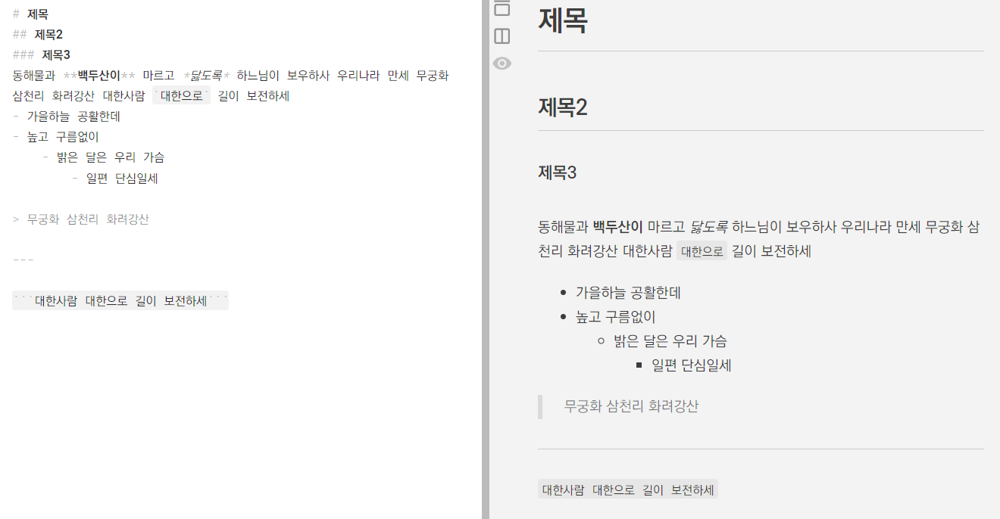

# 노션 알아보기

## 노션?

### 노션이란 

- Ivan Zhao가 설립한 주식회사 Notion Labs가 2016년 발표한 노트 및 프로젝트 관리 도구
- 클라우드 기반으로 노트 간의 연결과 데이터베이스를 사용해 데이터를 기록관리하고 동료와 협업하는 일에 강점
- 예쁜 디자인의 문서를 만들 수 있고 이를 웹으로 배포할 수 있어서 비교적 IT 친화적이지 않은 일반인에게도 널리 사용됨

***


## 노션으로 무엇을?

::: notes
- 여러가지 기록 용도: 일기, 독후감상, 자료 수집 등
- 웹페이지 배포 용도: 랜딩 페이지, 정보 전달 페이지 등
- 프로젝트 관리 도구
- 구글 시트, 에어테이블과 같은 간이 데이터베이스로 사용
- [노션 사용사례](https://www.notion.so/ko-kr/customers)
:::


## 노션의 구조

- 워크스페이스 ⊃ 스페이스 ⊃ 페이지 ⊃ 하위페이지 ⊃ 블록
- 노션은 블록을 아래로 쌓아서 문서를 구성

### 계정

- 개인 워크스페이스
    - 페이지
        - 블록
        - 페이지
- 팀스페이스
	    - 페이지
	        - 블록
	        - 페이지


## 블록

- 노션을 구성하는 최소의 단위
- 텍스트의 경우 하나의 문단 (엔터로 줄바꿈)이 하나의 블록
- 블록끼리는 순서를 바꿀 수 있다.
- 블록 단위에 댓글 작성 가능

### 슬래시 커맨드

- `/` 를 눌러 다양한 레이아웃, 블록, 기능 사용하기
- `@` 를 사용해 날짜, 친구 등 언급하기


## 댓글

- 페이지와 블록에 댓글달기 가능
- 해결(Resolve)처리해서 숨길 수 있다.
    - 이슈 관리를 위한 기능


## 마크다운(Markdown)

- HTML의 Subset인, 리치 텍스트를 표현하기 위한 간이 문법
- 이름은 HTML(Hypertext Markup Language)의 말장난
- [마크다운 가이드](https://m00nlygreat.notion.site/ba2a279ebbf94484b4bdfa42105935a0)

### 플레인 텍스트와 리치 텍스트

- 플레인 텍스트: 메모장
- 리치 텍스트: 워드패드

### 사용처

- 디스코드, 슬랙, 노션, Github
- Obsidian, LogSeq, Github, ChatGPT, StackEdit, Joplin


---



## 마크다운의 문법 소개

*제목*

```markdown
＃ 제목
＃＃ 제목 2
＃＃＃ 제목 3
```

*텍스트*

```markdown
**굵게**
*이탤릭*
~~취소선~~
```

***

*인용*

```markdown
> 인용
```

*리스트*

```markdown
- 순서 없는 리스트 항목
- 순서 없는 리스트 항목

1. 순서 있는 리스트 항목
2. 순서 있는 리스트 항목
```

---

*코드*

````markdown
```
코드 블록
```
````

*링크*

```markdown
[링크 텍스트](URL)
```

*이미지*

```markdown

```

***

*수평선*

```markdown
ㅡㅡㅡ
```

*테이블*

```markdown
| 헤더1 | 헤더2 |
|------|------|
| 셀1   | 셀2   |
```

*체크박스*

```markdown
- [x] 완료 항목
- [ ] 미완료 항목
```

## Markdown is the new MS Word

1. 마크다운은 생각과 아이디어를 **최소한의 서식으로 보존하고 정리**하는 데에 도움을 줍니다.
2. 마크다운은 여러 포맷으로 변환될 수 있습니다. 따라서 레이아웃이나 서식과 같은 장치보다도 **원본 콘텐츠를 지키고 더욱 개선하는 일**에 적당합니다.
3. 마크다운은 글의 구조를 표현하는 데에 필요한 모든 규칙을 가지고 있습니다. 따라서 **구조적 글쓰기 훈련**을 하는 데에도 도움이 됩니다.
4. ChatGPT와 같은 대부분의 거대언어모델 역시 마크다운 호환 형식으로 답변하며, 마크다운을 읽고 쓰는 데에 능숙합니다. 말하자면 AI와 대화할 때도 최적화되어 있는 것이죠.
5. 마크다운은 점차 더 많은 현세대 애플리케이션에 통합되고 있습니다. 곧 더 많은 곳에서 마크다운을 보게 될 것입니다.

## 옵시디언 (Obsidian)

- 마크다운과 노트의 연결을 근간으로 하는 개인 지식 DB 구축 도구
	- 제텔카스텐(Zettelkasten), 세컨드브레인
- RAG를 통해 생성형 AI와 내 지식 데이터베이스를 사용한 챗봇 구축
- 지식의 연결을 시각화하는 Graph View


## Mermaid.js

- 마크다운을 채택한 많은 에디터에서 호환되는 다이어그램/차트 작성 도구
- 간단한 플레인 텍스트 문법으로 차트 또는 다이어그램 작성
- [Mermaid.js Live Editor](https://mermaid.live/edit)

```markdown
> GPT등의 언어모델은 스스로는 다이어그램을 그리지 못하지만 mermaid.js 문법의 코드를 작성할 수 있다!
```


## 멘션

- `@` 를 사용해서 멘션
- 날짜 또는 사용자, 페이지를 멘션
    - 페이지를 멘션하는 경우, 페이지에서는 백링크로 취급되어 등록된다.
    - 사용자는 워크스페이스 안에 추가된 사용자를 멘션 가능
        - 사용자를 멘션하는 경우, 해당 유저에게 알림이 제공된다.
    - 페이지를 멘션하는 것으로 위키와 같은 사용방식을 구현할 수 있다.
        - `[[` 대괄호 두 개로도 할 수 있음
- 특정 날짜, 시간에 리마인더 설정

***


## 페이지

### 페이지 구성

- 제목: 페이지의 제목. 상위 페이지에서는 블록으로 취급됨.
- 아이콘: 노션의 상징.
- 커버 사진: 노션의 상징2. 별 것 아닌데 페이지를 예뻐보이게 만드는 것.
- 블록들, 댓글

### 하위 페이지 만들기

- 블록을 선택해서 ‘페이지로 전환’
- 슬래시 커맨드 `/page` 사용


---

### 페이지 기록(Page History)

- 페이지를 특정 시점으로 원상복구 할 수 있음.
- `Ctrl + Z`를 눌러서 되돌리기 할 수 있음.
    - `Ctrl + Shift + Z` 를 눌러서 다시 하기?


## 노트 간 연결하기

- 하위 페이지
	- 기본적으로 하위 페이지를 생성하면 상위 페이지에 연결됨.
- 페이지 멘션
	- 페이지를 언급하여 관련 문서를 링크할 수 있음.


# 데이터베이스

## 데이터베이스(Database)

- 다양하고 복잡한 구조의 정보를 정리하는 방법
	- 엑셀, 구글 시트와 같은 스프레드 시트를 떠올리면 쉬움.
	- 가로로 또는 세로로 무한인 2차원 형식의 데이터
- **테이블**(Tables), **시트**(Spreadsheets), **데이터베이스**(Databases)
    - 특정 엔티티를 주제로 한 데이터베이스
- **엔트리**(Entries), **레코드**(Records), **행**(Rows), **페이지**(Pages)
    - 표에서 한 줄(행)에 들어가는 일련된 데이터
- **속성**(Properties), **필드**(Fields), **열**(Columns)
    - 어떤 개체에 대한 질문의 모음
- **객체**(Objects), **엔티티**(개체, Entities)
    - 속성으로 설명되는 구조화된 정보

---

- 데이터베이스의 형식으로 저장된 정보들은 여러가지 가공이 가능
    - 검색(Search)
    - 필터(Filter)
    - 정렬(Sorting)
    - 여러 엔트리에 대한 계산
    - 연결된 정보들에 대한 참조
- 데이터베이스 연결(관계, Relation)

---

### 새 데이터베이스 생성

- 테이블을 추가한다. 시트를 새로 만든다.
- 노션에서 데이터베이스는 하나의 페이지로 취급
- 노션의 데이터베이스 엔트리 또한 페이지로 취급

### 속성에 유형 지정

- 유형을 지정하는 이유
	- 정보를 어떻게 써야 하는지 컴퓨터에게 알려줌.


## 노션 데이터베이스를 사용하는 이유

- 검색, 정렬 등의 사무적인 용도로 엑셀보다 편리할 수 있음
- 동료들과 실시간으로 함께 편집할 수 있음.
- 보기(View) 방식을 지정해 적절한 용도의 레이아웃으로 변경할 수 있음.

***

## 보기 (View)

- 같은 데이터베이스의 내용으로, 목적에 맞는 레이아웃과 속성만을 보여주도록 하는 방법
- 특정 보기와 필터, 정렬을 사용해 노션 페이지에 삽입(임베드) 가능
    - 대쉬보드
    - 또는 반복되는 어떤 개념을 예쁘게 표시할 때 좋음.
- 하위 그룹화는 보드 보기(Board view)에서만 가능
- 디폴트 페이지(템플릿) 설정

## 숨겨진 속성(Hidden Fields)

- 사람이 입력하기는 조금 귀찮고 어렵지만, 사무에 활용하기 좋은, 노션이 대신 입력해주는 속성들
    - 생성일시
    - 생성자
    - 최종편집 일시
    - 최종편집자
    - ID


## 필터

- 데이터베이스의 필드(속성)를 기준으로 아이템을 필터
- 필터는 임시보기 상태로 추가되며, 모두에게 보기로 저장을 해야 적용됨.
- 고급 필터
    - AND/OR 연산으로 조건을 결합


## 관계(Relation)

### 관계형 데이터베이스

- 레코드에 고유한 ID(키)를 부여하고 ID로서 테이블 간에 정보를 연결하는 방법

### 노션의 관계형 속성

- 다른 데이터베이스의 항목을 연결
- 쌍방향 연결: 쌍방향으로 연결을 하면 각 속성에서도 반대편 속성의 값들을 참조할 수 있음.

### 롤업(Roll-ups)

- 기존의 관계형 속성의 데이터베이스 항목 중 이름을 제외한 다른 속성을 불러오는 방법


## 할 일 관리

- 데이터베이스를 만들 때 가장 중요한 건, 어떤 엔티티를 다룰지에 관한 것.
    - 주도면밀하게 데이터베이스를 설계해야 개발 과정, 또는 이후 사용에서도 예상치 못한 문제들을 미리 방어하거나 대비할 수 있음.
- 언제까지 해야하는지
    - 정확한 일자는 아니더라도, 언제까지는 해야된다.

### 할 일 관리 템플릿 만들기

- 고급 필터
    - 완료일시가 이번 주인 것
    - 완료일시가 비어있는 것
    - AND/OR 연산

## 수식

- 엑셀, 구글 시트의 수식과 비슷한 노션의 수식
    - 데이터베이스에 동적(dynamic)인 값을 넣는 것.
- 노션 데이터베이스에서는 수식 속성으로 구현됨.


## `@오늘`과 `@지금`의 차이

- `@오늘`은 시간을 포함하지 않음.
- `@지금`은 시간을 포함함.

### 구글 시트가 날짜를 처리하는 방식

- 하루를 숫자 1로 처리함.
- 1은 24시간