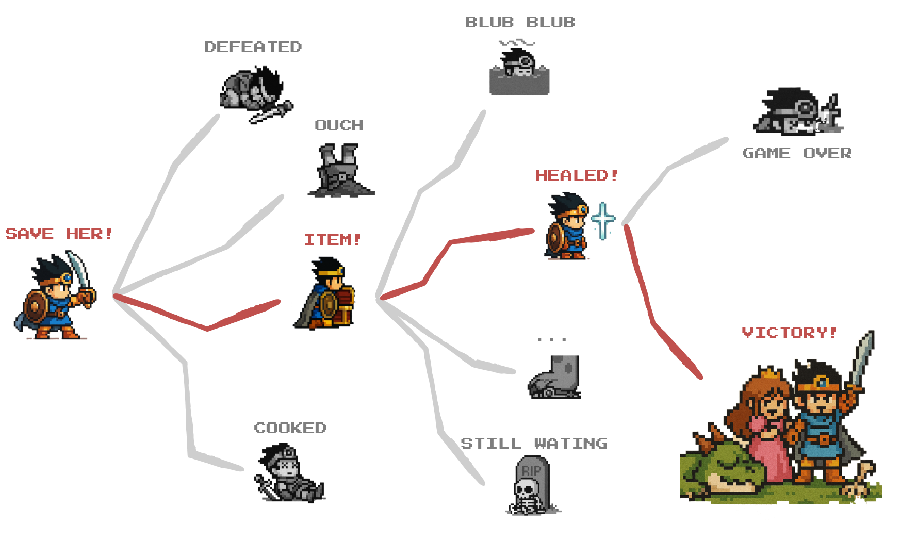

# 바이브 코딩

## 바이브 코딩(Vibe Coding)

- 캐나다의 인공지능 과학자, **안드레 카파시**(Andrej Kaparthy)가 만든 단어
	- 기존 논리 기반의 규칙이 엄격하고 질서정연한 사고과정을 통해 코드를 작성하던 전통적 개발과 달리, 
	- *느낌(vibe) 위주로 언어모델에게 요청하여 코드를 작성하는 개발방법*
- 비개발자도 자연어로 소프트웨어를 작성할 수 있는 **기술의 민주화** 시대가 도래했다는 의견

#### ...이지만 정말 그럴까?

# 무엇을 만들 것인가

## 기획

### 무엇을 만들지 생각하기

- 부록(소프트웨어의 분류) 참고
- 바이브코딩의 대부분은 웹 애플리케이션 Saas 프로덕트를 작성

### 제품 요구사항 정의서 (Product Requirement Document) 작성

- 바이브코딩에서 **요구사항 정의서는 곧 프롬프트**가 됩니다.

## 제품의 복잡도 결정

---

### 심플하게 가자

- **Standalone**: DB, 프론트/백엔드 통합
	- Ruby on Rails / SQLite
- **Static Web**: 오로지 정해진 내용만 보여주는 웹사이트 (위키피디아 등..)
- **CLI/TUI App**: 터미널에서 실행되는 애플리케이션 (자동화 앱 등)

 

# 무.한.회.귀 바이브코딩

## 바이브코딩 도구

### 풀 바이브

- 코딩, 디자인, [데이터베이스], 배포까지 완전 자동
	- Lovable, Bolt.new, Repl.it, Figma Make, v0.dev

### AI-Assisted Coding

- MCP 등의 도구를 사용해 코드를 자동으로 쓰고, 테스트, 커밋까지 자동화하는 코딩 도구
	- Cursor, Claude-code, Gemini-CLI, OpenAI Codex 등

#### 용어에 대한 논란 있음

- Vibe Engineering, Augmented Coding, AI Pair Programming..

## 무.한.회.귀 바이브코딩

- 고전 RPG 게임처럼 실패하면 과거의 *세이브 포인트로 돌아가* 다시 진행하는 것으로 결국 엔딩에 도달하는 방식의 바이브 코딩
- 코드를 전혀 몰라도 할 수 있나요?
	- It's on you!

> Github의 **Branch 기능**을 적극사용합니다.

## 스킬

### 진행

- `PRD.md`와 `AGENTS.md` 작성하고
- **Github 브랜치**를 생성하여 프롬프트를 던지고 작업 시작

### 전투

- 에러 및 버그 발생시 오류 메시지를 확인하고 고쳐달라 요청하기
- 각 단계에서 *어디서 버그를 확인해야 하는지* 명확히 알기

***

### 세이브

- 원하던 작업과 테스트가 완료되면 **변경사항 커밋** / **브랜치 병합**하여 작업 내용을 저장

### 로드

- 버그를 수정할 수 없거나, 의도대로 결과가 나오지 않는 경우 브랜치를 삭제해서 마지막 안정 상태로 돌아가서 다시 시도하기

> 때에 따라 이미 수행한 *브랜치 병합을 되돌려야* 하는 경우도 있다!

## 프로그램은 하나의 폴더와 여러 개의 텍스트 파일로 이루어져 있다.

### 코드베이스

- 이 구성을 **코드베이스**(Codebase)라 하며, 하나의 프로젝트는 보통 하나의 코드베이스로 이루어져 있음
- *외부 패키지/모듈 설치, Git 저장소, Docker* 등 각종 개발 활동의 단위가 됨
- Claude Code, Gemini-CLI, Cursor 등의 도구는 이 코드베이스를 생성하거나 읽고 관련된 코드를 생성하는 것이 목적
	- ChatGPT와 같은 웹 챗봇 인터페이스에서는 코드를 생성할 수는 있어도, 코드베이스를 기반으로 유의미하게 관련있는 코드를 만들지 못하기 때문

## Git Branch

- Git 과 Github은 **코드베이스를 버전관리** 하는 도구
- 

## 코드가 하는 일

- [**Show**]: 화면에 표시
- [**Wait**]: 사용자 입력 대기
  - UI / 입력장치
- [**Calculate**]: 데이터 가공
- [**Write**]: 데이터 기록
  - DB (로컬 / 원격)
- [**Read**]: 데이터 불러오기
	- API, DB, 통신
- [**Call**]: 다른 프로그램 사용하기
  - API, 라이브러리, Extensions, Plugins

> 코드가 하는 작업을 이 6개로 쪼개고 분류해야 한다.

## 예시 - 로그인

1. 화면에 표시: 2 인풋, 1 버튼
2. 사용자 입력 대기: id, password -> 버튼 누르기
3. 다른 프로그램 사용하기: id, password를 서버로 보내어 맞는지 확인
	- 데이터 불러오기: 사용자 인증 결과
4. 데이터 불러오기: 홈 화면 데이터 불러오기
	- 화면에 표시: 홈 화면

## 거의 모든 프로그램의 공통 양식

1. [**Name**]: 이름을 부르고
2. [**Arguments**]: 필요한 것을 주면
3. [**Definition**]: 약속된 작업을 처리하고
4. [**Return**]: 하나의 결과를 준다.
5. [**Listen**]: 반복하거나 대기

## 일리커피를 주문하자

- 일리커피를 주문할 때는 상품명(`str`), 원두선택(`str`), Takeout 여부(`bool`), Size업 여부(`bool`)를 줘야 한다

## 서브웨이

- 빵 종류 (`str`)
- 구울까 말까 (`bool`)
- 소스 (최대 2개) ()
- 야채 빼는 거 (`[str]`)
- 세트 상품 여부

### 썹픽

[나중에](notes/나중에.md)

## 플랫폼 선택하기

### Front-ends & Back-ends

- CLI, TUI, GUI 애플리케이션
	- `Python`, `Node.js` 등
- 웹 사이트 또는 웹 애플리케이션
	- `Next.js` + `React`, `Ruby on Rails`
- 모바일, 데스크탑 네이티브 애플리케이션
	- `Flutter`, `Swift`, `Kotlin`

***

### Databases

- 클라우드: `Supabase` / `Firebase`
- 로컬 DB: `SQLite`
- API: `Google sheets`, `Notion` 등 ..

## 데이터베이스를 써야 하는 이유

- 모든 데이터를 우리가 입력하지 않기 때문에 (정적 데이터 & 동적 데이터)
- 유저 데이터를 저장하기 위해

### 동적 데이터

- API
- DB
- 사용자 입력

# 부록: 소프트웨어의 분류

