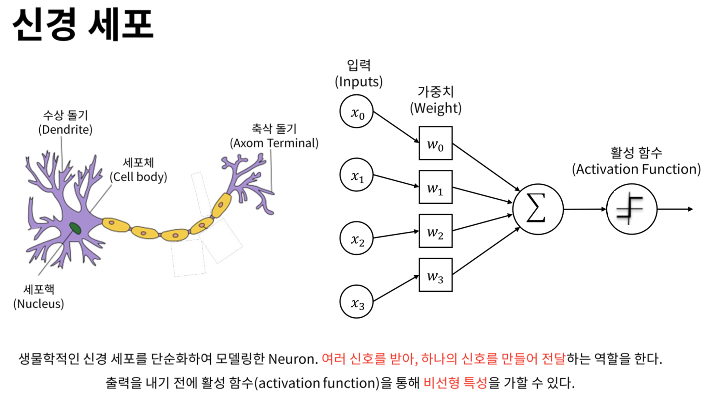
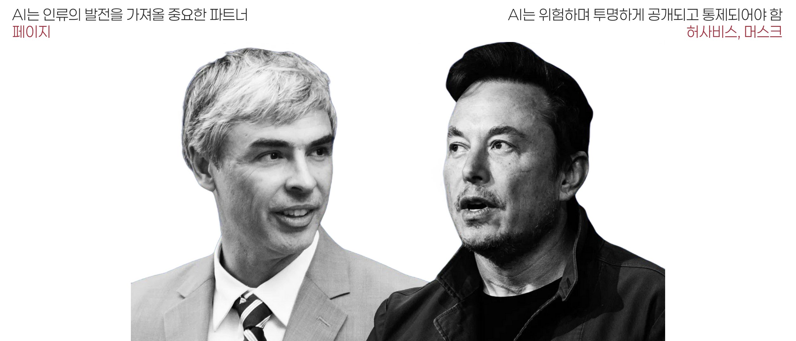

## AI의 역사

### 인공지능 (Artificial Inteligence)의 두 갈래

- 알고리즘 기반 (Rule-based Systems)
	- 사람이 모든 규칙과 조건을 제시하여 그대로 수행하는 인공지능
	- 사람이 지시한 것 이외에는 할 수 없음
- 인공신경망 기반 (Machine Learning)
	- 뉴런을 모방하여 인간 두뇌와 비슷하게 작동하는 인공 신경망 (Neural network)
	- 막대한 연산량 필요

---

---

---

::: notes

### 알고리즘과 신경망의 대결

- 1950년대, 인공지능에 대한 구상 중 인공 신경망 개념 등장
	- 도형을 인식하는 퍼셉트론 (Perceptron)
- 2010년초 제프리 힌턴에 의해 재발견됨.
	- 심층 인공신경망(Deep Neural network)과 딥 러닝의 발견
	- 이미지 인식 경연대회에서 놀라운 성과
	- 딥마인드와 알파고의 등장
	- OpenAI와 ChatGPT의 등장
:::

## LLM의 종류

## 오픈 AI와 일론 머스크

::: notes
- AI에 대해 상반된 두 가지 입장
	- AI는 위험하며 투명하게 공개되고 통제되어야 함 (허사비스, 머스크)
	- AI는 인류의 발전을 가져올 중요한 파트너 (페이지)
- 일론 머스크, AI 발전을 감시하기 위해 딥마인드 지분 구입

### 딥마인드 구글에 인수

- 머스크 반발
:::

---

### 머스크 오픈AI 설립

- 오픈AI와 테슬라 병합 시도
- 실패 후 마이크로소프트에 지분 전량 매도

### 오픈AI의 대성공

- 오픈AI, CEO 샘 올트먼 해임 및 복직
- 머스크 x.ai 설립

## AI의 미래

### 강 인공지능 (Strong AI)

- 약 인공지능 (Weak AI)
	- 특정한 분야의 일을 인간의 지시에 따라 수행하는 인공지능
- 스스로를 업데이트하는 인공지능

### AI와 인간의 가치

- 로마시대 콜로세움의 이야기
- Genuine, authentic한 인간에의 선호

## AI 이모저모

- 하드웨어 vs 소프트웨어?
	- H100, H200, B200 .. 
	- NVIDIA의 승리는 어디까지인가
- 온디바이스 AI
	- 갤럭시?
	- 개인화의 측면
	- 비용의 측면
- OpenAI, 동영상 생성 AI Sora 발표
- 애플, 구글과 Gemini 사용 협약 중?

