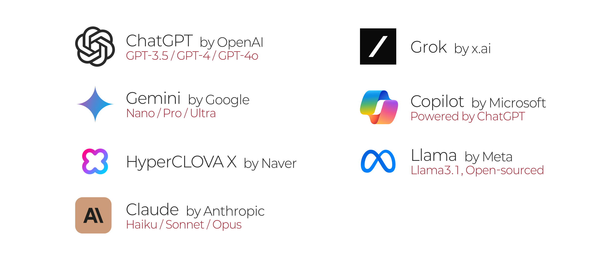

## AI의 역사

### 인공지능 (Artificial Inteligence)의 두 갈래

- 알고리즘 기반 (Rule-based Systems)
	- 사람이 모든 규칙과 조건을 제시하여 그대로 수행하는 인공지능
	- 사람이 지시한 것 이외에는 할 수 없음
- 인공신경망 기반 (Machine Learning)
	- 뉴런을 모방하여 인간 두뇌와 비슷하게 작동하는 인공 신경망 (Neural network)
	- 막대한 연산량 필요

---

---

---

::: notes

### 알고리즘과 신경망의 대결

- 1950년대, 인공지능에 대한 구상 중 인공 신경망 개념 등장
	- 도형을 인식하는 퍼셉트론 (Perceptron)
- 2010년초 제프리 힌턴에 의해 재발견됨.
	- 심층 인공신경망(Deep Neural network)과 딥 러닝의 발견
	- 이미지 인식 경연대회에서 놀라운 성과
	- 딥마인드와 알파고의 등장
	- OpenAI와 ChatGPT의 등장
:::

## LLM의 종류

## 오픈 AI와 일론 머스크

::: notes

- AI에 대해 상반된 두 가지 입장
	- AI는 위험하며 투명하게 공개되고 통제되어야 함 (허사비스, 머스크)
	- AI는 인류의 발전을 가져올 중요한 파트너 (페이지)
- 일론 머스크, AI 발전을 감시하기 위해 딥마인드 지분 구입

### 딥마인드 구글에 인수

- 머스크 반발

:::

---

### 머스크 오픈AI 설립

- 일론, 샘 올트먼, 일리야 수츠케버 등
- 오픈AI와 테슬라 병합 시도
- 실패 후 마이크로소프트에 지분 전량 매도

### 오픈AI의 대성공

- 오픈AI, CEO 샘 올트먼 해임 및 복직
- 머스크 x.ai 설립
- 샘 올트먼, 초정렬팀 해체
	- 일리야 수츠케버 퇴사

 

## AI의 미래

### 강 인공지능 (Strong AI)

- 약 인공지능 (Weak AI)
	- 특정한 분야의 일을 인간의 지시에 따라 수행하는 인공지능
- 스스로를 업데이트하는 인공지능 (AGI, 일반 인공지능)

### AI와 인간의 가치

- 로마시대 콜로세움의 이야기
- Genuine, authentic한 인간에의 선호

## AI 이모저모

### 승리의 키

- 하드웨어 vs 소프트웨어?
	- H100, H200, B200 .. 
		- NVIDIA, AI Saas 
	- NVIDIA의 승리는 어디까지인가
		- 인텔, 메타, Groq 등 빅테크 들의 탈NVIDIA를 위한 노력
		- [짐 켈러 "엔비디아 시대는 결국 끝난다.."](https://www.youtube.com/watch?v=2pw-YZ7KuFY)
	- Sora와 대항마들
		- Sora
		- Vidu, Kling
		- Luma Dream Machine

---

- Data 보유
	- 빠르면 2025년 학습시킬 데이터 고갈
	- AGI 달성을 위한 키

- 온디바이스 AI
	- 갤럭시?
	- 개인화의 측면, 비용의 측면
- OpenAI, 동영상 생성 AI Sora 발표
	- 중국판 Sora, Vidu와 Kling

---

### GPT-4o

- GPT-4 Omni
	- 진정한 멀티 모달
	- `im-a-good-gpt2-chatbot`과 `also-a-good-gpt2-chatbot`
- 1/2 정도의 토큰을 쓰고도 같은 성능
	- 무료 사용자에게도 제공
	- GPTs 무료화
- [Say Hello to GPT-4o](https://www.youtube.com/watch?v=vgYi3Wr7v_g)
- [Be My Eyes Accessibility](https://www.youtube.com/watch?v=KwNUJ69RbwY)

---

### 2024 애플 WWDC

- 애플 인텔리전스
	- 10 TOPS, 1.5GB 의 성능으로 온디바이스로 작동
- AI 에이전트: 시스템과의 Integration
	- 애플 2024 WWDC, Siri와 ChatGPT의 통합

