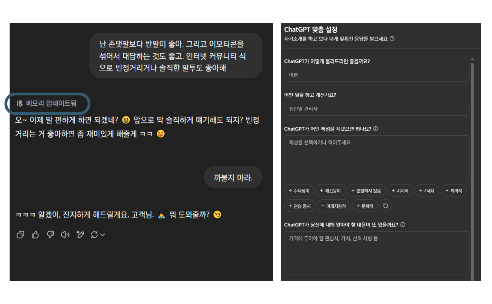
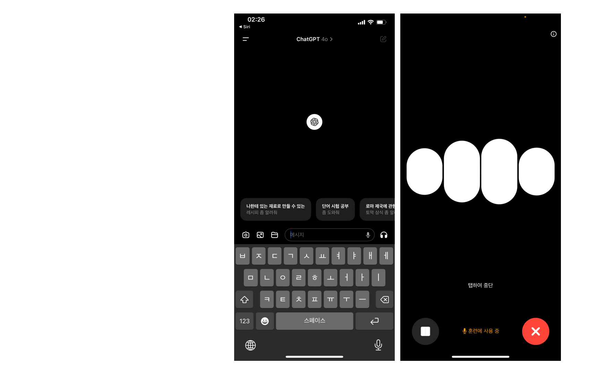

## Custom Instruction & Memory

### Custom Instruction 

- ChatGPT가 좀 더 사용자 친화적인 맥락으로 대답할 수 있도록 사용자의 정보나 답변에 있어서의 희망사항을 미리 알려주기

### Memory

- ChatGPT는 대화 도중 사용자의 선호나 배경에 대한 정보가 감지되면 그 사실을 자신의 *메모리*에 업데이트하여 답변에 반영한다.

## Vision & DALL-E

::: notes
- GPT-4 Vision: 사진을 보고 해석하는 능력
	- 프롬프트에 사진 파일을 첨부
- DALL-E 3: 프롬프트 기반으로 이미지를 생성하는 능력 (Midjourney와 같은)
	- '그림을 그려줘.', '이미지를 생성해줘.' 등의 표현 사용
- 풍경 사진, 이미지에서 도표, 이미지로 된 텍스트까지
:::

## Browsing

- 실시간으로 인터넷을 검색하고, 검색한 내용을 기반으로 답변을 생성하는 것 (RAG)
	- '최근', '오늘', '2025년' 등 시점을 가리키는 표현
	- LK-99 등 최근 화제가 되었던 연속성 있는 이슈
	- '검색해줘' 등의 직접적인 표현
- 기존 ChatGPT의 데이터 학습 시점
	- GPT-3.5: 2022년 1월 까지
	- GPT-4: 2023년 12월 까지
	- GPT-4o: 2023년 9월 까지

## Data Analysis

- 파이썬 백엔드를 실행하여 데이터 분석 등을 수행하는 기능
	- 파일 리딩: CSV, PDF, PPT, XLS, DOC 등 문서 제공
	- '차트를 그려줘.'와 같은 표현
- 알아서 파이썬 코드를 짜고 실행함.
	- 오류 발생 시 자동으로 재시도
- 기본적으로 파이썬으로 수행가능한 데이터 분석, 파일 관련, 수학 등의 요청을 받아들이나, API콜, 크롤링 등 시스템에 영향을 주거나 부담스러운 작업은 거절
	- [ChatGPT로 동영상 만들기](https://www.clien.net/service/board/lecture/18553432)

## GPTs

- 자주 사용하는 GPT 프롬프트 설정을 별도의 GPT로 만들어서 편리하게 독립된 채널에서 대화하기
- GPT-4의 모든 기능 사용 가능: 
	*Vision, Browsing, Data Analysis*
- 액션: 요청 받은 텍스트의 내용에 따라, 외부 API를 사용해서 전용 기능을 실행하고 그 응답결과를 답변 처리에 사용가능
- 만든 GPT는 스토어에 올려 누구나 쓸 수 있게 만들거나, 유료화할 수도 있음

## ChatGPT App

- iOS/Android/Windows/Mac 을 지원하는 네이티브 앱
- 내장된 마이크를 통해 ChatGPT와 음성대화 가능!
	- 영어 회화 연습
	- 중간에 끊기(interrupt) 가능한 자연스러운 대화
- 향후 OS와 AI Agent 통합이 연결로가 될 수 있음

