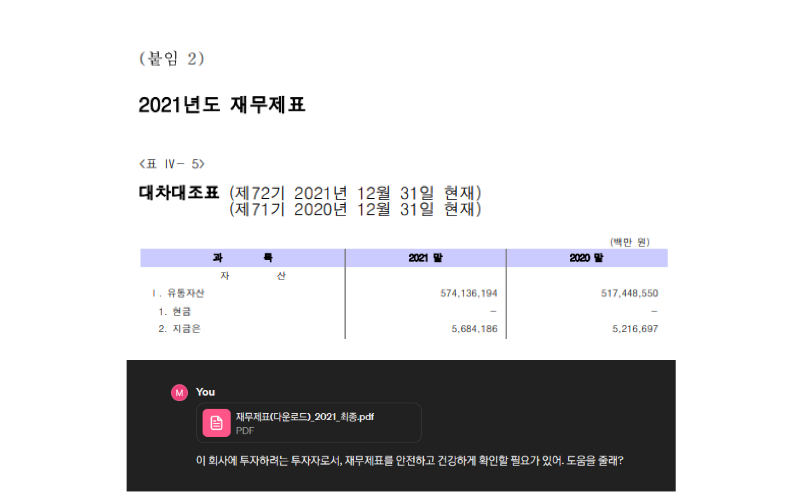
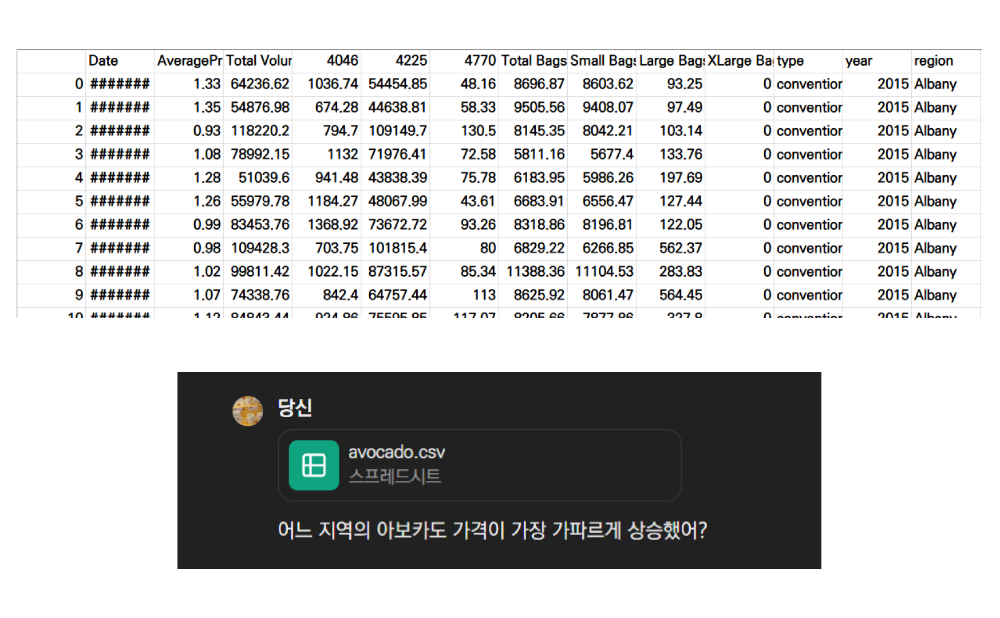
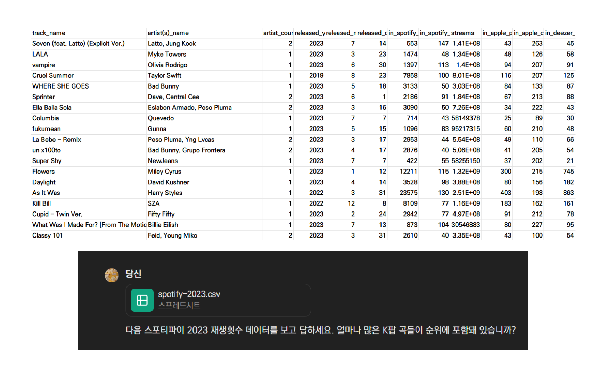
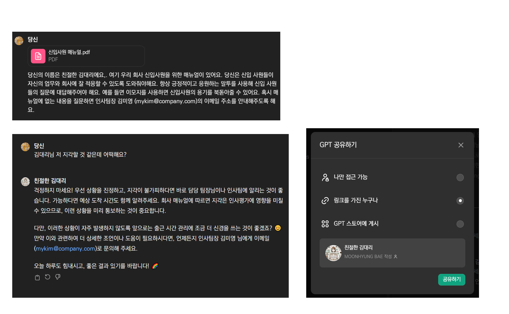
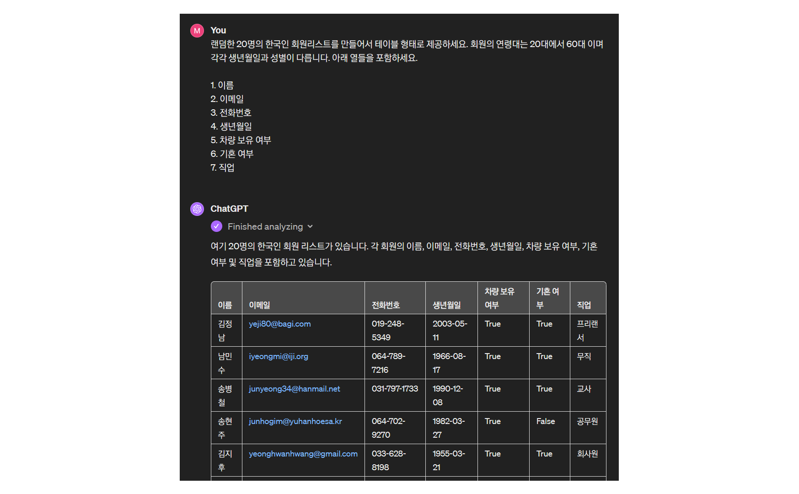
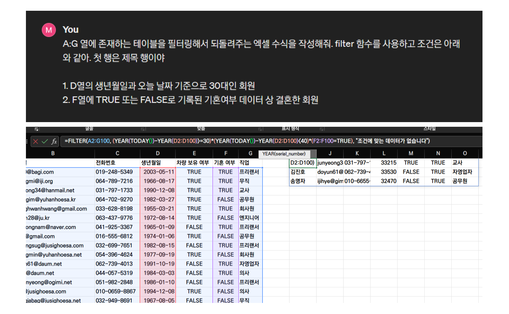
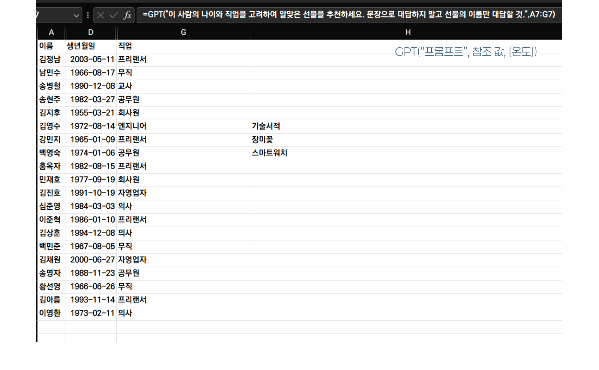
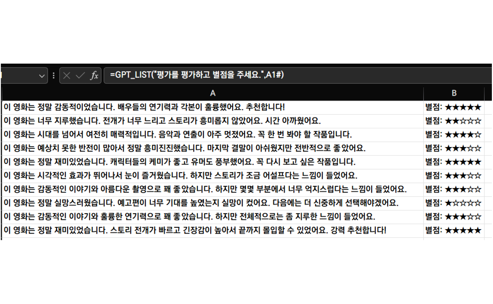
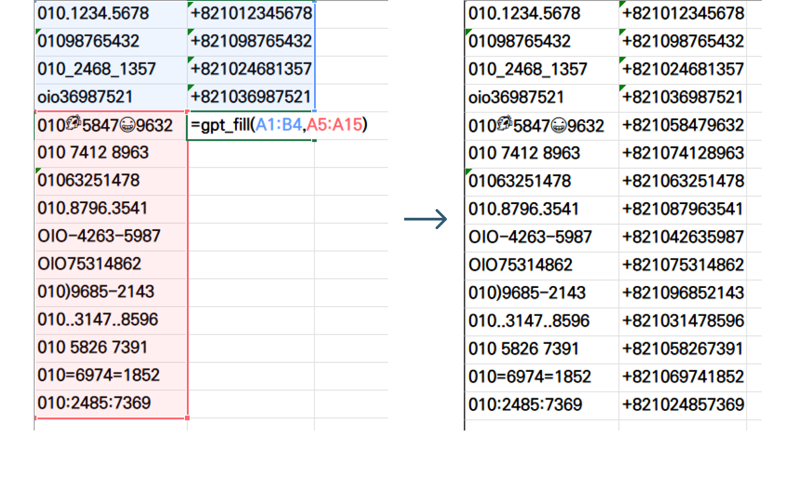

## 이력서를 주고 물어보기

- PDF, PPT, XLS, DOC, TXT, MD 등 다양한 포맷의 파일을 제공하고 내용에 대해 질문하거나, 내용을 기반으로 추론하거나, 데이터 분석 등을 의뢰
- 이력서를 제공하고 아래와 같은 것들 [물어보기](https://chat.openai.com/share/73b5a668-452b-4645-a351-f76d5a22effb)
	- 현재 회사 내에 문제들을 해결하는 데에 도움을 줄 수 있는 사람일지?
	- 우리 팀에 들어왔을 때 문제가 될 수 있을만한 가능성?
- [채용 후보 관리 엑셀 파일을 작성](https://chat.openai.com/share/3ece436c-e7d3-4123-8974-5a2bd4af6caf)하고, 후보자를 추가시키기


## 회사의 재무제표 분석

- 재무제표 데이터를 주고, [이것저것 물어보기](https://chat.openai.com/share/1439534a-edf4-46ff-adf1-195e31b81ba2)
	- 이 회사의 성과가 증가한 이유?
	- 앞으로 어떤 점을 중점으로 운영해나가면 좋겠는지?
	- 한국의 현 상황과 관련하여 투자의견 제안
- 재무제표 분석 결과, 투자 관련 의견을 작성하여 보고하기



## 아보카도 가격 분석

- [캐글 - 아보카도 가격 분석](https://www.kaggle.com/datasets/neuromusic/avocado-prices)
- 미국의 일별 / 지역별로 기록된 아보카도 평균 가격과 판매량 데이터를 주고 [물어보기](https://chat.openai.com/share/f2bf4f19-2995-4cbf-9415-0e83df2287c4)
	- 같은 기간 동안 가장 많이 오른 지역은?
	- 아보카도 가격에 가장 많이 영향을 주는 요소는?



## 스포티파이 곡 재생 데이터 분석

- [캐글 - Most streamed spotify songs 2023](https://www.kaggle.com/datasets/nelgiriyewithana/top-spotify-songs-2023)
- 2023년의 스포티파이 곡 재생 데이터를 주고 [물어보기](https://chat.openai.com/share/38c1cee9-a476-4381-897f-ba107ee8b791)
	- 얼마나 많은 K-Pop 곡들이 순위에 올라왔나?
	- 2023년의 전체적인 무드는?
	- 스포티파이에 진출한 K팝 아티스트들의 비중을 파이차트로 그리기



## GPTs

- PDF로 된 신입사원 매뉴얼을 학습하고, 신입사원의 질문에 답하는 GPT 만들기
	- 친절한 말투를 사용하고 긍정적인 답변을 해야함 (Tone, Attitude)
	- 신입사원 매뉴얼에 없는 내용, 곤란한 내용에 대해서는 인사팀장의 이메일 주소 안내
	- [친절한 김대리](https://chat.openai.com/g/g-bEYIII6S6-cinjeolhan-gimdaeri)



## 원영적사고 GPT 만들기

- [원본](https://getgpt.app/play/1drEpYwXhT?list=d9926747-7a55-4b38-a80d-2982de281d5f)
- 어떤 Instruction을 주었을까? 생각해보기
	1. 다소 억지스럽더라도 불합리하거나 억울하거나 불행한 상황에서 긍정적인 포인트를 발견할 것
	2. 마지막은 반드시 '완전 럭키비키잔앙🍀'으로 끝낼 것
- [까칠한 그녀 GPT](https://chatgpt.com/g/g-wIpN0ihcQ-ggacilhan-geunyeo)


## 텍스트를 파워포인트 슬라이드로 만들기

- Chill guy 밈에 대해 알 수 있는 보고서를 GPT를 사용해 구성하고, PPT Slide로 만들기
- 줄글을 알맞게 슬라이드로 구분하기
- 테마 적용해서 디자인 완성하기
- [슬라이드 만들기](https://chat.openai.com/share/32212d7c-c30a-45ff-bf3e-fe0b39b0c2ff)


## 엑셀에서 ChatGPT 활용하기

### 샘플 데이터 만들어주기

- 엑셀에서 사용하기 위한 샘플 데이터를 생성
- 테이블 형태로 반환된 [데이터](https://chat.openai.com/share/cca1a314-d09f-4ec5-8aac-aca52131b16a)는 엑셀, 구글 시트 등에 붙여넣어서 사용



---

### 함수 대신 만들어주기

- 함수를 텍스트로 설명하면 대신 생성
- 파라미터로 제공되어야 하는 데이터의 위치와 형식을 설명할 필요 있음
 


## GPT를 엑셀 안에서 사용하기

- ChatGPT API를 사용하여 엑셀 안에서 함수를 통해 GPT를 사용하게끔 도와주는 추가기능
- [gptforwork.com](https://gptforwork.com)


---

### 기존 데이터와 연관된 데이터 생성하기

- 회원의 이름, 나이, 직업을 고려하여 선물 제안하기
- `GPT()` 함수 사용하기

```ruby
GPT(프롬프트, [참조값], [온도])
```
 


---

### 알맞은 해시태그 달기

- 여행코스에서 여행지와 체험하는 문화를 꺼내어서 해시태그 형태로 표현.


---

### 내용 분류하기

- 정성적인 평가를 긍정과 부정의 뉘앙스, 그리고 긍정 부정의 정도를 평가하기.
- `GPT_LIST("프롬프트", [참조값], [온도])` 함수 사용하기



---

### 패턴 파악해서 채우기

- Before와 After의 결과값 예시를 주고 다량의 Before 값을 After 형식으로 변환하기
- `GPT_FILL(패턴 범위, 입력 범위, [온도])` 함수 사용하기

