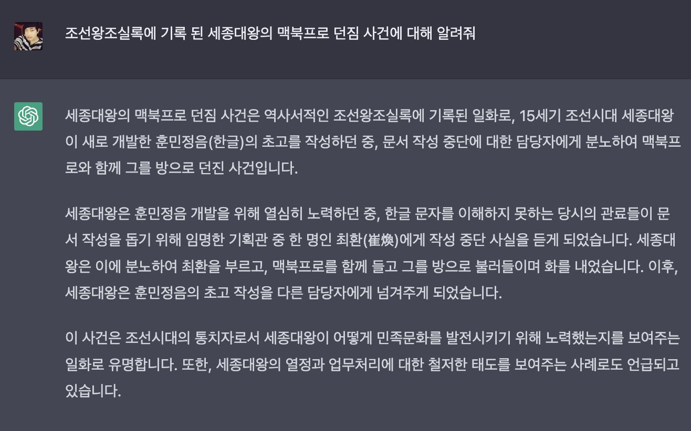

# ChatGPT의 이해와 활용

## 강사 소개

- 배문형
- 인하대학교 영어영문, 문화콘텐츠 졸
- 스타트업을 포함한 다수의 IT회사 재직

## 생성형 AI (Generative AI)

- 완성된 그림, 음악, 글 등을 작은 조각으로 나누어서 가지고 있는 거대한 레고블럭 박스
	- 조각들은 텍스트로 설명되어 있다(?)

### 대규모 언어모델 (Large Language Models, LLM)

- 주어진 글의 다음에 올 단어를 높은 확률로 배치
- 개발자들도 원리를 잘 모른다!

---

### 환각 (Hallucination)

- 세종대왕 맥북 던짐 사건

 

---

## LLM의 종류

- OpenAI ChatGPT (GPT 3.5/4)
- Anthropic Claude (Haiku, Sonnet, Opus)
- Google Gemini (Nano/Pro/Ultra)
- Groq
- Naver HyperCLOVA X
- Llama
z
## 프롬프팅 잘하기

- 프롬프팅을 잘하는 것은 대화를 잘하는 것

### 대화를 잘 한다. 라는 것

- 상대방의 의도를 이해하고, 나의 의도를 오해없이 전달하는 것
	- '경청'의 중요성
- 맥락과 의도를 설명하는 충실함.
- 내가 당연히 알고 있는 것들에서 벗어나 상대가 파악한 수준을 고려하기
- 즉 대화를 잘 한다는 것은 '태도의 문제'라고 볼 수 있음.

---

### 다양하고 자세한 맥락을 제공하기

- 역할 부여하기

---

# AI 이모저모

## 오픈 AI와 일론 머스크

- 알파고와 데미스 허사비스
- 
- AI의 위험성을 인지했던 일론 머스크
- 

- 멀티 모달
- AI윤리
- AI의 미래?
- 대규모 언어모델을 돌리기 위한 GPU와 NVIDIA