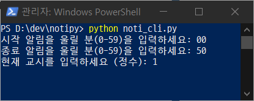

## ChatGPT로 코딩하기

- ChatGPT는 텍스트를 생성할 수 있는 모델
- 즉 **코드를 작성하는 것 외의 모든 일**은 우리가 해줘야 한다.


## 파이썬 설치하기

### Windows

터미널에서 아래 명령어 입력

```ruby
winget install -e --id Python.Python.3.10
```

***

### mac OS

- 맥에는 기본적으로 파이썬이 설치돼있다.

Homebrew 설치

```ruby
bash
/bin/bash -c "$(curl -fsSL https://raw.githubusercontent.com/Homebrew/install/HEAD/install.sh)"
```

파이썬 설치

```ruby
brew install python
```

## noti.py

- 매 시각 정해진 시간(분)에 시작, 종료 알림음을 재생하는 프로그램
- 재생 디바이스 선택 가능
- [noti.py 생성](https://chat.openai.com/share/cc7f22e6-a41d-4f3b-9a2d-c61a51ebc526)



---


