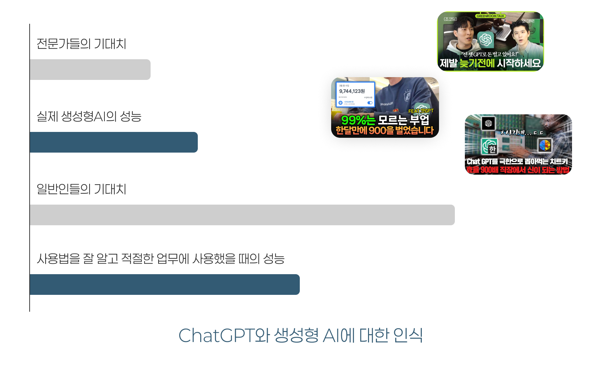
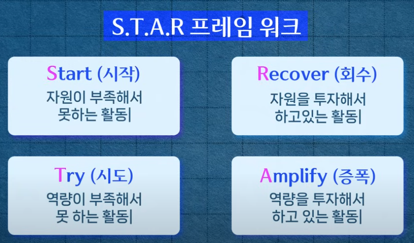

## ChatGPT와 생성형 AI에 대한 오해

- “대박 쉬운 ChatGPT로 코딩하기”
	- 안 쉬움
- "해외에서 난리난 ChatGPT 신기능” 
	- 난리 안남
- "AI는 진실만을 말한다."
	- AI는 진실을 판가름할 수 있는 능력이 없음.
- "AI가 우리 직업을 없앨 것이다."
	- 대부분의 영역에서 AI는 업무 효율을 끌어내는 도구로서의 인식이 자리잡음

***

```markdown
> 90% 이상의 생성형 AI 관련 지식들은 유튜브를 통해 유통되고, 전파됨
```

- 계속해서 새로운 것이 나오는 특성상 아래는 있을 수 없음
	- 어느 시점에서 AI를 마스터한다
	- AI를 집중적으로 공부해서 끝내겠다
- 그러므로 FOMO에 시달리지 말고, 당장 안 필요해도 업무에 조금씩 써보면서 꾸준히 화제를 팔로우하기 

## 그럼 어떻게 공부할까

- 형식지와 암묵지, explicit and tacit knowledge
	- 흥미본위의 유튜브 탐색과 당장의 간단한 업무 활용으로
	- AI를 둘러싼 담론을 폭넓게 바라보고 여러 맥락 안에서 AI를 이해하기

```markdown
> 왕도(Royal road)가 없다!
```



---

## S.T.A.R 프레임워크

- [경희대 김상균 교수의 AI 학습/훈련법](https://www.youtube.com/watch?v=sDBDHF6m578)
	1. 시간이 가장 많이 투입되는 일 찾기
	2. 개선하고 싶은 나의 핵심 역량
	3. 하고싶은데 못해본 것 찾기
	4. 시간이 더 많이 있으면 해보고 싶은 것

```markdown
> 현재의 AI란 즉, 사람이 간단히 할 수 있는 일을 사람보다 훨씬 빠르게 할 수 있는 도구이므로, 이를 초점삼아 내 업무에 어떻게 적용할지 고민해볼 것
```

- 더 전문성이 있는 사람이 AI를 활용했을 때 차별화를 가져올 수 있다.
	- 일자리 -> 일거리
		- 전통적 직업의 해체
	- 직업 -> 스킬
		- 직군으로서의 역할보다 어떠한 능력을 가지고 있는지가 중요

