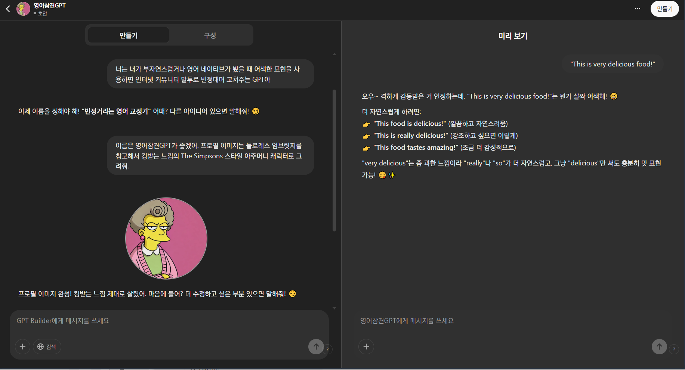
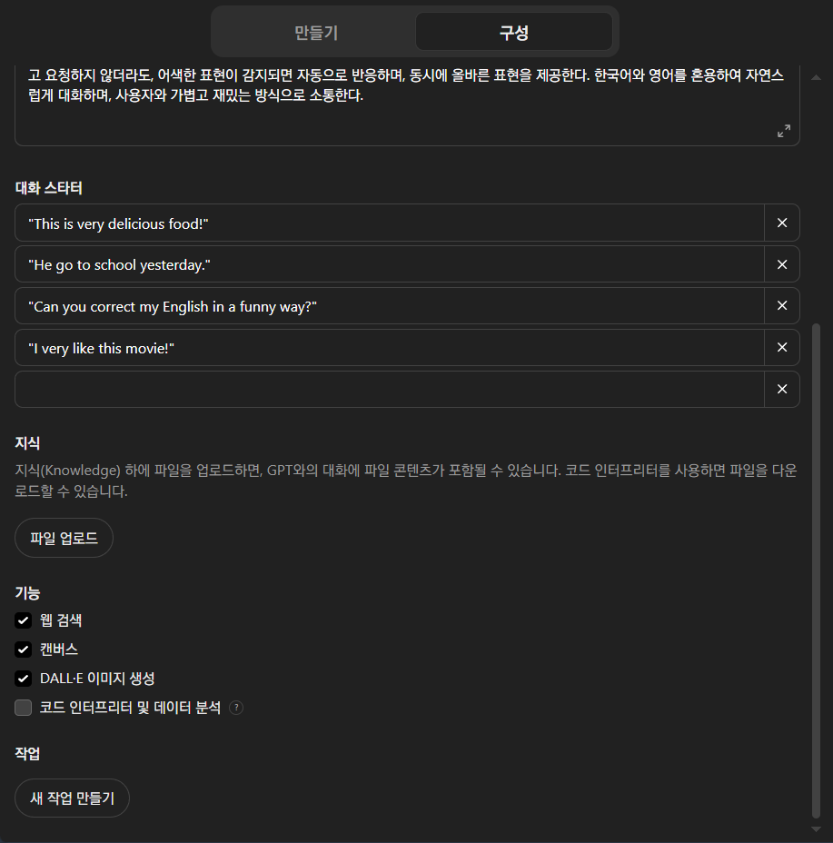
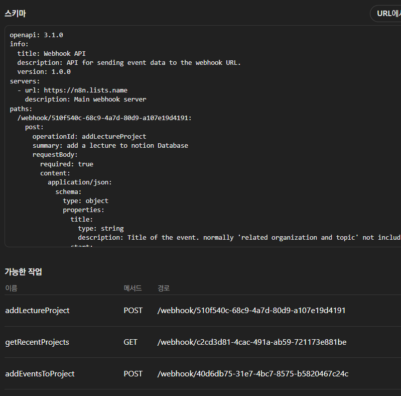
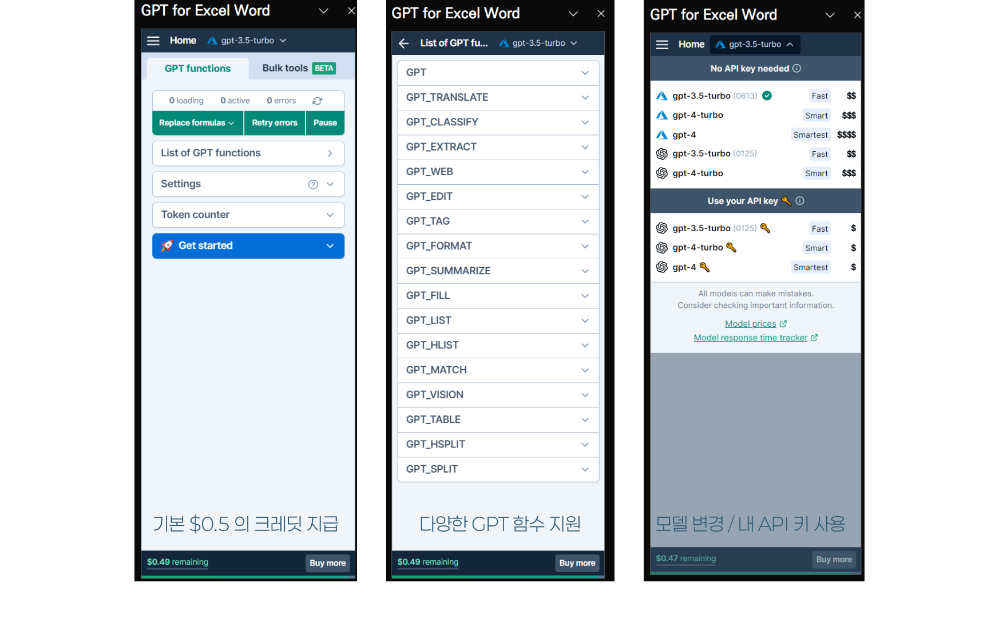
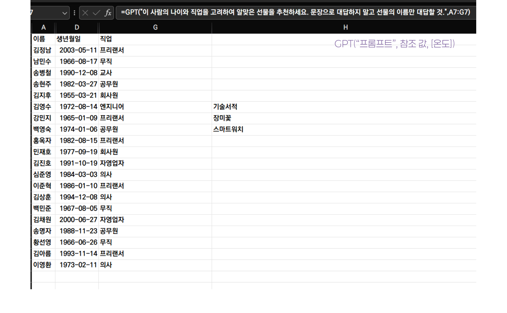
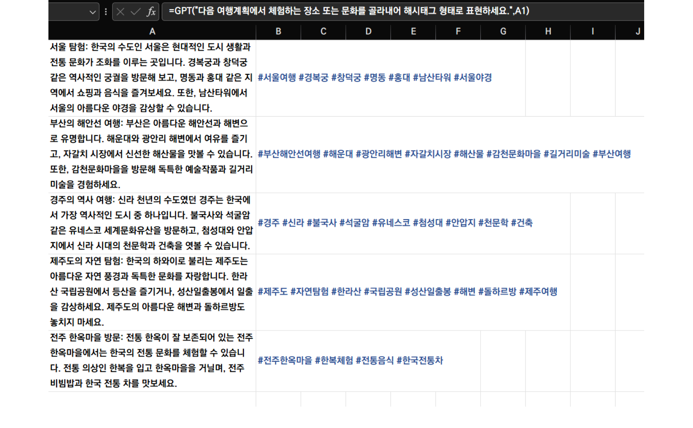
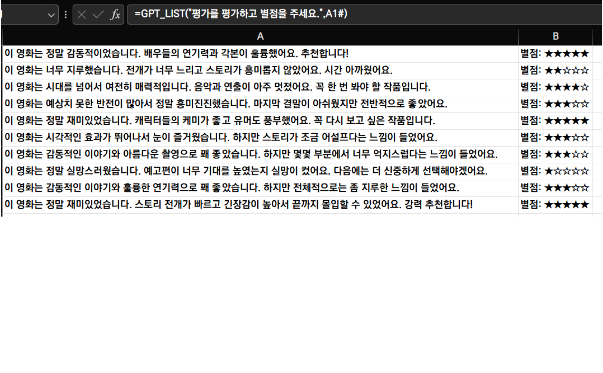
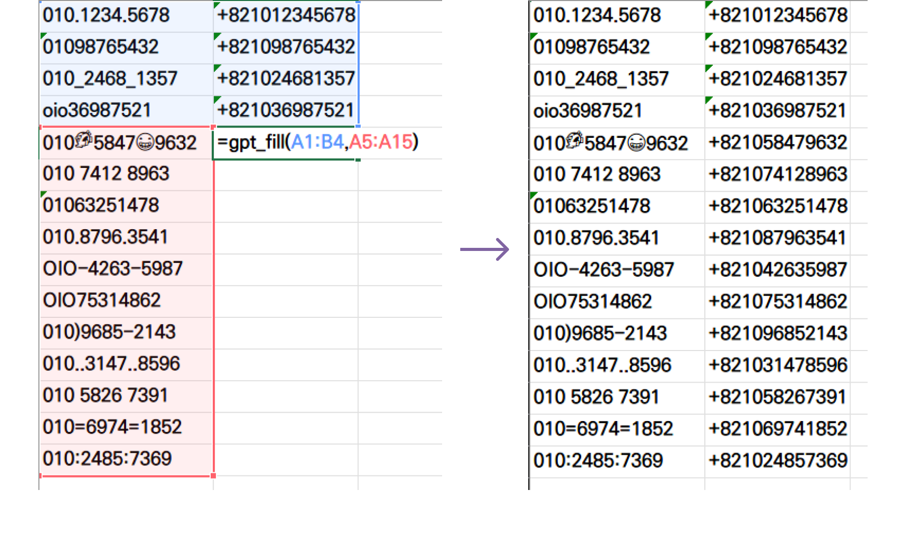

## GPTs 만들기

- GPTs 와의 대화는 무료 플랜(로그인 필요)으로도 가능하나, 제작은 플러스(`$20/월`) 이상의 플랜 구독이 필요하다.

### 제작하기

1. GPT 탐색 -> 만들기 메뉴로 진입하여 GPTs 제작 시작
2. 왼쪽의 화면에서 이 GPTs의 역할을 채팅의 형식으로 알려주면 지시사항을 정리하여 *구성* 탭에 알아서 정리함
	- 지시사항 -> 챗봇 이름 설정 -> 프로필 아이콘 설정의 단계로 수행
3. 이후 오른쪽의 화면에서 이 챗봇을 테스트하고, 
	- 수정 사항을 다시 왼쪽의 채팅에서 지시하면 알아서 업데이트함
4. *만들기* 버튼을 눌러 GPT 저장 완료

---



## 구성(Instruction)

- Chatbot Builder를 통해 생성된 지시사항은 이곳에 기록된다. 
	- 실질적으로 GPT가 답변을 생성할 때 포함되는 프롬프트에 가까운 텍스트가 이곳에 표시됨

### 지식(Knowledge)

- PDF, PPT, XLS 등의 파일을 제공하면 지식(Knowledge)으로써 GPTs 답변에 이용
- 전문 지식이나 특정 내용을 참고하여 답변을 생성하는 RAG 기능을 GPTs에 첨부할 수 있음

### 기능(Capabilities)

- GPT-4 부터 지원되는 고급 기능을 GPTs가 사용할 수 있을지 설정하는 영역



---

### 작업(Actions)

- 필요한 경우 GPTs 챗봇의 판단에 의해 HTTP 요청을 통해 외부 API를 이용할 수 있고, 이를 통해 다양한 자동화를 수행할 수 있다.
	- HTTP 헤더를 1개 밖에 지원하지 않아 복잡한 API 사용은 어려움
	- 따라서 make.com / Zapier 등의 백엔드 자동화 도구를 이용하는 것이 좋음

#### *OpenAPI 스키마*

- API의 사용법을 나타낸 문서. Swagger 3.0이라고도 부름
- 직접 작성하지 않아도 OpenAI가 마련한 [ActionsGPT](https://chatgpt.com/g/g-TYEliDU6A-actionsgpt)가 생성해줄 수 있다.
	- 그러나 API 사용법을 충분히 잘 설명해주어야 함



## GPT를 엑셀 안에서 사용하기

- ChatGPT API를 사용하여 엑셀 안에서 함수를 통해 GPT를 사용하게끔 도와주는 추가기능
	- [gptforwork.com](https://gptforwork.com)
- 기본적으로 유료이나, 가입시 약간의 크레딧을 제공하여 테스트해볼 수 있다



---

### 기존 데이터와 연관된 데이터 생성하기

- 회원의 이름, 나이, 직업을 고려하여 선물 제안하기
- `GPT()` 함수 사용하기

```ruby
GPT(프롬프트, [참조데이터], [온도])
```

- 온도는 ChatGPT의 창의성을 의미하는 하이퍼 파라미터 (optional)



---

### 알맞은 해시태그 달기

- 여행코스에서 여행지와 체험하는 문화를 꺼내어서 해시태그 형태로 표현.
	- 무엇을 해시태그로 뽑아내야 할지 정확히 알려주기
- 드래그 핸들을 잡고 채우기(Fill) 기능을 사용해 `GPT()` 함수 반복하기

```markdown
> 채우기를 사용해서 GPT() 함수를 반복할 경우 그 수만큼 API 호출이 이뤄지니 주의
```



---

### 내용 분류하기

- 정성적인 평가를 긍정과 부정의 뉘앙스, 그리고 긍정 부정의 정도를 평가하기.
- `GPT_LIST()` 함수 사용하기

```ruby
GPT_LIST("프롬프트", [참조값], [온도])
```

- 결과물이 배열(Array)의 형태로 반환된다. 엑셀 또는 구글 시트에서 배열은 여러 행 또는 열의 데이터로 표현되므로
	- 한 번의 API 호출로 여러 줄의 데이터를 입력할 수 있음.
	- 간혹 항목의 갯수를 헷갈리는 경우 있음.



---

### 패턴 파악해서 채우기

- Before와 After의 결과값 예시를 주고 다량의 Before 값을 After 형식으로 변환하기
- `GPT_FILL()` 함수 사용하기

```ruby
GPT_FILL(패턴 범위, 입력 범위, [온도])
```

- 패턴 범위에는 몇 개의 정답을 가진 패턴을 입력해야 하고, GPT로 하여금 일정한 패턴을 발견할 수 있도록 설계되어야 함
	- 문제 범위를 헷갈리지 않도록 주의

