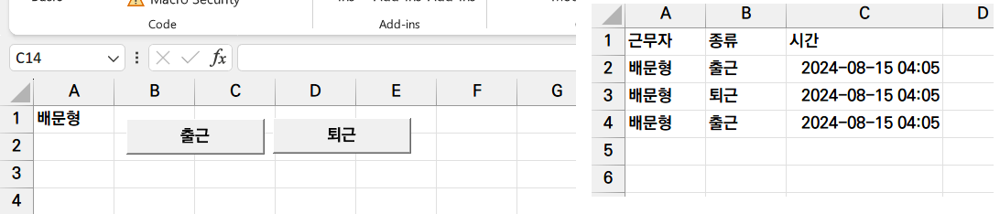
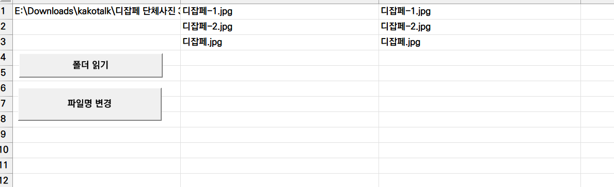
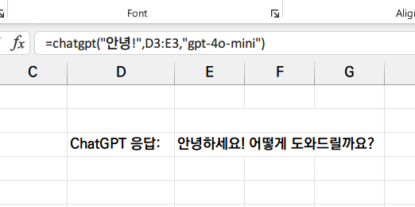

## VBA

- Visual Basic for Applications
- 파워포인트, 엑셀 등의 기능을 조작하는 스크립트 언어로, (상대적으로) 쉬운 문법과 오피스에 구석구석 통합되어 있어 많은 작업을 줄일 수 있음.

### 두 가지 사용 방식

- 매크로
	- 엑셀의 일련된 작업들을 VBA를 통해 자동화할 수 있음
	- 버튼 또는 UI 컨트롤을 추가하여 트리거 기반의 자동화 과정을 실행
- 사용자 함수
	- 기존 엑셀 함수에 더해 사용할 수 있는 사용자 커스텀 함수를 VBA로 제작할 수 있음

## 근태 체크 엑셀 매크로 만들기

- 출근/퇴근 버튼을 누르면 근태 시트에 자동으로 출퇴근 시간이 적히도록 엑셀 매크로 작성
	- 다음과 같은 기능을 하는 엑셀 VBA 매크로를 작성해줘. 버튼을 누르면 "근무자" 시트의 A1셀에 적혀있는 근무자 이름을 가지고 "출퇴근" 시트에 한 줄을 기록. A열에는 근무자의 이름, B열에는 "출근" C열에는 현재 시간을 적어줘

```markdown
> 코드를 요청하는 프롬프트보다 사실은 버튼을 배치하고 그 버튼의 동작을 구상하는 것이 훨씬 중요하다.
```



## 파일명 변경 엑셀 만들기

- 폴더 내 파일명을 일괄 변경해주는 엑셀 매크로 만들기
- "다음과 같은 기능을 수행하는 엑셀 VBA 매크로를 작성해줘"
	- 버튼을 누르면 A1열에 적혀있는 시스템 경로의 폴더의 모든 파일명을 불러와서 B열에 한줄씩 적는 매크로
	- 버튼을 누르면 B열의 각 행에 있는 A1셀의 시스템 경로의 파일명을 C열의 대응하는 각 행의 변경된 이름으로 변경하는 매크로. 단 B열과 C열의 이름이 같은 경우 처리하지 말 것.

```markdown
> 사실은 이미 누가 만들어둔 편리한 매크로가 있으니 이런 것도 할 수 있다는 걸 참고만 하고 이걸 쓰도록 하자.
```

- [파일명 변경 매크로](https://m.blog.naver.com/dowahn/130114764344)



## ChatGPT를 엑셀에서 사용할 수 있도록 커스텀 함수 만들기

- GPT API`GPT()` 함수 만들기
- 패키지 설치

