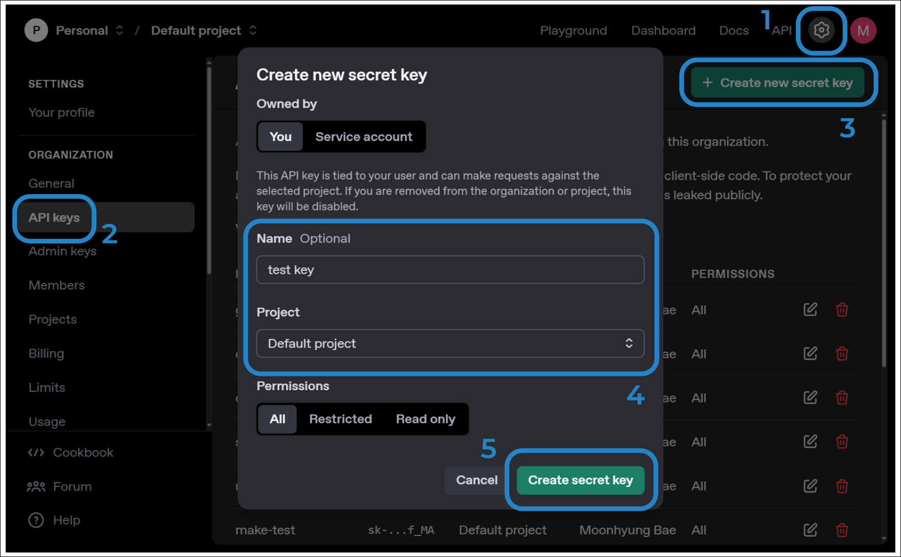

## OpenAI API Key 발급

1. [https://platform.openai.com](https://platform.openai.com)으로 이동 및 로그인
2. 설정(Settings) - API Keys로 이동
3. Create new secret key
4. 이름과 프로젝트를 입력하고 Create Secret Key

- API키의 이름은 여러 개의 키를 발급했을 때 어디에 썼던 키인지 기억하기 위해 쓰는 것
- 생성 직후에만 키를 확인할 수 있으므로 잃어버리면 재발급을 해서 사용
	- 기존 키는 반드시 폐기

