# 일반적인 키워드

## 정서

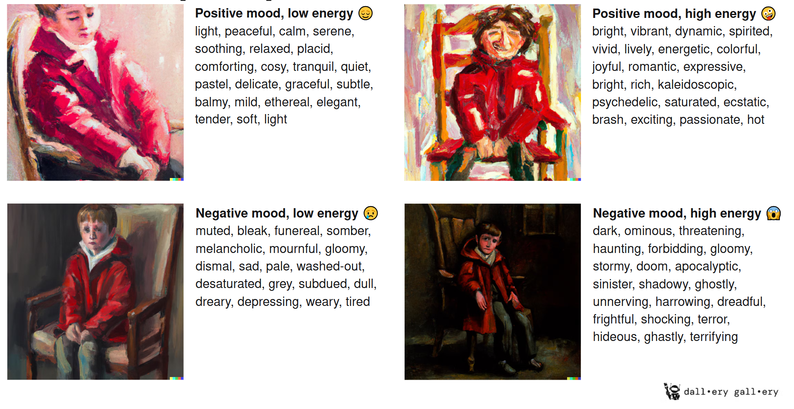

## 구조와 규모

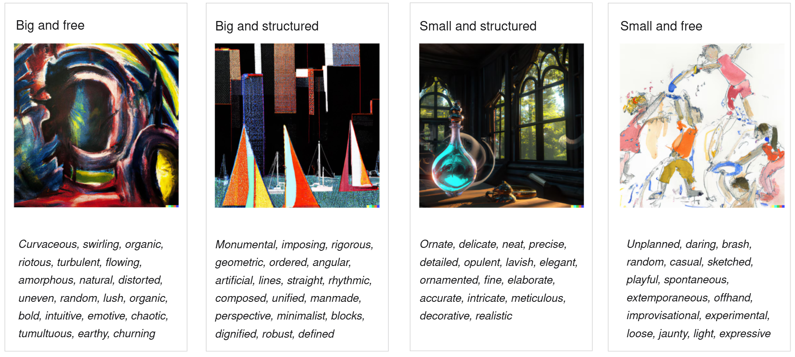

## 느낌, 바이브

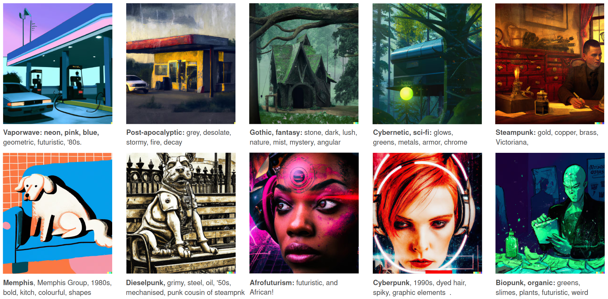

# 실사

## 실사 사진을 만들기 위한 프롬프트

- 사진이 어떻게 구성되었나?
- 정서적인 느낌은 어떠한가?
- 어떤 앵글로 얼마나 가까이에서 찍혔나?
- 피사계 심도(Depth of field)는 어느정도?
- 빛은 어느방향에서 얼마나 와서 피사체에 얼마나 부딪히는가?
- 자연광인가 인공광인가? 빛의 색은? 하루 중 언제 찍혔나?

***

- 어떤 카메라, 어떤 렌즈를 사용했나? 접사/망원/광각?
- 스튜디오? 아니면 세상의 어딘가. 어디에서 찍혔나?
- 디지털/아날로그 어떤 카메라를 사용했나?
- 어떤 시대의 사진인가?
- 사진은 언제 어떤 상황에 출판되거나 사용되었나?

---

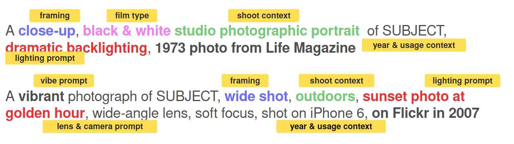

## 피사체와의 거리

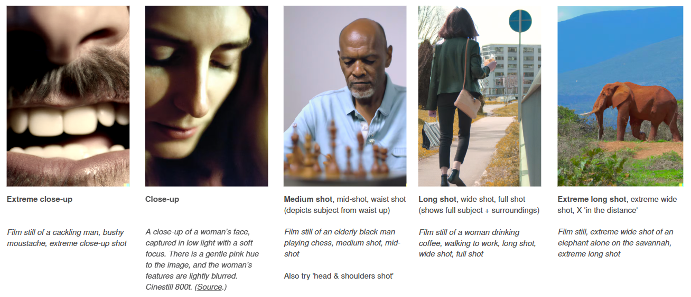

## 카메라의 위치

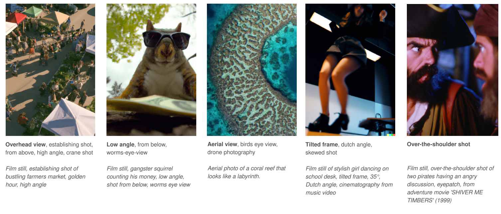

## 카메라 설정 / 렌즈

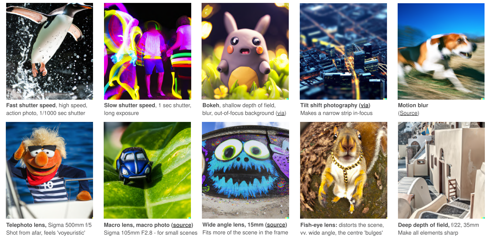

## 자연광

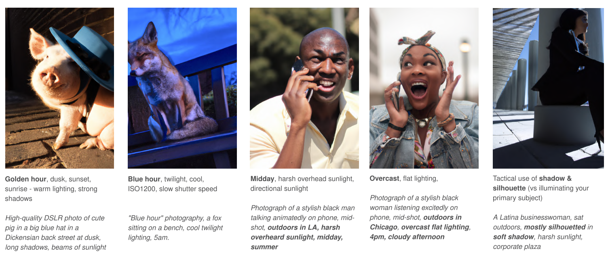

## 인공광

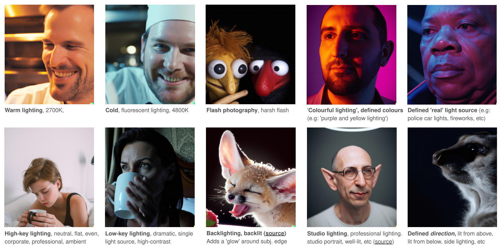

## 영화적 연출

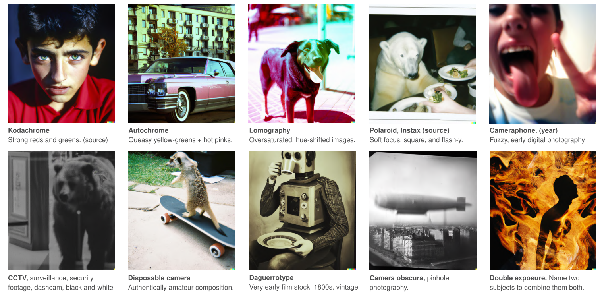

---

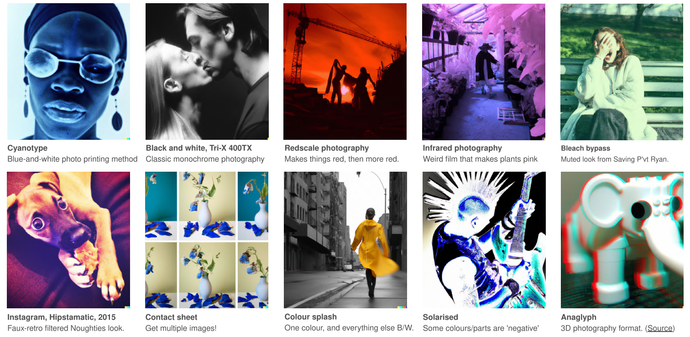

## 레퍼런스: TV쇼 / 영화

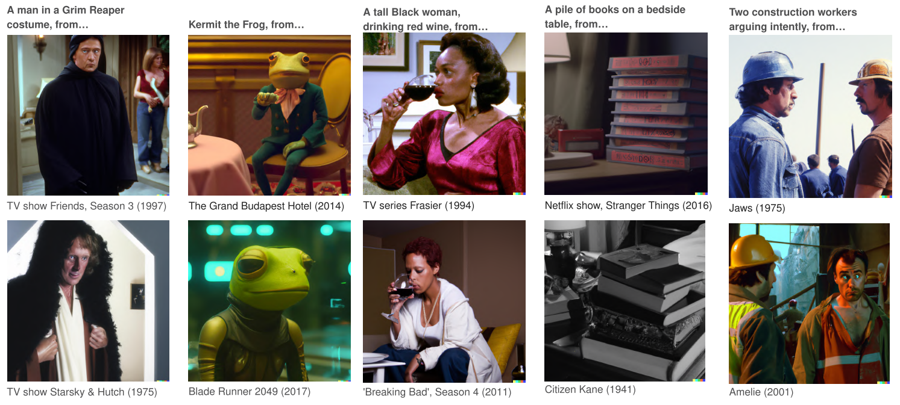

## 레퍼런스: 사진 관련 업계 

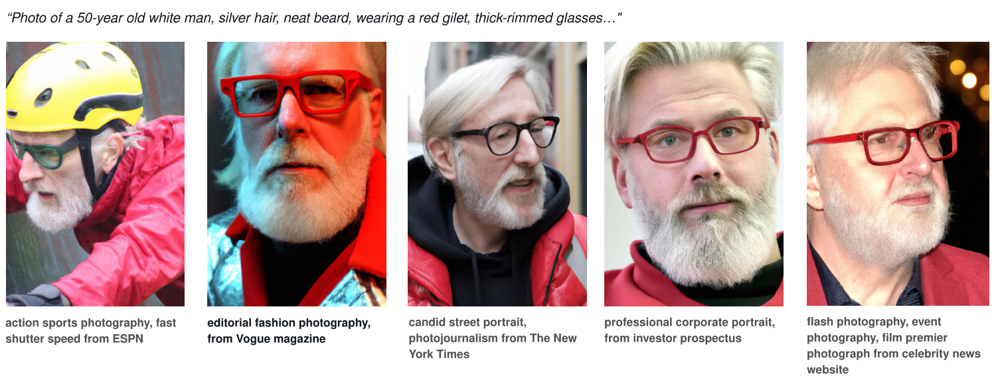

## 레퍼런스: 유명 사진작가

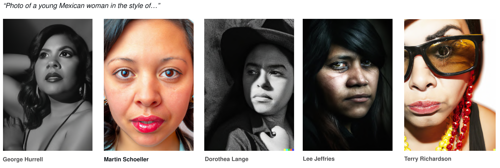

# 그림

## 흑백, 아날로그

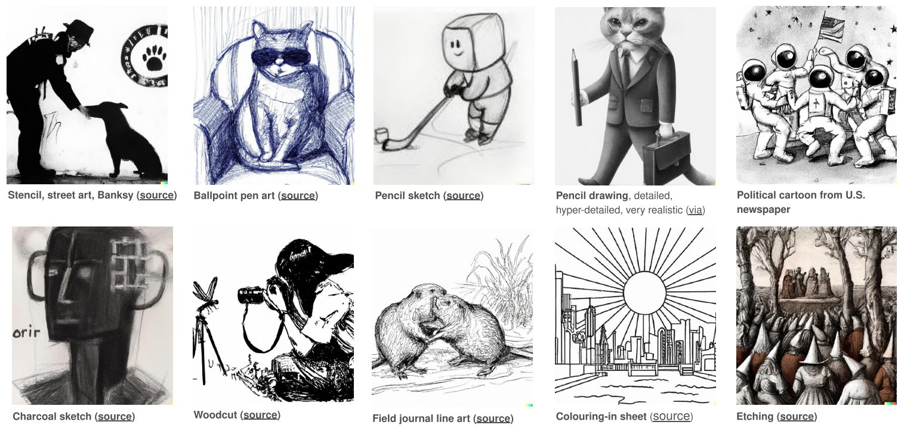

## 컬러, 아날로그

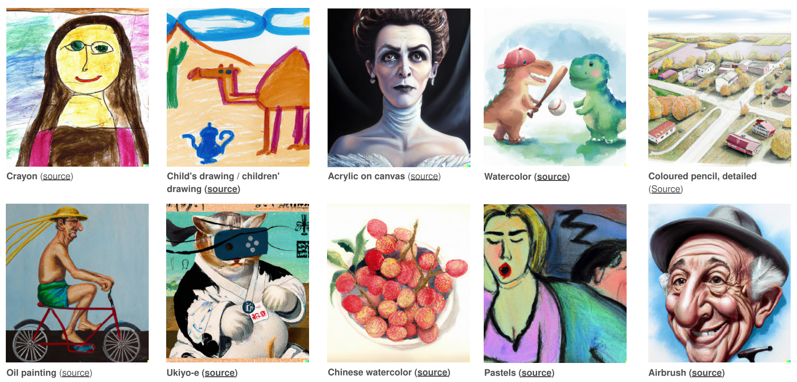

## 디지털

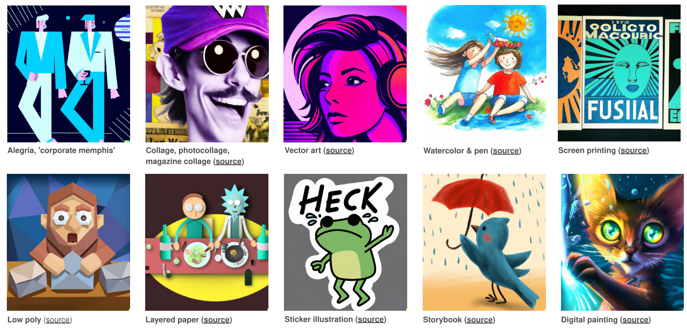

## 교육 / 정보전달

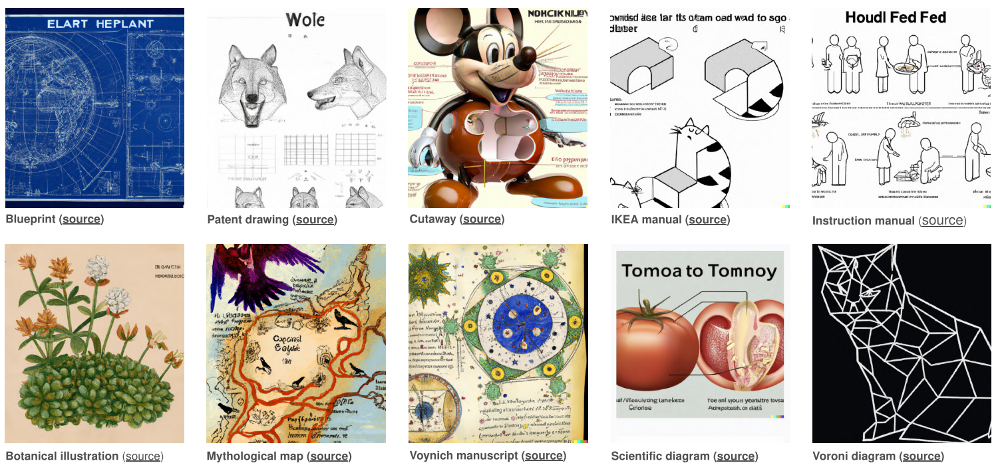

## 3D / 텍스처

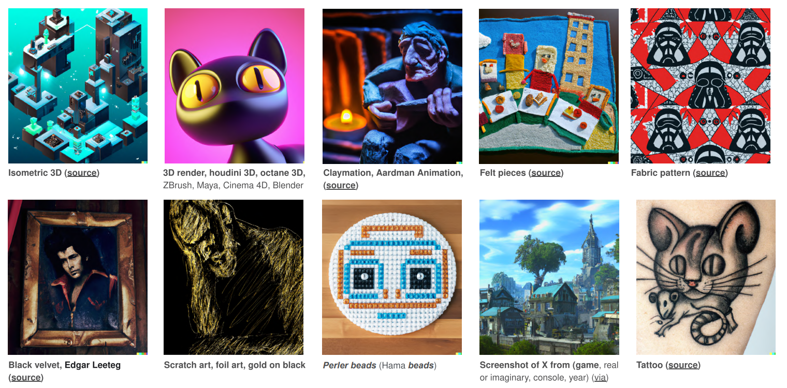

## 