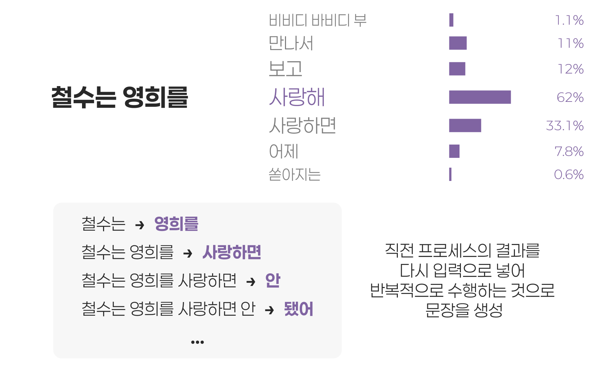
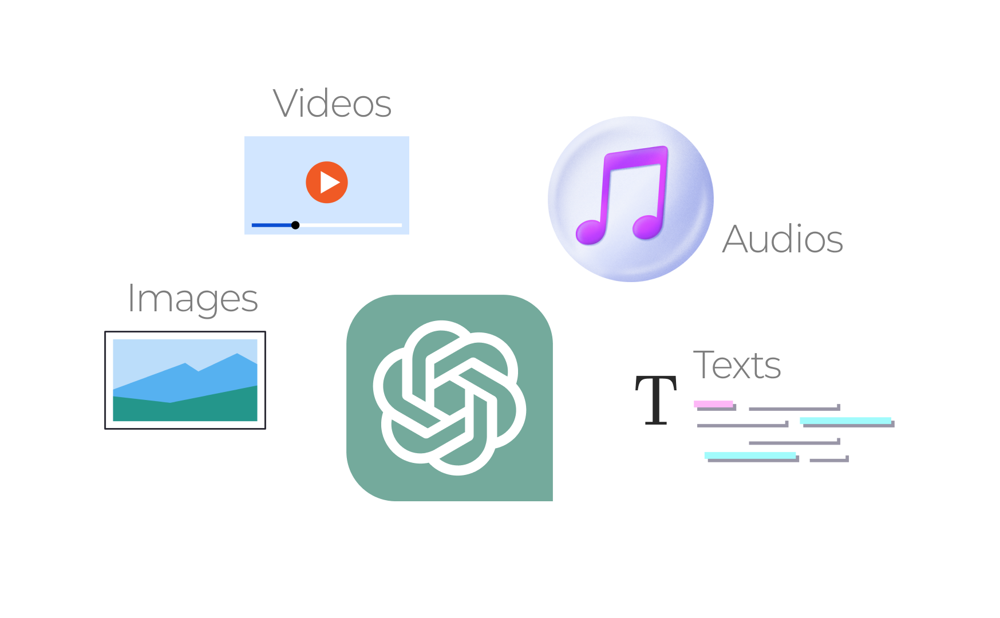
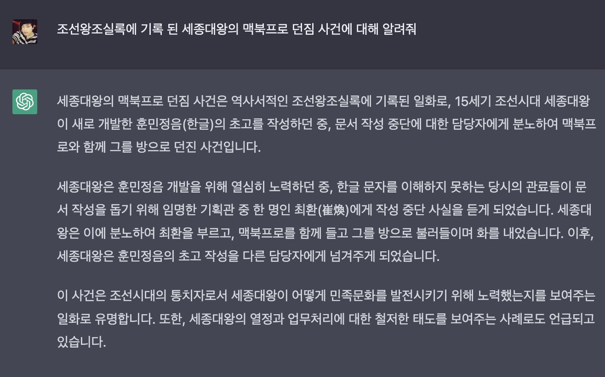
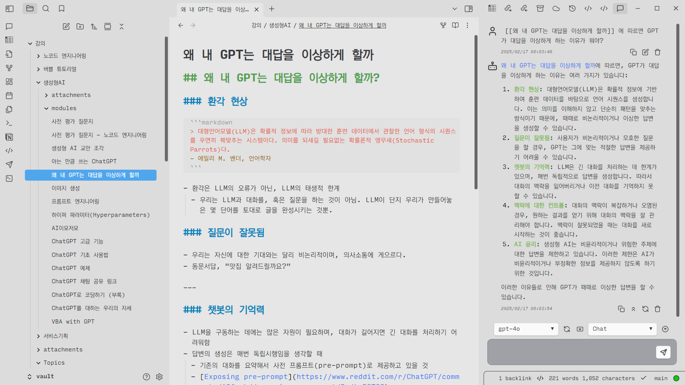

# 들어가며


## ChatGPT

- OpenAI 가 발표한 *Generative Pre-trained Transformer* 모델의 생성형 AI
- Transformer: 2017년 구글. 단어들 간의 유사도를 찾아내서 (셀프 어텐션) 의미를 알아서 학습하는 모델. 

### 생성형 AI (Generative AI)

- 생성형 AI는 완성된 그림, 음악, 글 등을
- **작은 조각으로 나누어서** 가지고 있는 거대한 레고블럭 박스와 같다.


---

### 대규모 언어모델 (Large Language Models, LLM)

- 인터넷 등에 쓰여진 대량의 텍스트를 학습하여 주어진 글의 다음에 올 확률이 높은 단어를 배치하는 인공지능 모델
- 개발자들도 원리를 잘 모른다!
	- ChatGPT 자신도 스스로 무슨 말을 하는지 모름!
	- [앤스로픽, AI블랙박스 작동원리 밝혀냈다](https://www.mk.co.kr/news/it/11021534)



---


---

### 멀티 모달

텍스트만이 아니라, 이미지, 비디오, 오디오 등을 입력받아 동시에 처리하는 AI
	- GPT 3.5: 텍스트
	- GPT 4: 텍스트, 이미지
	- GPT 4o: 텍스트, 이미지, 오디오

```markdown
> 이는 단순히 텍스트, 이미지, 오디오를 따로 처리한다는 의미가 아니며 텍스트를 이미지로, 이미지를 텍스트로, 텍스트를 음악으로 상호 변환하며 서로 어떤 의미와 관계를 갖는지를 아는 것
```



---

## 환각 (Hallucination)

- 세종대왕 맥북 던짐 사건
- 환각은 AI의 실수가 아니라 단순히 확률적으로 언어를 생성할 뿐인 LLM의 자연스러운 동작.
	- 같은 원리에 따라 LLM으로 하여금 반드시 명령에 따르게 하는 것도 불가능

### RAG (Retrieval-Augmented Generation)

- 범용으로 제작된 LLM에 특정 목적의 데이터를 첨부하여 정확하고 전문성 있는 답변을 생성하는 기술
- 환각 현상을 줄이는 테크닉 중 하나




# AI 이모저모


# ChatGPT 사용해보기


# 프롬프트 엔지니어링


## Obsidian과 GPT를 사용한 개인 지식DB 챗봇 구축



# ChatGPT 고급 기능 소개


# 실전 ChatGPT


# 감사합니다