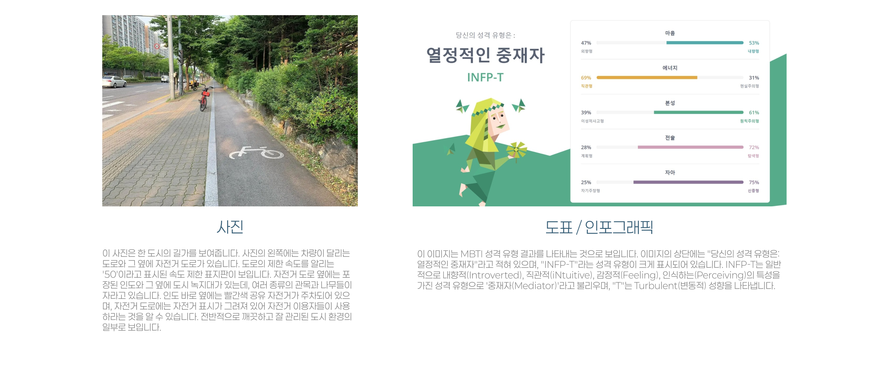
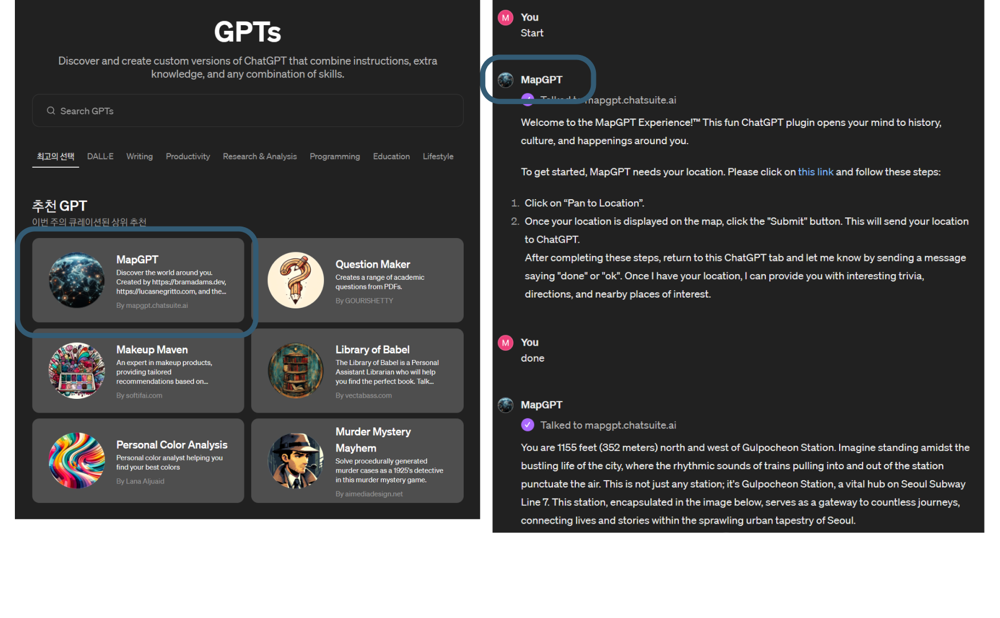

# 들어가며

## ChatGPT

- OpenAI 가 발표한 *Generative Pre-trained Transformer* 모델의 생성형 AI
- Transformer: 2017년 구글. 단어들 간의 유사도를 찾아내서 (셀프 어텐션) 의미를 알아서 학습하는 모델. 

### 생성형 AI (Generative AI)

- 생성형 AI는 완성된 그림, 음악, 글 등을
- **작은 조각으로 나누어서** 가지고 있는 거대한 레고블럭 박스와 같다.

---

### 대규모 언어모델 (Large Language Models, LLM)

- 인터넷 등에 쓰여진 대량의 텍스트를 학습하여 주어진 글의 다음에 올 확률이 높은 단어를 배치하는 인공지능 모델
- 개발자들도 원리를 잘 모른다!
	- ChatGPT 자신도 스스로 무슨 말을 하는지 모름!
	- [앤스로픽, AI블랙박스 작동원리 밝혀냈다](https://www.mk.co.kr/news/it/11021534)

---

---

### 멀티 모달

텍스트만이 아니라, 이미지, 비디오, 오디오 등을 입력받아 동시에 처리하는 AI

- 이는 단순히 텍스트, 이미지, 오디오를 따로 처리한다는 의미가 아니며 텍스트를 이미지로, 이미지를 텍스트로, 텍스트를 음악으로 상호 변환하며 서로 어떤 의미인지를 아는 것
	- GPT 3.5: 텍스트
	- GPT 4: 텍스트, 이미지
	- GPT 4o: 텍스트, 이미지, 오디오

---

## 환각 (Hallucination)

- 세종대왕 맥북 던짐 사건
- 환각은 AI의 실수가 아니라 단순히 확률적으로 언어를 생성할 뿐인 LLM의 자연스러운 동작.

### RAG (Retrieval-Augmented Generation)

- 범용으로 제작된 LLM에 특정 목적의 데이터를 첨부하여 정확하고 전문성 있는 답변을 생성하는 기술

# AI 이모저모

# ChatGPT 사용해보기

# 프롬프트 엔지니어링

# ChatGPT 고급 기능 소개

## Custom Instruction

- ChatGPT가 좀 더 사용자 친화적으로 대답할 수 있도록 사용자의 정보나 답변에 있어서의 희망사항을 미리 알려주기

## Vision & DALL-E

::: notes
- GPT-4 Vision: 사진을 보고 해석하는 능력
	- 프롬프트에 사진 파일을 첨부
- DALL-E 3: 프롬프트 기반으로 이미지를 생성하는 능력 (Midjourney와 같은)
	- '그림을 그려줘.', '이미지를 생성해줘.' 등의 표현 사용
- 풍경 사진, 이미지에서 도표, 이미지로 된 텍스트까지
:::

## Browsing

- 실시간으로 인터넷을 검색하고, 검색한 내용을 기반으로 추론, 분석하는 것
	- '최근', '오늘', '2024년' 등 시점을 가리키는 표현
	- LK-99 등 최근 화제가 되었던 연속성 있는 이슈
	- '검색해줘' 등의 직접적인 표현
- 기존 ChatGPT의 데이터 학습 시점
	- GPT-3.5: 2022년 1월 까지
	- GPT-4: 2023년 12월 까지
	- GPT-4o: 2023년 9월 까지

## Data Analysis

- 파이썬 백엔드를 실행하여 데이터 분석 등을 수행하는 기능
	- 파일 리딩: CSV, PDF, PPT, XLS, DOC 등 문서 제공
	- '차트를 그려줘.'와 같은 표현
- 알아서 파이썬 코드를 짜고 실행함.
	- 오류 발생 시 자동으로 재시도
- 기본적으로 파이썬으로 수행가능한 데이터 분석, 파일 관련, 수학 등의 요청을 받아들이나, API콜, 크롤링 등 시스템에 영향을 주거나 부담스러운 작업은 거절
	- [ChatGPT로 동영상 만들기](https://www.clien.net/service/board/lecture/18553432)

## GPTs

- 자주 사용하는 GPT 프롬프트 설정을 별도의 GPT로 만들어서 편리하게 독립된 채널에서 대화하기
- GPT-4의 모든 기능 사용 가능: 
	*Vision, Browsing, Data Analysis*
- 액션: 요청 받은 텍스트의 내용에 따라, 외부 API를 사용해서 전용 기능을 실행하고 그 응답결과를 답변 처리에 사용가능
- 만든 GPT는 스토어에 올려 누구나 쓸 수 있게 만들거나, 유료화할 수도 있음

## ChatGPT App Mobile/Mac

- 설치형ChatGPT 앱
- ChatGPT와 음성대화 가능!
- 백그라운드 대화

# 실전 ChatGPT

# 감사합니다