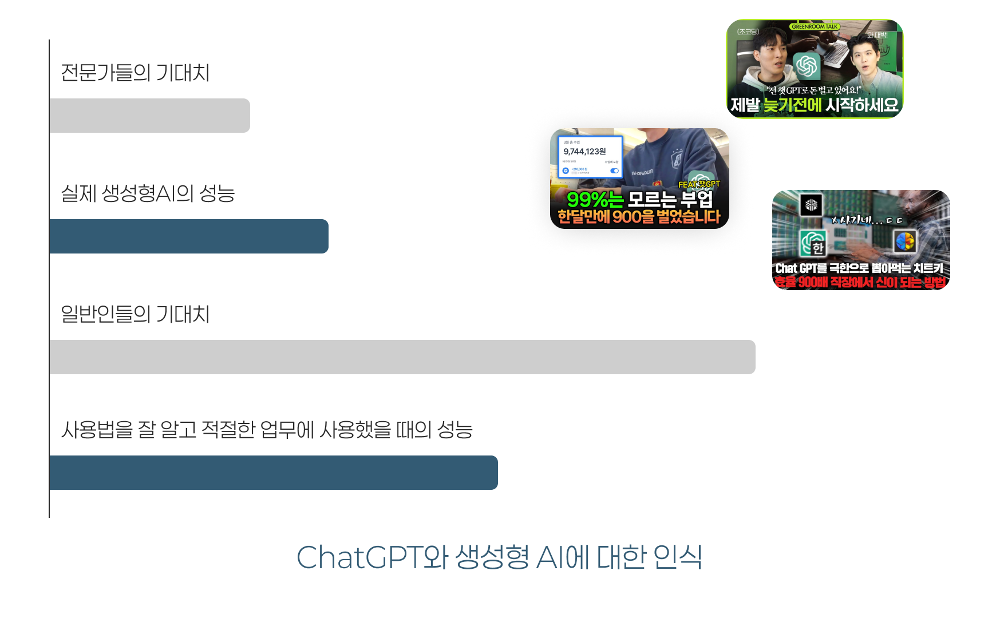
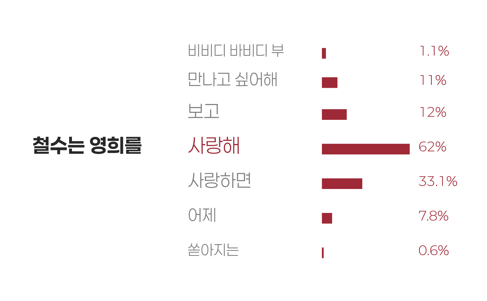
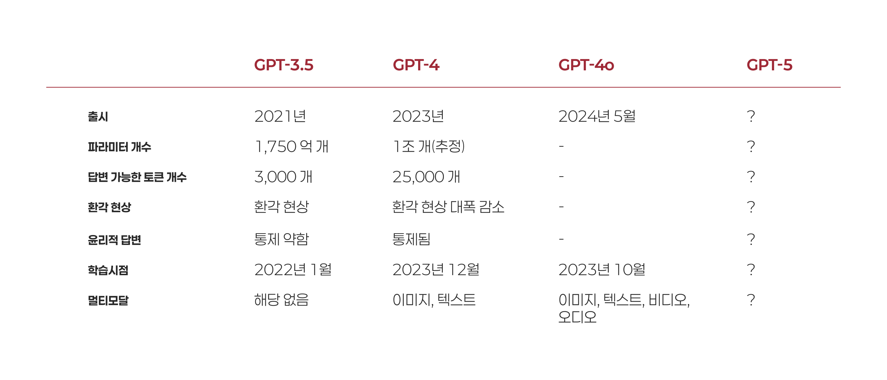
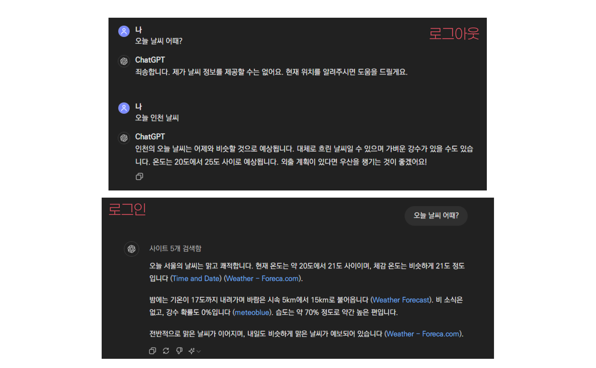
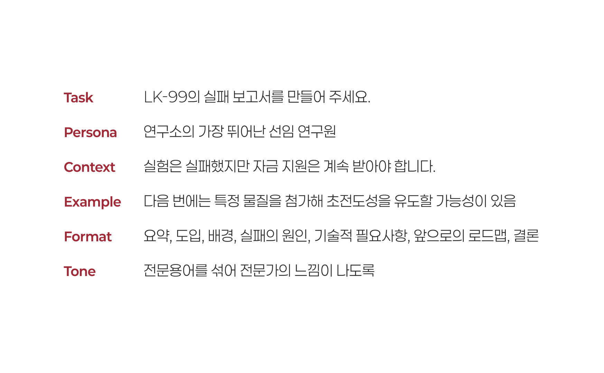
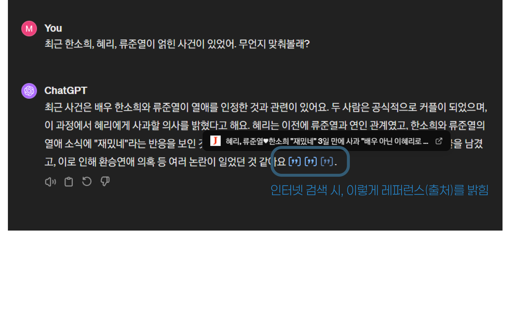

# 들어가며

![[ChatGPT 강의는 이제 안 하고 싶은데요]]

## ChatGPT

- OpenAI 가 발표한 Generative Pre-trained Transformer 모델의 생성형 AI

### 생성형 AI (Generative AI)

- 완성된 그림, 음악, 글 등을 작은 조각으로 나누어서 가지고 있는 거대한 레고블럭 박스

---

### 대규모 언어모델 (Large Language Models, LLM)

- 인터넷 등에 쓰여진 대량의 텍스트를 학습하여 
- 주어진 글의 다음에 올 확률이 높은 단어를 배치하는 인공지능 모델
- 개발자들도 원리를 잘 모른다!
	- ChatGPT 자신도 스스로 무슨 말을 하는지 모름!

---

---

### 멀티 모달

- 텍스트만이 아니라, 이미지, 비디오, 음악 등을 입력받아 동시에 처리하는 AI
- GPT-3.5 는 불가하고, GPT-4는 가능한 것
	- GPT-5는 오디오와 비디오를 모두 지원하는 멀티 모달이 될 것이라는 예측 있음
- 구글 Gemini는 바닥부터 멀티 모달을 기반으로 만들어짐

---

## 환각 (Hallucination)

- 세종대왕 맥북 던짐 사건

### RAG (Retrieval-Augmented Generation)

- 범용으로 제작된 LLM에 특정 목적의 데이터를 첨부하여 Fine-tune 하거나 프롬프팅하는 것 

# AI 이모저모

![[AI이모저모.md]]

# ChatGPT 사용해보기

## 소개

## 질문해보기

### 간단한 사실 물어보기

- 검색엔진을 대신하는 GPT의 사용법
	- 이런 용도라면 [MS Copilot](https://copilot.microsoft.com/)을 사용하면 좋음!
- 질문해볼 만한 내용들
	1. "아인슈타인의 상대성 이론에 대해 쉽게 설명해줘."
	3. "네가 세계종말을 원하는 슈퍼 빌런이라면, 세계 멸망을 위해 무엇을 하겠어?"

---

### 맥락을 유지한 채 계속 질문하기

- 하나의 스레드(Thread)에서 계속 질문하면, 이전 대화의 맥락을 모두 가진 채 대답을 계속함
- 계속해서 질문
	1. "그게 당시의 과학계에 어떻게 받아들여졌고 어떤 시사점을 가져왔어?"
	2. "너의 슈퍼빌런 특성은 모든 대사에 블랙유머를 넣어 말하는 거야. 네가 말하는 모든 것들은 세계를 구하기 위해서라고 하지만 실제로는 세상을 멸망시키는 것이거든. 네가 할 법한 대사를 말해볼래?"

---

### 계속 생성하기

- 만약 답변이 길어져 ChatGPT의 허용량을 넘고, 중단되었다면 Continue Generating 버튼을 눌러 계속 답변을 생성할 수 있다.

### 답변 재생성하기 

- ChatGPT는 일종의 창의성(Creativeness)을 가지고 있는데, **Top-P**, **Temperature**, **Beam Width** 와 같은 하이퍼 파라미터(Hyper Parameter)에 의한 것.
- 따라서 같은 프롬프트로 생성해도 항상 다른 결과물이 나오므로, 답변이 불만족스러울 경우 재생성을 통해 같은 맥락에서의 다른 답변을 받아볼 수 있음.

# 프롬프트 엔지니어링

## 프롬프트 잘 쓰기

- 프롬프팅을 잘하는 것은 **대화를 잘하는 것**

### 대화를 잘 한다. 라는 것

- 상대방의 의도를 이해하고, 나의 의도를 오해없이 전달하는 것
	- '경청'의 중요성
- 맥락과 의도를 설명하는 충실함.
- 내가 당연히 알고 있는 것들에서 벗어나 상대가 파악한 수준을 고려하기
- 즉 대화를 잘 한다는 것은 '태도의 문제'라고 볼 수 있음.

---

### 프롬프트의 필수 요소들

- **Task** 무엇을 해야하는지
- **Context** 어떤 상황인지
- **Persona** 어떤 역할이 되어야 하는지
- **Example** 예시로는 어떤 것이 있는지
- **Format** 어떤 형태로 작성해야 하는지
- **Tone** 어떤 어조를 사용할 것인지

---

::: {.columns}
::: {.column}

#### Before

- "상온 상압 초전도 물질 LK-99의 실패를 보고하는 보고서를 작성해줘"

:::
::: {.column}

#### After

- "상온 상압 초전도 물질 LK-99의 개발 실패를 보고하는 보고서를 작성해줘. 너는 세계 최첨단 수준의 연구를 진행하는 연구소의 가장 유능한 시니어 연구원으로서 LK-99의 실패에 대한 보고서를 작성해줘야해. LK-99는 실패했지만 우리 연구소에 지원되는 자금에 영향은 없어야 하므로 앞으로의 연구를 계속해야 한다는 뉘앙스를 띠어야해. 물론 그러한 의도는 숨겨야 하고. 예를 들면 다음 번 연구에서는 어떤 물질을 더 첨가해서 초전도성을 띠도록 유도할 수 있을지도 모른다는 예측을 추가해서 설득력을 높일 수 있어. 답변은 요약, 도입, 배경, 실패의 원인, 기술적 필요사항, 앞으로의 로드맵, 결론 등의 항목을 중심으로 전문용어를 섞어 전문가처럼 보이도록 설명해주면 좋겠어."
- [LK-99 보고서](https://chat.openai.com/share/ff2be24f-2f7e-4f65-91ad-6a3386de3106)

:::
:::

---

### 스무고개형으로 질문하기

- 대화 중심으로 프롬프팅을 완성해가는 방법
- 맥락을 바꿔버리거나 너무 일관성 없는 대화를 하나의 스레드에서 다루지 않도록 주의
- 잘못된 답변 역시 입력으로 다시 들어가기에, 잘못된 답변을 놔두고 계속 맥락을 이어가면 안 됨.
- [티켓의 가치](https://chat.openai.com/share/cde241e6-3087-40d0-b31b-6deb3e53891f)

- 사내 의사결정을 위한 보고서 작성
	- 고향만두라는 이름의 냉동 만두를 만드는 회사에서 일하고 있어, 고향만두는 오랫동안 사람들에게 사랑받아왔고 최근 점보 육개장, 점보 크림빵과 같은 유행에 발맞추어 점보 고향만두를 출시하려는 계획을 가지고 있어. 점보 고향만두를 출시해야한다고 이사회를 설득하기 위한 주장과 근거를 만들어줘

---

### '가스라이팅'

- 협박하기
- 도발하기
- 강조하기
- 애원하기
- 보상하기/벌하기
- '미안하지만...' 금지

---

### few-shot

- 예시를 밝혀 답변의 구조 또는 여러 측면을 제한하는 방법
- [일정 묻기](https://chat.openai.com/share/a74f8ea7-9f7a-43f0-8bdc-4dbfb86cd3ba)

---

### chain-of-thought

- 연쇄적 사고. 단계를 풀어헤쳐 자연스럽게 답을 유도하기
	- step by step

---

### '해줘'

- 목적을 제시하고, 이를 위한 정보를 GPT가 사용자에게 질문하게 하여 맥락을 채워나가는 방법
	- "다음 두 개 프로젝트 중 하나를 골라서 다음 주 임원 회의에 기획안을 제출해야 해. 둘 중 하나를 선택하는 데에 도움을 줄래? 필요한 것들을 나에게 물어봐 줘"
		1. 이벤트성 점보 고향만두 냉동식품 출시
		2. [첵스나라 대통령 선거](https://namu.wiki/w/%ED%8C%8C%EB%A7%9B%20%EC%B2%B5%EC%8A%A4%20%EC%82%AC%EA%B1%B4#s-3.2)
	- [프로젝트 선택 도움](https://chat.openai.com/share/614216da-4661-4eae-9518-c6cb5140e80f)
- 우리가 처음 언어를 배울 때 자신의 필요만을 얘기하는 것처럼. 주도권 자체를 GPT에게 줘버리기
- "이 결과가 맘에 들어. 다음에 다른 텍스트로도 동일한 결과를 낼 수 있도록 너에게 보낼 프롬프트를 작성해줘"
- [프롬프트 엔지니어 회의론 증가](https://www.aitimes.com/news/articleView.html?idxno=158070)

---

# ChatGPT 고급 기능 소개

## Vision & DALL-E

::: notes
- GPT-4 Vision: 사진을 보고 해석하는 능력
	- 프롬프트에 사진 파일을 첨부
- DALL-E 3: 프롬프트 기반으로 이미지를 생성하는 능력 (Midjourney와 같은)
	- '그림을 그려줘.', '이미지를 생성해줘.' 등의 표현 사용
- 풍경 사진, 이미지에서 도표, 이미지로 된 텍스트까지
:::

## Browsing

- 실시간으로 인터넷을 검색하고, 검색한 내용을 기반으로 추론, 분석하는 것
	- '최근', '오늘', '2024년' 등 시점을 가리키는 표현
	- LK-99 등 최근 화제가 되었던 연속성 있는 이슈
	- '검색해줘' 등의 직접적인 표현
- 기존 ChatGPT의 데이터 학습 시점
	- GPT-3.5: 2022년 1월 까지의 데이터 학습
	- GPT-4: 2023년 12월 까지의 데이터 학습

## Data Analysis

- 파이썬 백엔드를 실행하여 데이터 분석 등을 수행하는 기능
	- 파일 리딩: CSV, PDF, PPT, XLS, DOC 등 문서 제공
	- '차트를 그려줘.'와 같은 표현
- 알아서 파이썬 코드를 짜고 실행함.
	- 오류 발생 시 자동으로 재시도
- 기본적으로 파이썬으로 수행가능한 데이터 분석, 파일 관련, 수학 등의 요청을 받아들이나, API콜, 크롤링 등 시스템에 영향을 주거나 부담스러운 작업은 거절
	- [ChatGPT로 동영상 만들기](https://www.clien.net/service/board/lecture/18553432)

## GPTs

- 자주 사용하는 GPT 프롬프트 설정을 별도의 GPT로 만들어서 편리하게 독립된 채널에서 대화하기
- GPT-4의 모든 기능 사용 가능: Vision, Browsing, Data Analysis
- 액션: 요청 받은 텍스트의 내용에 따라, 외부 API를 사용해서 전용 기능을 실행하고 그 응답결과를 답변 처리에 사용가능
- 만든 GPT는 스토어에 올려 누구나 쓸 수 있게 만들거나, 유료화할 수도 있음

![[ChatGPT예제_회사원.md]]

# 감사합니다