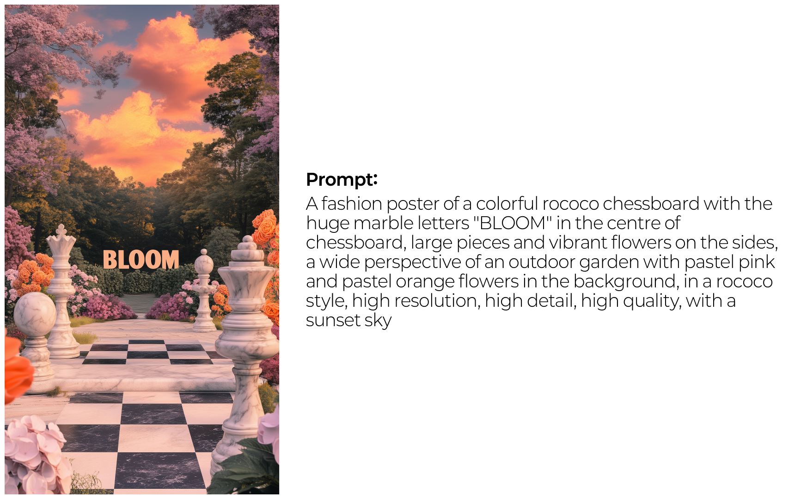
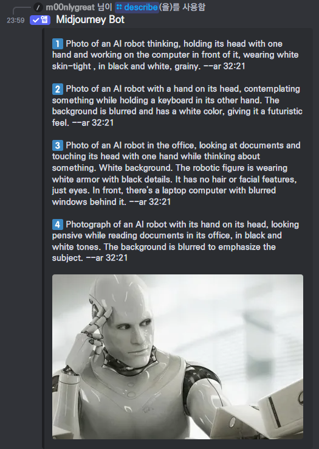
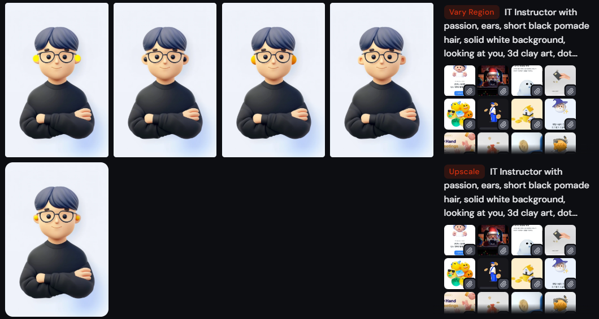
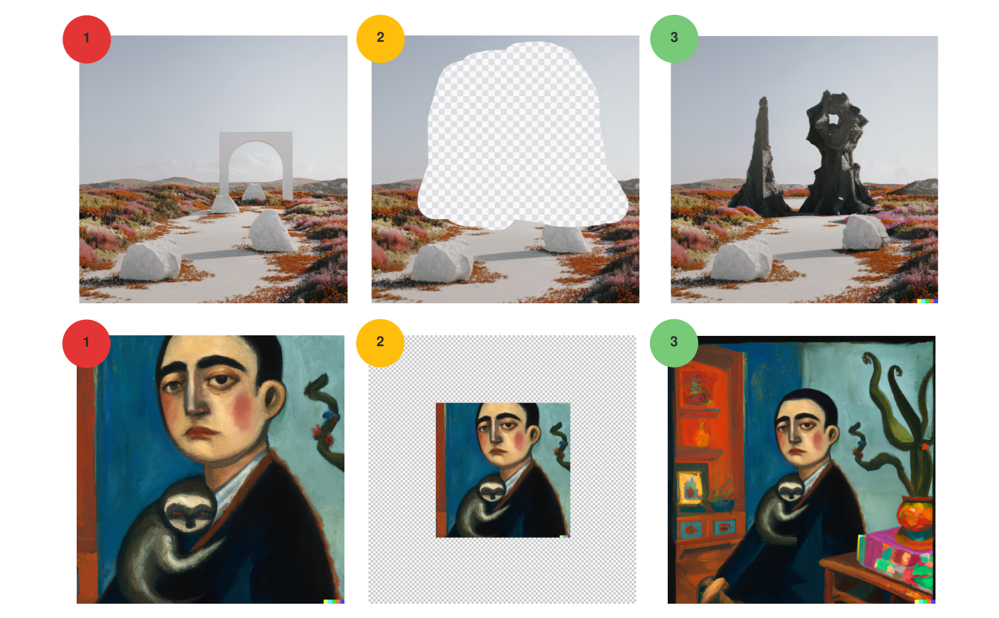

## 이미지 생성형 AI

### 종류

- [Stable Diffusion](https://stability.ai/): Stability AI의 오픈소스 이미지 생성 모델
- [Flux.1](https://blackforestlabs.ai/): Stability AI로부터 나온 인력들이 만든 Black Forest Labs가 만든 오픈소스 모델
- [MidJourney](https://www.midjourney.com/): Diffusion 기반의 이미지 생성 모델/서비스
- [Dall-E](https://openai.com/index/dall-e-3/): ChatGPT에 통합(Integrated)된 이미지 모델. 텍스트 이해가 뛰어남 
- [Imagen](https://deepmind.google/technologies/imagen-3/): 구글 Deepmind의 이미지 생성 모델

***

### 응용 서비스

- [Leonardo.ai](https://leonardo.ai/): 다양한 이미지 생성 모델을 제공하는 웹 기반 이미지 생성 서비스
- [Replicate](https://replicate.com/): LORA 등의 개발자 수준 기능을 지원하는 GPU 대여 이미지 생성 서비스
- [Whisk](https://labs.google/fx/tools/whisk): Imagen 모델을 활용, 전경, 배경, 스타일을 이미지로 입력받아 이미지를 생성하는 UI가 특징
- [Nordy.ai](https://nordy.ai/): 국산 Comfy UI 웹 서비스

## txt2img

### 텍스트 프롬프트로 이미지 생성하기

- 쉼표로 구분한 키워드를 여러 개 작성하는 것이 보통
	- DALL-E를 제외한 이미지 생성 모델들은 텍스트 해석이 약하기 때문에 복잡한 문장을 받아들이기 어렵다.
- 전경, 배경, 피사체, 스타일로 구분해 프롬프트 쓰기
- GPTs 사용하기

## img2txt

- Image 2 Text 사용해서 이미지 설명하고 프롬프트에 참고하기
- 언어모델의 멀티모달 기능을 활용 (GPT4-Vision)
- 미드저니에서는 `/describe`를 사용

## reference

- 스타일 및 캐릭터 레퍼런스 사용하기

## 고급 편집 기술

- InPainting
- OutPainting(Uncrop)

# 이미지 생성 프롬프트

