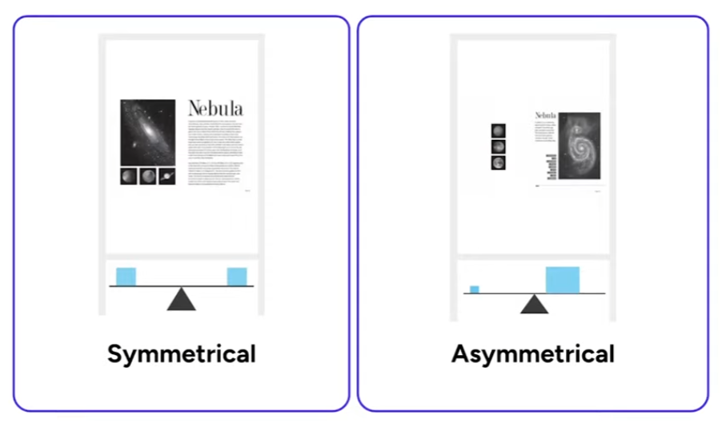

## 기획

- 푸른 산호초
- [칠성레이블]
- [2005 채연](https://www.youtube.com/watch?v=wneFAWbBhBM)

### 닫히면 안되는 팝업들

### 이중 스크롤 (inner scroll)

### 쿠팡이츠가 잘 먹었냐고 인사하는 시간을 어떻게?

- 배달 주문을 하고 핸드폰을 내비두었다면 먹은 다음 핸드폰으로 돌아가는 시간을 잴 수 있을 것임.

- 매슬로의 인간 욕구 5단계
- 논리, 객관성을 획득하는 법
	- 반대 주장을 검증하라
	- Doublethink

- 스레드의 추천로직과 데이터분석에 대한 불신

- 인증과 인가 (Authenticate vs. Authorization)
- 더닝 크루거 이펙트

- [의견이 갈리고 있는 배달주문](https://web.humoruniv.com/board/humor/read.html?table=pds&pg=0&number=1348399)
	- 그냥 좋아요 싫어요를 시계열로 보여주는 게 낫지 않을까? 스팀처럼

## UX Components

- Text
	- Types
		- Headings
		- Paragraphs (Body)
		- Footnotes
	- Typefaces / Fonts
	- Bio Reading
- Color
	- Semantic Color
		- Primary
			- Primary Contrast
		- Secondary
		- Tertiary
		- Text
		- Surface
		- Destructive
		- Positive/Negative
		- Success
	- Color Schemes
		- Monochromatic
	
- Areas
	- Z-Depth
- Motion
- Layouts
	- Grid system

## Design Principles

- Contrast
	- in Shape/Color/Type/Scale

- Balance
	- 대칭/비대칭

- Alignment

- Repetition

- Proximity

- Hierarchy

# UX

[(번역) 아이콘 현지화를 잊지 마세요](https://velog.io/@sehyunny/dont-forget-to-localize-icons)
- [어몽어스와 제네바 협약 위반](https://youtube.com/clip/UgkxWzNl3rFO9-MNru3m23EqkfIuaTTYaYnk?si=wwoYMUY4Bql2w_QH)
- 일본의 UX

[서비스 기획 잔소리](modules/서비스%20기획%20잔소리.md)

[LLM을 UX에 통합하기](modules/LLM을%20UX에%20통합하기.md)

## 각종 디바이스와 플랫폼에서의 UX

- 자동차 전장
	- 내비게이션의 UX
- 키오스크?
	- 신라호텔? UX
	- UX
		- UX 경쟁요소가 아님... 
		- 예쁨.....
		- 단가
- 게임패드, TV UI
- 국회로 가야겠다 
	- UX는 만능이 아니다
	- 디자이너는 디자인으로 문제를 해결하려 하고
	- 개발자는 코드로 문제를 해결하려 하고
	- 기획자는 기획으로 문제를 해결하려 하지만
	- 진짜 문제는 직군을 초월한다

- 일본, 중국의 UX
	- 일본: 지저분함 -> 정보가 앞에 드러나있을수록 안전하다고 생각
	- 중국: QR코드를 화면에서도 씀.

## 여러 문제들

- 상태를 전환하는 버튼
- 클릭한 내용을 펼쳐주는 아코디언
- 팀-플레이어, 플레이어, 경기-플레이어 보고서 문제

## 개발 지식
- 그냥 개발을 공부하면 되지 않나?

## 플랫폼을 개발하기
- 모든 플랫폼 참여자의 이해가 일치하도록 구성

## 의사결정이 어렵다면

- 기획에는 정답이 없다.
	- 명백한 오답은 있다.
	- '정답이 있다'라고 생각하는 것
- 그러므로 

## 용어 선점을 위한 몸부림들

- Ontact, Untact
- 디지로그 
	- 이어령
- 메타버스
- TX라이팅
	- [TX라이팅, 꼭 해야 합니까](https://ditoday.com/tx-%EB%9D%BC%EC%9D%B4%ED%8C%85-%EA%BC%AD-%ED%95%B4%EC%95%BC-%ED%95%A9%EB%8B%88%EA%B9%8C/)

[Data is beautiful 10 of the best data visualization examples](../웹클립/Data%20is%20beautiful%2010%20of%20the%20best%20ata%20visualization%20examples.md)

Sankey Chart