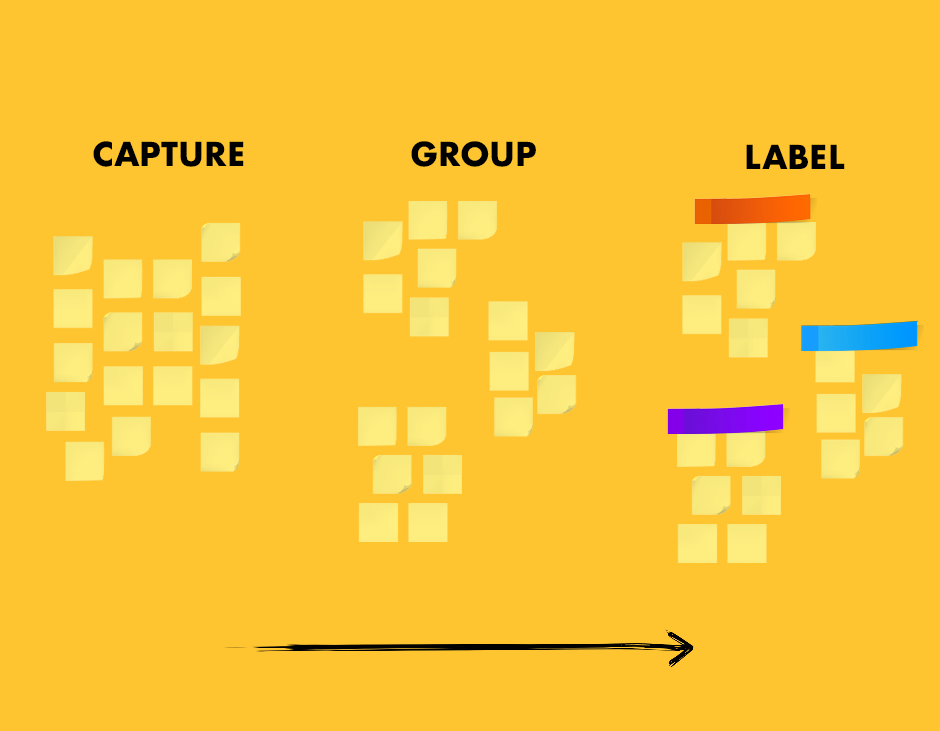
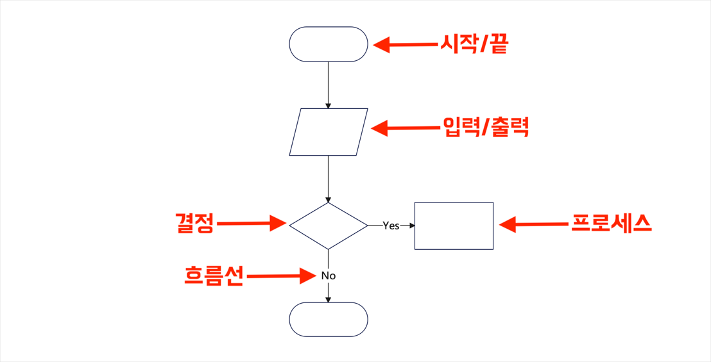
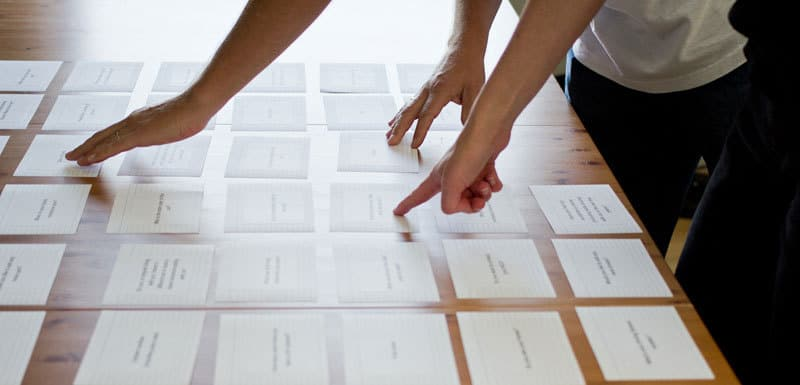

## 어피니티 다이어그램

- 스타트업 하면 떠오르는 이미지 속에 반드시 있는 그거
- 불규칙한 정성적 데이터를 분류하고 의미있는 데이터로 만드는 방법

## 플로우차트 (Flowchart)

- 흐름도. 로직을 표현하는 다이어그램
- 본래는 코딩을 위한 알고리즘 프로토타이핑의 용도이므로 플로우차트의 기호들은 컴퓨터의 동작과 관련되어 있다
- 흐름도의 주체가 무엇인지를 엄격하게 고려하면서 작성하기

## 휴리스틱 (Heuristic)

- **발견법**(發見法). 불충분한 시간이나 정보로 인하여 합리적인 판단을 할 수 없거나, 체계적이면서 합리적인 판단이 굳이 필요하지 않은 상황에서 사람들이 빠르게 사용할 수 있게 보다 용이하게 구성된 간편추론의 방법
	- 즉 **어림짐작**

### 휴리스틱의 여러 이름

- 간편법, 간편추론법, 어림법, 어림셈, 어림짐작법, 주먹구구법, 편의법, 쉬운 발견법, 판단 효과, 발견법, 경험적 지식, 즉흥적 추론, 쉬운 방법, 지름길

***

###  뻔히 눈에 보이는 것을 추론하기 위해 애쓸 필요는 없다

- 기획자의 직관을 이용해 의사결정 및 판단을 빠르게 할 수 있지만 그만큼 주관성에 빠져버릴 위험이 있다.
- 그러나 시행착오를 통해 개선되는 만큼, 휴리스틱은 암묵지를 획득하기 좋은 훈련법이기도 하다.

## A/B 테스트

- 동일한 조건의 사용자 여럿에 서로 다른 버전의 애플리케이션을 제공하고 유저의 행동을 관찰하는 UX 테스트 기법

### 주의

- 너무 자주 많이 하지 말 것. 기본적으로 리스크가 전제됨
- A/B 테스트 결과는 절대적이거나 항구적이지 않다
- 지역최적점에 머물게 될 위험

## UX 히트맵

- 스크롤, 클릭, 커서 움직임 등의 유저 행동을 누적된 히트맵으로 보기
- 사용자의 정보 습득 경로와 주 의사결정 요인 등을 확인할 수 있는 지표

## 카드소팅 (Card Sorting)

- 주로 화면의 순서와 메뉴의 하이어라키를 결정하기 위해
- 사용자에게 아이템을 카드의 형태로 쥐어주고 알아서 배치해보게 하는 방법
- 사용자가 익숙하고 직관적이라고 느끼는 화면의 순서, 메뉴의 배치를 알아낼 수 있다

