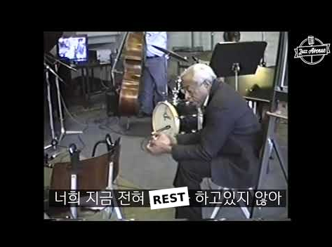

## 소프트 스킬

### 호기심

- the one must-have skill

### 커뮤니케이션

- 이해와 공감
- 논리력
- 솔직하고 투명한 커뮤니케이션

***

### 꼼꼼함

- MECE 하게 정리하기
	- Mutually Exclusive, Collectively Exhaustive
	- 상호배타적이며 전체 포괄적
- 일반적인 의미의 꼼꼼함 역시 필수

---

### 창의력

- 본질과 형식
	- 본질은 형식의 상위 호환
	- 형식을 따르는 사람은 창조가 불가능
	- [반도체 전설 짐 켈러](https://www.youtube.com/watch?v=iwXr1IRaqWA)
- 기싸움을 하지 말자
	- [모욕적인 질문에 답하는 스티브 잡스](https://www.youtube.com/watch?v=Ew53EGl0rXo)
	- [유튜버에게 생각지도 못한 질문을 들은 일론 머스크](https://www.youtube.com/watch?v=WY73exaVpyw)
	- [People that are really good](https://www.youtube.com/watch?v=tkHvxLwLx3M)

***

### 그리고 약간의 고집

- Think Different!
- 똑똑한 사람은 쉽게 예민해지기 마련입니다.
	- 하지만 당신이 예민하다는 사실이 당신의 똑똑함을 증명하지는 않습니다.

## 하드스킬

### 글쓰기

- 구조적 글쓰기
	- 마크다운
	- 세컨드브레인
- 생각을 표현하기도 하고, 정리를 할 때도 쓸 수 있는 도구
- 적어도 주어와 술어가 호응하는 글을 쓸 수 있도록

### 말하기

- 명료하고 전달력 있는 목소리
- 이해와 공감을 전할 수 있는 some kinda 연기력
	- 솔직함은 훈련해야 하는 것입니다.

***

### 툴 사용

- 생각을 표현하거나 정보를 구축하는 다양한 도구 활용
	- 오피스, 피그마, 생성형 AI
	- 데이터 분석
	- 동영상 편집, 촬영
	- 노코드 도구: 노션, 웹 빌더, 자동화 등

---

### 데이터 분석

- 데이터를 정량적, 정성적으로 분석하고 인사이트를 도출할 수 있는 능력
	- 데이터 분석은 어디까지나 도구일 뿐
	- 반드시 가설 검증의 형태로 이뤄져야 한다.

***

### 개발과 기술에 대한 이해

- [오늘도 개발자가 안 된다고 말했다](https://www.yes24.com/Product/Goods/97919905)
- 그럴 거면 그냥 개발 공부하는 게 낫지 않을까?

## 라이브러리

#### 다양한 지식과 경험의 독자적 체계

### 경험

- 일상 속에서도 불편함을 발견하기
- 적극적으로 눈 앞의 문제들을 해결하기
- 경험으로부터 귀납적 원리를 이끌어 내기
- 다양한 프로젝트 경험

***

### 지식

- Every knowdledge in the world counts.
	- 특히 기술과 컴퓨터에 관한 지식
	- 도메인 날리지(Domain Knowledge)
- 특히 어떤 기술을 내가 안다. 라고 말할 수 있다는 것은
	- 그 기술과 관련된 전후 역사를 알고 있다는 것
- 나만의 지식 체계를 구축하기
	- 블로그
	- 세컨드 브레인

---

### 용어

- 나의 언어로 재해석해야 내 것이 됨.
- 정확한 용어에 집착하지 말고 **뭣이중헌지**를 판단하기

### 방법론 (Frameworks)

- 그 어떤 것도 본질에 선행하지 않음
- 방법론은 도구로써 활용할 때 가치가 있으며, 방법론에 매몰되어서는 안됨
	- 그것이 방법론의 본질이기도 하고
- 방법론/프레임워크는 모든 문제상황을 해결하는 전가의 보도가 아니므로 
	- 반드시 나의 맥락과 사정을 분석하여 적합한지 판단해야 하고
	- 이것이 가능하면 방법론을 그대로 따르는 것이 아니라 알맞게 각색하여 수용할 수 있으며
	- 나아가서는 자신만의 방법론을 만들어낼 수 있기 때문

---

### 우상 숭배 금지

- 애자일
- 디자인 시스템
- REST API
- 디자인 패턴
- 방법론, UX 도구들
- 데이터분석

#### 비판적으로 사고할 것!

